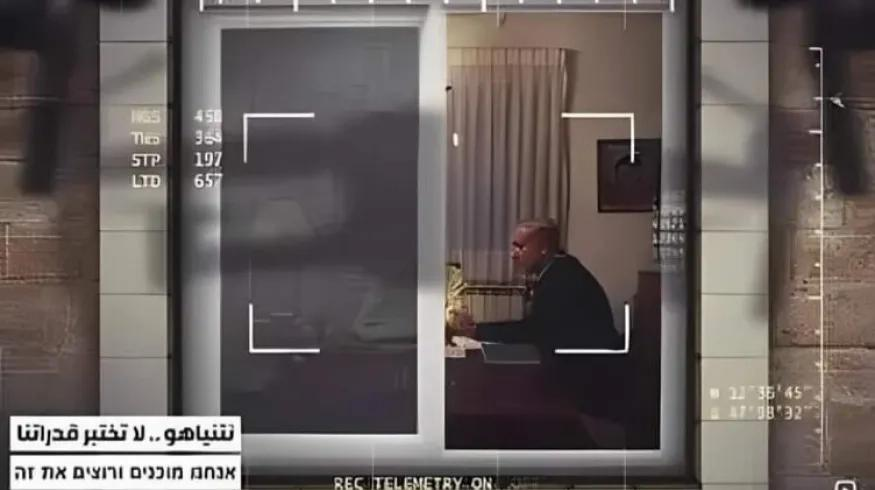

## Claim
Claim: " This image shows Israeli PM Benjamin Netanyahu inside his office and was captured and published by Hezbollah in August 2024."

## Actions
```
reverse_search()
web_search("Hezbollah Benjamin Netanyahu office")
```

## Evidence
### Evidence from `reverse_search`
From [Source](https://pesacheck.org/altered-this-photo-of-a-drone-surveilling-pm-netanyahu-is-fabricated-396f43e817da): Found exact image on website with title: ALTERED: This photo of a drone surveilling PM Netanyahu is ...
Content: The search result from PesaCheck states that the image  is fabricated. The original photo of Benjamin Netanyahu is from 2009. The article was published 1 day ago.


### Evidence from `web_search`
Al Jazeera ([Source](https://www.aljazeera.com/news/2024/10/22/hezbollah-takes-responsibility-for-drone-attack-on-netanyahu-holiday-home)) reported on October 22, 2024, that Hezbollah claimed responsibility for a drone attack on Benjamin Netanyahu's holiday residence.

The Times of Israel ([Source](https://www.timesofisrael.com/netanyahus-office-confirms-israel-was-behind-devastating-pager-attacks-on-hezbollah/)) reported that Israel was behind attacks on Hezbollah communications devices in September 2024. ABC News ([Source](https://6abc.com/15590173)) reported on November 27, 2024, that the Israeli cabinet approved a ceasefire deal between Israel and Hezbollah.


## Elaboration
The image 

## Final Judgement
The image is fabricated, and the original photo of Benjamin Netanyahu is from 2009. The claim that Hezbollah captured and published the image in August 2024 is false.

The claim is demonstrably false because the image is fabricated, and the context provided is inaccurate. `false`


### Verdict: FALSE

### Justification
The image in question is fabricated, as confirmed by a reverse image search, with the original photo dating back to 2009. Therefore, the claim that Hezbollah captured and published this image of Benjamin Netanyahu in August 2024 is false.
