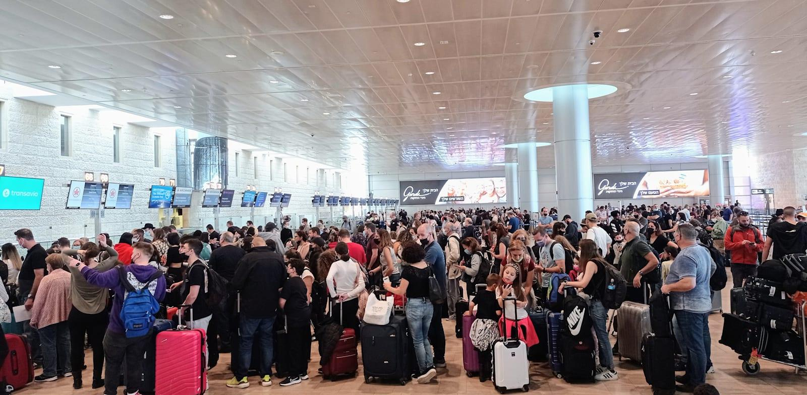

## Claim
Claim: " This image shows Israelis fleeing the airport after the Houthis attack on July 19, 2024."

## Actions
```
reverse_search()
web_search("Houthis attack airport July 19 2024")
```

## Evidence
### Evidence from `reverse_search`
The image 

### Evidence from `web_search`
On July 19, 2024, the Houthi militia claimed responsibility for a drone attack on Tel Aviv. Reuters reports that the attack killed one person and injured four others. The Guardian and The New York Times also reported on the Houthi drone strike in Tel Aviv on the same date.

The Reuters article can be found here: [Source](https://www.reuters.com/world/middle-east/israeli-military-says-tel-aviv-blast-apparently-caused-by-drone-2024-07-19/). The Guardian article can be found here: [Source](https://www.theguardian.com/world/article/2024/jul/19/yemen-houthis-claim-deadly-drone-attack-on-tel-aviv-israel). The New York Times article can be found here: [Source](https://www.nytimes.com/2024/07/19/world/middleeast/houthis-drone-strike-tel-aviv.html). , , , 


## Elaboration
The evidence confirms that a Houthi drone attack on Tel Aviv occurred on July 19, 2024. However, the provided evidence does not contain any information about the image 

## Actions
```
image_search("Israel airport crowds")
```

## Evidence
### Evidence from `image_search`
From [Source](https://en.globes.co.il/en/article-israels-crowded-airports-boost-iaa-results-1001458704): 
Content: The search result from Globes.co.il shows a crowded airport in Israel. 


## Elaboration
The evidence shows that the image depicts a crowded airport in Israel. However, there is no information to confirm that the image shows Israelis fleeing the airport after the Houthi attack on July 19, 2024.

Therefore, the claim cannot be verified.


## Actions
```
web_search("Israel airport security July 19 2024")
```

## Evidence
### Evidence from `web_search`
On July 19, 2024, a global tech outage caused by a software update from CrowdStrike impacted airlines and airports, leading to flight cancellations and delays. The Times of Israel reported that Ben Gurion Airport was expected to be affected. Reuters also reported on the global tech outage affecting airlines and airports. (, , )


## Elaboration
The evidence indicates that on July 19, 2024, a global tech outage affected airlines and airports, including Ben Gurion Airport. This could have caused delays and congestion. However, there is no information to confirm that the image shows Israelis fleeing the airport after the Houthi attack.

Therefore, the claim cannot be verified.


## Final Judgement
The image depicts a crowded airport, and while there was a Houthi attack on July 19, 2024, and a global tech outage affecting airports on the same day, there is no evidence to confirm that the image shows Israelis fleeing the airport after the Houthi attack. `not enough information`

### Verdict: NEI

### Justification
The claim cannot be verified. While a Houthi attack and a global tech outage affecting airports occurred on July 19, 2024, there is no evidence to confirm that the image depicts Israelis fleeing the airport after the attack. The image search results show crowded airports in Israel, but do not link the image to the specific event.
