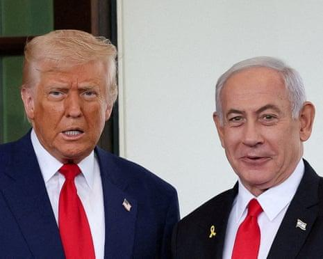
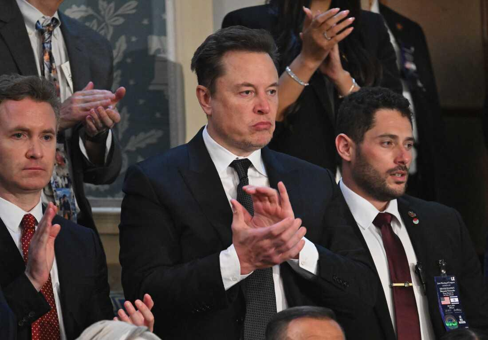

## Claim
Claim: " This is an authentic image of Donald Trump, Benjamin Netanyahu and Elon Musk during Netanyahu's official visit to the U.S. in February 2025."

## Actions
```
web_search("Donald Trump Benjamin Netanyahu Elon Musk meeting")
image_search("Donald Trump Benjamin Netanyahu Elon Musk")
```

## Evidence
### Evidence from `web_search`
The Guardian published a live coverage on July 7-8, 2025, about Donald Trump and Benjamin Netanyahu's meeting at the White House, amid indirect talks between Israel and Hamas over a ceasefire and hostage deal in Gaza. The article also mentions that Trump called Musk's new political party 'ridiculous'. ([https://www.theguardian.com/us-news/live/2025/jul/07/donald-trump-elon-musk-new-party-us-politics-live-latest-news](https://www.theguardian.com/us-news/live/2025/jul/07/donald-trump-elon-musk-new-party-us-politics-live-latest-news)) 

France 24 published an article on February 5, 2025, stating that an AI-generated photo of Elon Musk, Donald Trump, and Benjamin Netanyahu () is circulating on social media. The article debunks the claim that the image is authentic. An NDTV article, published on January 2, 2025, discusses Elon Musk's praise for Donald Trump's negotiation skills regarding the Israel-Hamas conflict. ([https://www.ndtv.com/world-news/elon-musk-vs-donald-trump-musks-praise-for-trump-amid-latest-feud-credit-where-its-due-8811697](https://www.ndtv.com/world-news/elon-musk-vs-donald-trump-musks-praise-for-trump-amid-latest-feud-credit-where-its-due-8811697)) 


### Evidence from `image_search`
The NPR article includes an image of Elon Musk () and can be found here: [Source](https://www.npr.org/2024/07/24/nx-s1-5049715/elon-musk-donald-trump-tesla). Al Jazeera published an image of Donald Trump and Benjamin Netanyahu () and can be found here: [Source](https://www.aljazeera.com/news/liveblog/2025/7/7/donald-trump-live-us-president-to-host-israeli-pm-benjamin-netanyahu).


## Elaboration
The claim is false. According to a France 24 article, the image of Donald Trump, Benjamin Netanyahu, and Elon Musk is AI-generated and not authentic. The article debunks the claim that the image is real.


## Final Judgement
The image is confirmed to be AI-generated and not authentic. Therefore, the claim is false. `false`

### Verdict: FALSE

### Justification
The claim is false. Evidence from a France 24 article indicates that the image of Donald Trump, Benjamin Netanyahu, and Elon Musk is AI-generated and not an authentic photograph.
