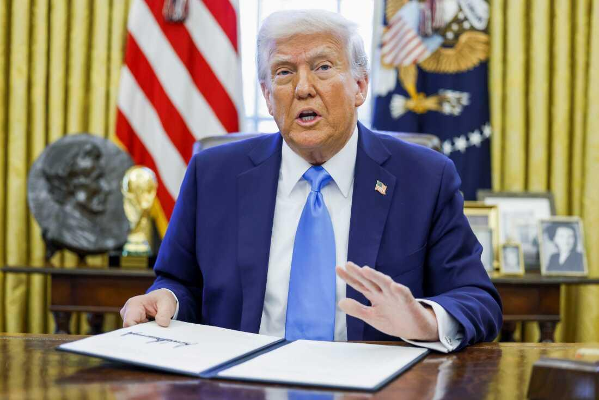

## Claim
Claim: "Trump signed an executive order on January 20, 2025, to halt all funding to UNRWA."

## Actions
```
web_search("Trump executive order UNRWA funding")
```

## Evidence
### Evidence from `web_search`
According to an Al Jazeera article published on February 4, 2025, Donald Trump is planning to extend a funding ban on UNRWA and is expected to sign an executive order (<image:0>). NPR reported on February 3, 2025, and updated on February 4, 2025, that Trump signed an executive order that cuts future funding to UNRWA (). An article from Akin Gump, published on February 5, 2025, discusses a Trump Executive Order that orders the reevaluation of the United States’ commitment to UNRWA ().

The sources are: [https://www.aljazeera.com/news/2025/2/4/trump-to-withdraw-us-from-un-human-rights-council-extend-unrwa-funding-ban](https://www.aljazeera.com/news/2025/2/4/trump-to-withdraw-us-from-un-human-rights-council-extend-unrwa-funding-ban), [https://www.akingump.com/en/insights/blogs/trump-executive-order-tracker/withdrawing-the-united-states-from-and-ending-funding-to-certain-united-nations-organizations-and-reviewing-united-states-support-to-all-international-organizations](https://www.akingump.com/en/insights/blogs/trump-executive-order-tracker/withdrawing-the-united-states-from-and-ending-funding-to-certain-united-nations-organizations-and-reviewing-united-states-support-to-all-international-organizations), and [https://www.npr.org/2025/02/03/nx-s1-5285696/trump-un-human-rights-council-withdrawal](https://www.npr.org/2025/02/03/nx-s1-5285696/trump-un-human-rights-council-withdrawal).


## Elaboration
The evidence indicates that Donald Trump signed an executive order regarding UNRWA funding. NPR reported on February 3, 2025, that Trump signed an executive order that cuts future funding to UNRWA. An Al Jazeera article from February 4, 2025, mentions Trump is expected to sign an executive order to extend a funding ban on UNRWA. An article from Akin Gump, published on February 5, 2025, discusses a Trump Executive Order that orders the reevaluation of the United States’ commitment to UNRWA.

The exact date of the executive order is not explicitly stated in the provided evidence, but NPR's report suggests it was signed on or before February 3, 2025.

The claim states the executive order was signed on January 20, 2025. This specific date is not supported by the provided evidence.


## Final Judgement
The evidence suggests that Trump signed an executive order related to UNRWA funding, but the exact date of January 20, 2025, mentioned in the claim, is not supported by the provided sources.

`false`


### Verdict: FALSE

### Justification
The claim is false. While evidence from sources like [NPR](https://www.npr.org/2025/02/03/nx-s1-5285696/trump-un-human-rights-council-withdrawal) and [Al Jazeera](https://www.aljazeera.com/news/2025/2/4/trump-to-withdraw-us-from-un-human-rights-council-extend-unrwa-funding-ban) indicates that Trump signed an executive order concerning UNRWA funding, the provided evidence does not support the specific date of January 20, 2025, as the date of the order.
