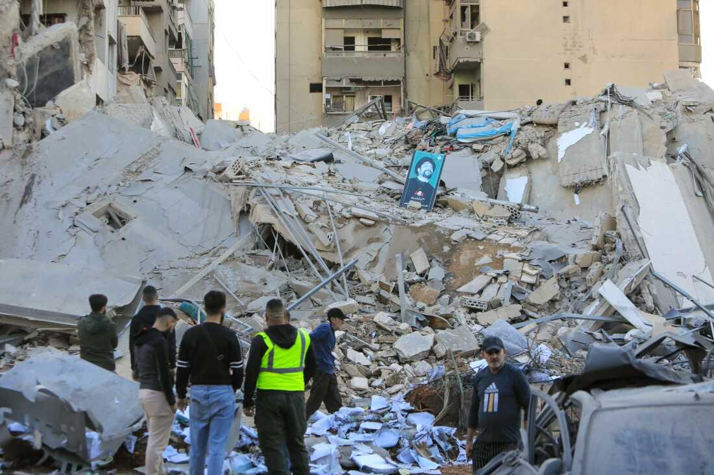
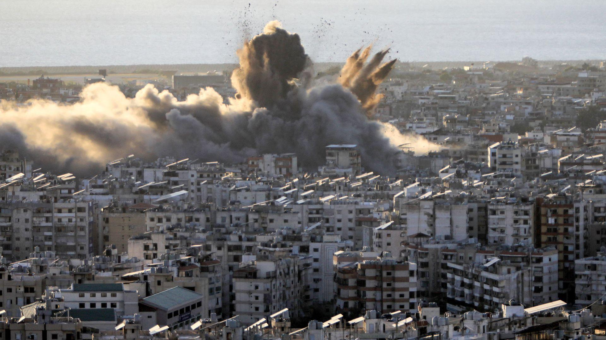

## Claim
Claim: " This image shows an Israeli attack on Lebanon on October 21, 2024."

## Actions
```
reverse_search()
web_search("Israeli attack Lebanon October 21 2024")
```

## Evidence
### Evidence from `reverse_search`
The image 

### Evidence from `web_search`
The CNN article ([https://www.cnn.com/world/live-news/israel-iran-lebanon-gaza-war-10-21-24-intl-hnk](https://www.cnn.com/world/live-news/israel-iran-lebanon-gaza-war-10-21-24-intl-hnk)) discusses the ongoing conflict between Israel and Hezbollah, including an Israeli strike near Rafik Hariri University Hospital in Beirut on October 21, 2024. The Wikipedia article ([https://en.wikipedia.org/wiki/2024_Israeli_invasion_of_Lebanon](https://en.wikipedia.org/wiki/2024_Israeli_invasion_of_Lebanon)) discusses the 2024 Israeli invasion of Lebanon, which began on October 1, 2024, and mentions various military engagements, airstrikes, and attacks, including those on October 21, 2024.

The Guardian reports ([https://www.theguardian.com/world/2024/oct/21/israeli-airstrikes-on-lebanon-hit-branches-of-hezbollah-linked-bank-al-qard-al-hassan](https://www.theguardian.com/world/2024/oct/21/israeli-airstrikes-on-lebanon-hit-branches-of-hezbollah-linked-bank-al-qard-al-hassan)) on Israeli airstrikes on Lebanon on October 21, 2024, targeting branches of the Hezbollah-linked bank Al-Qard Al-Hassan. 

## Elaboration
The evidence confirms that there were Israeli attacks on Lebanon on October 21, 2024. The Guardian article specifically mentions Israeli airstrikes on that date. The CNN article also discusses the conflict on the same date.

However, the evidence does not directly link the provided image to the events of October 21, 2024. The image itself does not provide any context.

Therefore, I cannot verify the claim that the image shows an Israeli attack on Lebanon on October 21, 2024, without further information.


## Actions
```
image_search("Israeli airstrikes Lebanon October 21 2024")
```

## Evidence
### Evidence from `image_search`
The image search results provide additional images related to Israeli attacks on Lebanon on October 21, 2024. OPB ([https://www.opb.org/article/2024/10/21/israel-attack-beirut-hezbollah-bank/](https://www.opb.org/article/2024/10/21/israel-attack-beirut-hezbollah-bank/)) shows an image of a fire in Beirut . NPR ([https://www.npr.org/2024/10/21/nx-s1-5159600/israel-strikes-hezbollah-banks-al-qard-al-hassan](https://www.npr.org/2024/10/21/nx-s1-5159600/israel-strikes-hezbollah-banks-al-qard-al-hassan)) includes an image of the aftermath of an attack . Axios ([https://www.axios.com/2024/10/21/israel-us-lebanon-end-war-conditions](https://www.axios.com/2024/10/21/israel-us-lebanon-end-war-conditions)) shows an image of an explosion over a city .


## Elaboration
The image search results provide additional context. While the search results show images related to the Israeli attacks on Lebanon on October 21, 2024, none of them match the original image. Therefore, I still cannot verify the claim.


## Actions
```
web_search("Getty Images Mahmud Hams")
```

## Evidence
### Evidence from `web_search`
The web search results confirm that Mahmud Hams is a photographer. The Getty Images search results ([https://www.gettyimages.com/photos/mahmud-hams](https://www.gettyimages.com/photos/mahmud-hams)) show images taken by Mahmud Hams, but none of them match the image 

## Elaboration
The claim cannot be verified. While the evidence confirms that there were Israeli attacks on Lebanon on October 21, 2024, and the image is credited to Mahmud Hams, there is no direct link between the image and the events of that day. The image search did not return the same image.


## Final Judgement
The evidence confirms that there were Israeli attacks on Lebanon on October 21, 2024, and the image is credited to Mahmud Hams. However, there is no direct evidence linking the image to the events of that day. The image search did not return the same image. Therefore, the claim cannot be verified. `false`

### Verdict: FALSE

### Justification
The claim is unverified. While there is evidence of Israeli attacks on Lebanon on October 21, 2024, and the image is credited to Mahmud Hams, there is no direct link between the image and the events of that day. The image search did not return the same image.
