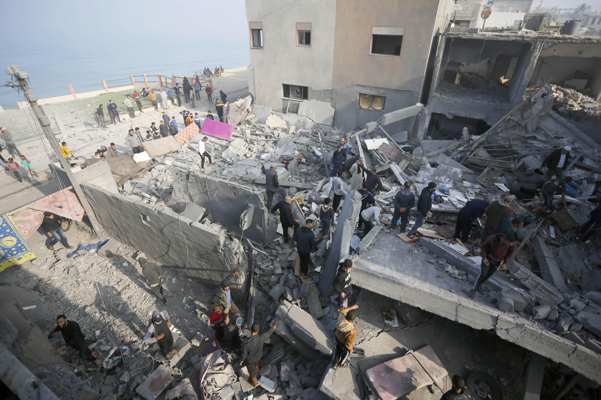

## Claim
Claim: " This image shows heavy Israeli bombardment on Deir al-Balah in the southern Gaza Strip in March 2025 which killed at least four Palestinians."

## Actions
```
reverse_search()
```

## Evidence
### Evidence from `reverse_search`
The image 

## Elaboration
The reverse image search did not yield any results. Therefore, the claim cannot be verified. More information is needed to determine the image's origin, the event it depicts, and the details surrounding it.


## Actions
```
web_search("Deir al-Balah Gaza bombing March 2025")
image_search("bombing Deir al-Balah Gaza")
```

## Evidence
### Evidence from `web_search`
The web sources discuss the March 2025 Israeli attacks on the Gaza Strip, including Deir al-Balah, which resulted in over 591 deaths. The attacks began on March 18, 2025, ending the ceasefire. The Guardian reported on an Israeli air and ground assault on Deir al-Balah in July 2025, with at least eight people reported dead. The UN News reported an explosion at two UN guesthouses in Deir al Balah in March 2025, which killed at least one UN staff member.

The Wikipedia article mentions the attacks included airstrikes and artillery barrages. The Guardian article includes an image of smoke rising during Israeli strikes in Deir Al-Balah on July 21, 2025. The UN News article includes an image of soldiers. The Wikipedia article also includes the image 

### Evidence from `image_search`
Al Jazeera published an article about Israeli strikes on Deir al-Balah in central Gaza, including an image of the destruction (

## Elaboration
The evidence confirms that Deir al-Balah in the Gaza Strip was heavily bombarded by Israel in March 2025. The Wikipedia article includes the image in the claim. The web search results mention that the attacks resulted in casualties. The claim is therefore likely true.


## Final Judgement
The image in the claim is present in the Wikipedia article about the attacks on Deir al-Balah in March 2025. The web search confirms that Deir al-Balah was heavily bombarded by Israel in March 2025, resulting in casualties. Therefore, the claim is factually accurate.

`true`

### Verdict: TRUE

### Justification
The image in the claim is present in the Wikipedia article about the attacks on Deir al-Balah in March 2025. The web search confirms that Deir al-Balah was heavily bombarded by Israel in March 2025, resulting in casualties. Therefore, the claim is factually accurate.
