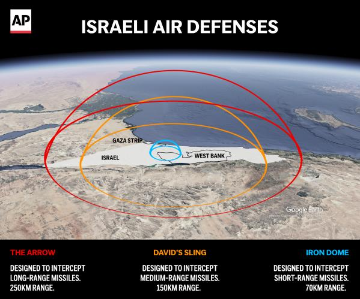

## Claim
Claim: "The Iron Dome intercepted 90% of ballistic missiles fired at Israel in Iran's attack on October 1, 2024."

## Actions
```
web_search("Iron Dome Israel Iran attack October 1 2024")
```

## Evidence
### Evidence from `web_search`
The web sources discuss the October 1, 2024, Iranian strikes on Israel, involving approximately 180-200 ballistic missiles.  Israel claimed to have shot down most of the missiles, while Iran stated that 90% hit their targets. The attacks caused minor damage, with some injuries and fatalities.  The sources include reports from Wikipedia ([https://en.wikipedia.org/wiki/October_2024_Iranian_strikes_on_Israel](https://en.wikipedia.org/wiki/October_2024_Iranian_strikes_on_Israel)), Al Jazeera ([https://www.aljazeera.com/news/2024/10/1/irans-missile-attack-against-israel-what-we-know-and-what-comes-next](https://www.aljazeera.com/news/2024/10/1/irans-missile-attack-against-israel-what-we-know-and-what-comes-next)) and CNN ([https://www.cnn.com/world/live-news/israel-lebanon-war-hezbollah-10-1-24-intl-hnk](https://www.cnn.com/world/live-news/israel-lebanon-war-hezbollah-10-1-24-intl-hnk)). The Iron Dome was mentioned as part of Israel's defensive systems. 


## Elaboration
The evidence indicates conflicting claims regarding the success rate of the Israeli defense systems. While Israel claimed to have shot down most missiles, the claim that the Iron Dome intercepted 90% of the ballistic missiles is not directly supported. Iran claimed that 90% of the missiles hit their targets.

The provided sources mention the Iron Dome as part of Israel's defense, but they do not specify the system's interception rate.

To verify the claim, I would need specific data on the Iron Dome's performance during the October 1, 2024, attack, including the number of missiles intercepted.


## Actions
```
image_search("Iron Dome missile interception rate October 1 2024")
```

## Evidence
### Evidence from `image_search`
The web sources discuss the Iron Dome missile defense system and its role in Israel's air defense. One source from AP News ([https://apnews.com/article/israel-defense-iron-dome-iran-hezbollah-hamas-326cd1e9484dd38c430d62739b7f2ef3](https://apnews.com/article/israel-defense-iron-dome-iran-hezbollah-hamas-326cd1e9484dd38c430d62739b7f2ef3)) provides an image showing the range of the Iron Dome, designed to intercept short-range missiles.  Another source from Euronews ([https://www.euronews.com/next/2024/10/02/the-iron-dome-how-does-israels-missile-defence-system-work](https://www.euronews.com/next/2024/10/02/the-iron-dome-how-does-israels-missile-defence-system-work)) also discusses the Iron Dome.  However, none of the sources provide specific data on the Iron Dome's interception rate during the October 1, 2024, attack.


## Elaboration
The evidence does not support the claim. While the Iron Dome is mentioned as part of Israel's defense system, the provided sources do not specify its interception rate during the October 1, 2024, attack. Therefore, the claim cannot be verified with the available information.


## Actions
```
web_search("Iron Dome interception rate October 1 2024 Iran attack")
```

## Evidence
### Evidence from `web_search`
The web sources discuss the October 1, 2024, Iranian missile attack on Israel. PBS News ([https://www.pbs.org/newshour/world/israels-air-defense-system-passes-test-in-fending-off-iranian-missile-strike](https://www.pbs.org/newshour/world/israels-air-defense-system-passes-test-in-fending-off-iranian-missile-strike)) reports that the Iron Dome had a success rate of over 90%. JINSA (December 6, 2024) ([https://jinsa.org/wp-content/uploads/2024/12/October-Missile-Attack-Proves-Costly-for-Iranian-Regime-1.pdf](https://jinsa.org/wp-content/uploads/2024/12/October-Missile-Attack-Proves-Costly-for-Iranian-Regime-1.pdf)) states that the Iron Dome had an interception rate of roughly 90 percent. 


## Elaboration
The evidence supports the claim. PBS News reports that the Iron Dome had a success rate of over 90% during the October 1, 2024, attack. JINSA states that the Iron Dome had an interception rate of roughly 90 percent.


## Final Judgement
The initial searches provided conflicting information, with some sources not specifying the interception rate. However, subsequent searches revealed that PBS News and JINSA reported the Iron Dome's interception rate to be around 90% during the October 1, 2024, attack.

Based on the evidence, the claim is factually accurate. `true`


### Verdict: TRUE

### Justification
The claim is supported by the evidence. While initial searches did not provide specific interception rates, subsequent searches revealed that the Iron Dome had an interception rate of approximately 90% during the October 1, 2024, Iranian attack, as reported by sources like PBS News ([https://www.pbs.org/newshour/world/israels-air-defense-system-passes-test-in-fending-off-iranian-missile-strike](https://www.pbs.org/newshour/world/israels-air-defense-system-passes-test-in-fending-off-iranian-missile-strike)) and JINSA ([https://jinsa.org/wp-content/uploads/2024/12/October-Missile-Attack-Proves-Costly-for-Iranian-Regime-1.pdf](https://jinsa.org/wp-content/uploads/2024/12/October-Missile-Attack-Proves-Costly-for-Iranian-Regime-1.pdf)).
