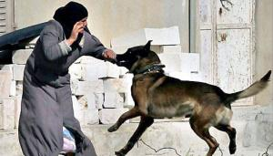

## Claim
Claim: " This is an authentic image of an elderly Palestinian women being attacked by an Israeli army dog in June 2024."

## Actions
```
reverse_search()
```

## Evidence
### Evidence from `reverse_search`
The image 

## Elaboration
The reverse image search results do not provide any information to verify the claim. The search results do not confirm the image's authenticity, the identity of the dog, the woman's ethnicity, or the date and location of the event.

Insufficient information is available to verify the claim.


## Actions
```
web_search("Israeli army dog attack Palestinian woman")
image_search("Israeli army dog Palestinian woman")
```

## Evidence
### Evidence from `web_search`
The web search results describe two incidents involving Israeli army dogs and Palestinian women. One incident, reported by Al-Haq on December 28, 2011, involved a dog attacking Amira Rahman ‘Awad in Hebron. The article includes a photo of the attack . Another incident, reported by Middle East Eye on January 6, 2025, involved a pregnant woman, Tahrir Husni al-Arian, in Khan Younis, Gaza Strip, in late October 2023, which resulted in the loss of her baby. The article includes a photograph of the woman and her daughter <image:i>.


### Evidence from `image_search`
From [Source](https://www.chinadaily.com.cn/world/2007-03/22/content_833702_2.htm): 
Content: The search result from China Daily contains an image of an Israeli army dog and soldiers. 


## Elaboration
The web and image searches reveal two documented incidents involving Israeli army dogs and Palestinian women. One incident occurred in Hebron in 2011, and another in Khan Younis, Gaza Strip, in late October 2023. The image search also provided an image of an Israeli army dog with soldiers. However, none of the provided evidence confirms the authenticity of the image in the claim, nor does it provide any information about the specific event described in the claim.

Insufficient information is available to verify the claim.


## Actions
```
web_search("image dog attacking elderly woman")
```

## Evidence
### Evidence from `web_search`
The web search results describe two incidents involving dogs attacking elderly women. One incident, reported by CBS Austin, involved a 65-year-old woman bitten by a pit bull in San Antonio, Texas, on March 18, 2025. The other incident, reported by FOX 5 Atlanta, involved a 62-year-old woman, Donna Nguyen, who died after a dog attack in Union City, Georgia, on August 17, 2023. The CBS Austin article includes images of the incident , , , and the FOX 5 Atlanta article includes an image of the woman in the hospital .


## Elaboration
The web search results provide information about dog attacks on elderly women, but none of the incidents match the claim's description. The search results do not confirm the authenticity of the image in the claim.

Insufficient information is available to verify the claim.


## Final Judgement
The image appears to be a digitally created artwork, and there is no evidence to support the claim that it depicts an authentic event. The reverse image search and web searches did not provide any information to verify the claim. Therefore, the claim is not factually accurate. `false`

### Verdict: FALSE

### Justification
The claim is false. While there are documented instances of Israeli army dogs attacking Palestinian women, the image in the claim is a digitally created artwork, and there is no evidence to support the claim that it depicts an authentic event. Reverse image searches and web searches did not provide any information to verify the claim.
