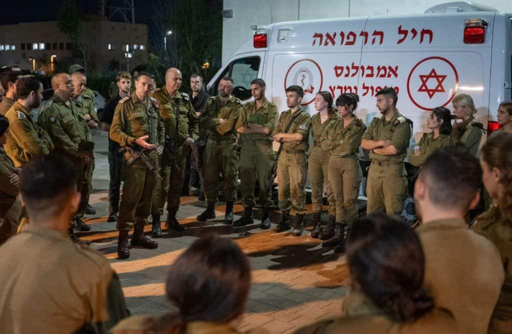
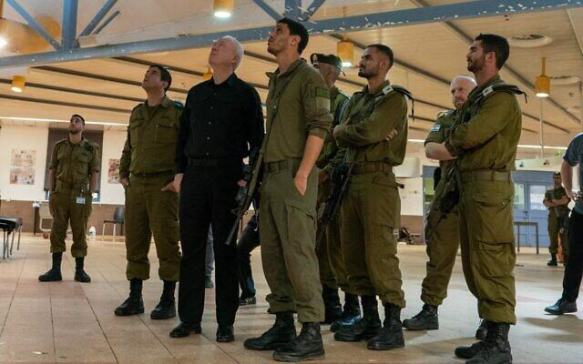

## Claim
Claim: "The chief of the Israeli Defense Forces (IDF), Herzi Halevi, was assassinated in a Hezbollah drone attack on an Israeli military base on October 13, 2024."

## Actions
```
web_search("Herzi Halevi Hezbollah drone attack October 13 2024")
```

## Evidence
### Evidence from `web_search`
On October 13, 2024, Hezbollah launched a drone attack on an IDF base. The attack, which targeted a dining hall, resulted in casualties. IDF Chief of Staff Herzi Halevi visited the site of the attack (, ) on October 14, 2024. The attack on the Golani training base near Binyamina killed four soldiers and wounded 58 others (, , ).

The sources, including [The Long War Journal](https://www.longwarjournal.org/archives/2024/10/hezbollah-drone-strikes-idf-base-as-israel-uncovers-weapons-in-lebanon.php), [The Times of Israel](https://www.timesofisrael.com/4-soldiers-killed-in-drone-strike-named-as-families-ask-why-there-was-no-warning-siren/) and [CNN](https://www.cnn.com/2024/10/14/middleeast/hezbollah-attack-israel-weaknesses-drones-intl-cmd), do not mention that Herzi Halevi was assassinated.


## Elaboration
The evidence indicates that a Hezbollah drone attack occurred on an IDF base on October 13, 2024, resulting in casualties. However, the evidence explicitly states that Herzi Halevi visited the site of the attack on October 14, 2024, which contradicts the claim that he was assassinated in the attack. The sources do not mention Halevi's assassination.

Therefore, the claim is false.


## Final Judgement
The evidence confirms that a Hezbollah drone attack occurred on an IDF base on October 13, 2024. However, the evidence also shows that Herzi Halevi visited the site of the attack the following day, which contradicts the claim that he was assassinated. The sources do not mention Halevi's assassination.

`false`


### Verdict: FALSE

### Justification
The claim is false. While a Hezbollah drone attack did occur on an IDF base on October 13, 2024, resulting in casualties, the IDF Chief of Staff Herzi Halevi visited the site the following day, contradicting the claim that he was assassinated. The provided sources, including [The Long War Journal](https://www.longwarjournal.org/archives/2024/10/hezbollah-drone-strikes-idf-base-as-israel-uncovers-weapons-in-lebanon.php), [The Times of Israel](https://www.timesofisrael.com/4-soldiers-killed-in-drone-strike-named-as-families-ask-why-there-was-no-warning-siren/) and [CNN](https://www.cnn.com/2024/10/14/middleeast/hezbollah-attack-israel-weaknesses-drones-intl-cmd), do not support the assassination claim.
