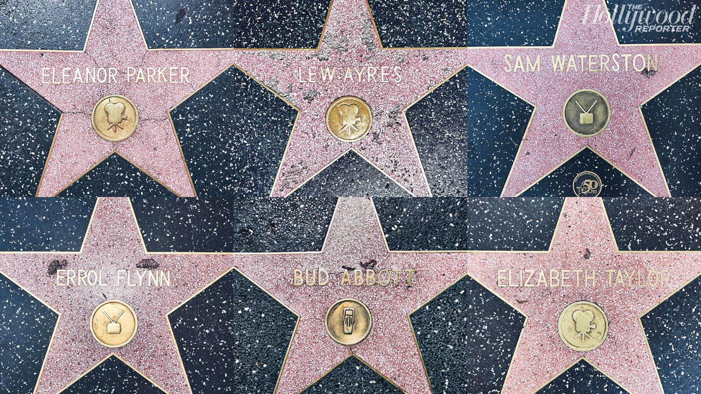
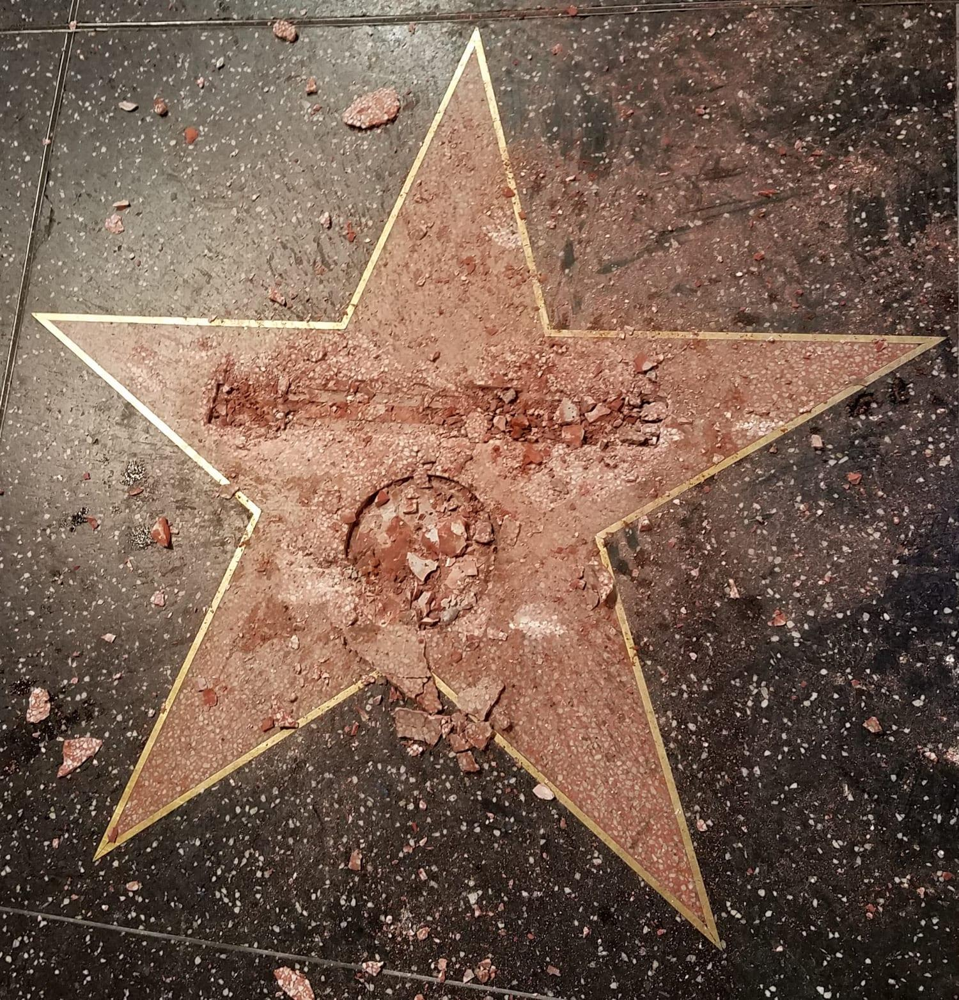

## Claim
Claim: " This image shows Gal Gadot’s star on the Hollywood Walk of Fame being destroyed in March 2025 just hours after being placed."

## Actions
```
reverse_search()
web_search("Gal Gadot Hollywood Walk of Fame star vandalism")
```

## Evidence
No new evidence found.

## Elaboration
The provided evidence does not contain any information about the destruction of Gal Gadot's star on the Hollywood Walk of Fame. The reverse image search and web search did not yield any results. Therefore, the claim cannot be verified.


## Actions
```
web_search("Hollywood Walk of Fame star vandalism")
image_search("Hollywood Walk of Fame star damage")
```

## Evidence
### Evidence from `web_search`
The Jacksonville.com reports that Donald Trump's star on the Hollywood Walk of Fame was vandalized in 2018 using a pickax ([https://www.jacksonville.com/story/news/2018/07/25/trumps-hollywood-walk-of-fame-star-vandalized/11314069007/](https://www.jacksonville.com/story/news/2018/07/25/trumps-hollywood-walk-of-fame-star-vandalized/11314069007/)). Entertainment Weekly published an article discussing whether Gal Gadot's Hollywood Walk of Fame star was destroyed, mentioning that her ceremony was disrupted by protestors and including a photo of her at the ceremony  and a photo of a vandalized star ([https://ew.com/fact-check-was-gal-gadot-s-hollywood-star-destroyed-11700747?srsltid=AfmBOorUGFAgUAMLdDQS1P_JHFaRBhc_qETYSdhReSxztcJSzqjLVKa0](https://ew.com/fact-check-was-gal-gadot-s-hollywood-star-destroyed-11700747?srsltid=AfmBOorUGFAgUAMLdDQS1P_JHFaRBhc_qETYSdhReSxztcJSzqjLVKa0)).

Times Now News fact-checks claims of recent vandalism of Donald Trump's Hollywood Walk of Fame star, stating that no recent vandalism has occurred and that circulating photos are from incidents in 2016 and 2018  ([https://www.timesnownews.com/world/us/us-news/was-donald-trumps-hollywood-star-vandalized-recently-fact-checking-viral-claims-article-119361540](https://www.timesnownews.com/world/us/us-news/was-donald-trumps-hollywood-star-vandalized-recently-fact-checking-viral-claims-article-119361540)).


### Evidence from `image_search`
ABC News shows an image of Donald Trump's star on the Hollywood Walk of Fame being vandalized.  The Hollywood Reporter published an article about the Hollywood Walk of Fame, including an image of several stars. 

NBC News published an article about the vandalism of Donald Trump's star on the Hollywood Walk of Fame. 


## Elaboration
The evidence includes an article from Entertainment Weekly that discusses whether Gal Gadot's Hollywood Walk of Fame star was destroyed. The article mentions that her ceremony was disrupted by protestors. The Times Now News fact-checks claims of recent vandalism of Donald Trump's Hollywood Walk of Fame star, stating that no recent vandalism has occurred and that circulating photos are from incidents in 2016 and 2018. The image search also shows images of vandalized stars, including Donald Trump's.

The evidence does not confirm that Gal Gadot's star was destroyed. The claim is therefore not supported by the evidence.


## Final Judgement
The evidence indicates that the image shows vandalism of a star on the Hollywood Walk of Fame, but it does not confirm that it is Gal Gadot's star. The evidence also suggests that the image is not recent. Therefore, the claim is not supported by the evidence. `false`

### Verdict: FALSE

### Justification
The claim is false. While the image depicts a vandalized star on the Hollywood Walk of Fame, there is no evidence to support that it is Gal Gadot's star or that the vandalism occurred recently. The evidence suggests that the image may be related to the vandalism of Donald Trump's star, which occurred in the past, as reported by [Times Now News](https://www.timesnownews.com/world/us/us-news/was-donald-trumps-hollywood-star-vandalized-recently-fact-checking-viral-claims-article-119361540).
