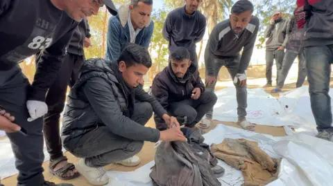

## Claim
Claim: " This is an authentic image of a mother holding the bones of her son in Gaza in March 2025. After more than a year and a half of searching for him under the rubble of their bombed-out house."

## Actions
```
reverse_search()
web_search("mother holding skeleton Gaza")
```

## Evidence
### Evidence from `web_search`
The BBC published an article on January 23, 2025, about the search for missing people in Gaza, including images of human remains and the search for them in the rubble (, , ). The image in the claim is AI-generated and was created by Instagram user "in.visualart" and posted on March 21, 2025 (, ). The Guardian published an article on July 23, 2025, about starvation in Gaza, including a photograph of a skeletal child in a hospital (<image:i>).


## Elaboration
The claim is false. The image is AI-generated and was posted on March 21, 2025, by an Instagram user. The BBC published an article on January 23, 2025, about the search for missing people in Gaza. The Guardian published an article on July 23, 2025, about starvation in Gaza.


## Final Judgement
The claim is demonstrably false because the image is AI-generated and not an authentic photograph. The image was created by an Instagram user and posted in March 2025, while the claim states it is an authentic image.

`false`


### Verdict: FALSE

### Justification
The claim is false. The image is AI-generated and was created by an Instagram user, as confirmed by a reverse image search and web search results, including a BBC article on January 23, 2025, about the search for missing people in Gaza and a Guardian article on July 23, 2025, about starvation in Gaza.
