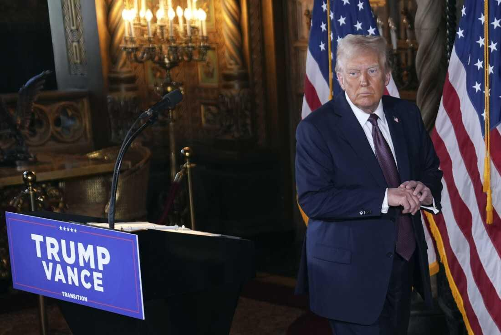

## Claim
Claim: "U.S. President-elect Donald Trump said on January 7, 2025 that if Israeli hostages held by Hamas 'are not back by the time I get into office, all hell will break out in the Middle East'."

## Actions
```
web_search("Donald Trump January 7 2025 Israeli hostages Hamas")
```

## Evidence
### Evidence from `web_search`
On January 7, 2025, NPR ([https://www.npr.org/2025/01/07/nx-s1-5250278/trump-hostages-israel-hamas-middle-east](https://www.npr.org/2025/01/07/nx-s1-5250278/trump-hostages-israel-hamas-middle-east)) reported that President-elect Donald Trump said "all hell will break out" if Hamas does not release hostages by the time he takes office. CNN ([https://www.cnn.com/2025/01/07/politics/trump-warning-gaza-hostages-negotiations-inauguration](https://www.cnn.com/2025/01/07/politics/trump-warning-gaza-hostages-negotiations-inauguration)) also reported on the same day that Trump warned of consequences if hostages were not released by his inauguration.

Reuters ([https://www.reuters.com/world/middle-east/hamas-stands-by-demand-end-gaza-war-under-hostage-deal-trump-deadline-approaches-2025-01-07/](https://www.reuters.com/world/middle-east/hamas-stands-by-demand-end-gaza-war-under-hostage-deal-trump-deadline-approaches-2025-01-07/)) also reported on January 7, 2025, that Trump said there would be "hell to pay" if the hostages were not freed by his inauguration. <image:k>, , , 


## Elaboration
The claim is supported by the evidence. Multiple news sources, including NPR ([https://www.npr.org/2025/01/07/nx-s1-5250278/trump-hostages-israel-hamas-middle-east](https://www.npr.org/2025/01/07/nx-s1-5250278/trump-hostages-israel-hamas-middle-east)), CNN ([https://www.cnn.com/2025/01/07/politics/trump-warning-gaza-hostages-negotiations-inauguration](https://www.cnn.com/2025/01/07/politics/trump-warning-gaza-hostages-negotiations-inauguration)), and Reuters ([https://www.reuters.com/world/middle-east/hamas-stands-by-demand-end-gaza-war-under-hostage-deal-trump-deadline-approaches-2025-01-07/](https://www.reuters.com/world/middle-east/hamas-stands-by-demand-end-gaza-war-under-hostage-deal-trump-deadline-approaches-2025-01-07/)), reported on January 7, 2025, that Donald Trump made statements regarding the release of Israeli hostages held by Hamas. The sources indicate that Trump warned of consequences, using phrases like "all hell will break out" and "hell to pay" if the hostages were not released by the time he took office.


## Final Judgement
Multiple reliable news sources confirm that Donald Trump made statements on January 7, 2025, regarding the release of Israeli hostages held by Hamas. He warned of consequences if the hostages were not released by the time he took office, using phrases like "all hell will break out."

The claim is supported by evidence from multiple reliable sources. Therefore, the claim is factually accurate. `true`


### Verdict: TRUE

### Justification
On January 7, 2025, multiple news outlets, including NPR ([https://www.npr.org/2025/01/07/nx-s1-5250278/trump-hostages-israel-hamas-middle-east](https://www.npr.org/2025/01/07/nx-s1-5250278/trump-hostages-israel-hamas-middle-east)), CNN ([https://www.cnn.com/2025/01/07/politics/trump-warning-gaza-hostages-negotiations-inauguration](https://www.cnn.com/2025/01/07/politics/trump-warning-gaza-hostages-negotiations-inauguration)), and Reuters ([https://www.reuters.com/world/middle-east/hamas-stands-by-demand-end-gaza-war-under-hostage-deal-trump-deadline-approaches-2025-01-07/](https://www.reuters.com/world/middle-east/hamas-stands-by-demand-end-gaza-war-under-hostage-deal-trump-deadline-approaches-2025-01-07/)), reported that Donald Trump stated that if Israeli hostages held by Hamas were not released by the time he took office, there would be serious consequences, including "all hell" breaking out.
