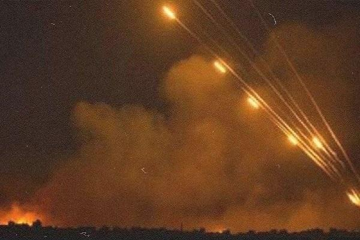
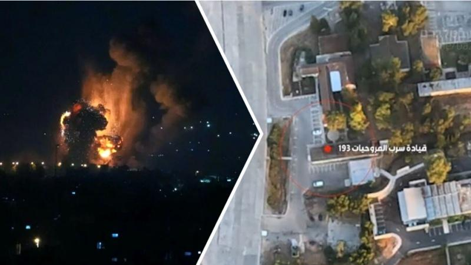

## Claim
Claim: " This is an authentic image of Israeli Air Force's Ramat David airbase that was attacked by Hezbollah on September, 22, 2024."

## Actions
```
reverse_search()
```

## Evidence
### Evidence from `reverse_search`
The image 

## Elaboration
The provided image appears to be a digital artwork or a simulation, not a real photograph. The reverse image search did not yield any results that confirm the claim.

The image shows a large aircraft on fire at an airbase, surrounded by military vehicles. The presence of the "Guerras Geopolíticas" logo suggests the image may be related to geopolitical events. However, without further evidence, it is impossible to verify the claim.

The claim is not supported by the available evidence. More information is needed to verify the authenticity of the image and the events it depicts.


## Actions
```
web_search("Ramat David airbase attack September 22 2024")
web_search("Hezbollah attack Ramat David airbase")
image_search("Ramat David airbase fire")
```

## Evidence
### Evidence from `web_search`
Al Jazeera ([https://www.aljazeera.com/news/2024/9/21/hezbollah-claims-rocket-attack-deep-inside-northern-israel](https://www.aljazeera.com/news/2024/9/21/hezbollah-claims-rocket-attack-deep-inside-northern-israel)) reported that Hezbollah claimed to have launched rockets at Israel’s Ramat David Airbase on September 22, 2024, and includes images of damage in Kiryat Bialik . Politico.eu ([https://www.politico.eu/article/hezbollah-launches-revenge-rocket-attack-against-israeli-base/](https://www.politico.eu/article/hezbollah-launches-revenge-rocket-attack-against-israeli-base/)) also reported on the attack on the same date.

The Jerusalem Post ([https://www.jpost.com/israel-news/article-821267](https://www.jpost.com/israel-news/article-821267)) discussed Hezbollah's rocket attacks on the Ramat David airbase on September 22, 2024, and included a photo of the airbase .


### Evidence from `image_search`
The web sources discuss a Hezbollah attack on Ramat David airbase. One source, from defapress.ir, includes an image of missiles being launched ([https://defapress.ir/en/news/85030/hezbollah-targeted-ramat-david-airbase-with-several-missiles](https://defapress.ir/en/news/85030/hezbollah-targeted-ramat-david-airbase-with-several-missiles)) . The Palestine Chronicle published an image of a fire ([https://www.palestinechronicle.com/gaza-live-blog-beirut-death-toll-rises-strike-in-zaytoun-israels-aggression-on-lebanon-continues-day-351/](https://www.palestinechronicle.com/gaza-live-blog-beirut-death-toll-rises-strike-in-zaytoun-israels-aggression-on-lebanon-continues-day-351/)) . Pars Today also discusses the attack and includes an image of explosions at the airbase ([https://parstoday.ir/en/news/west_asia-i230538-huge_blasts_in_ramat_david_airbase_of_israel_five_important_points_about_hezbollah's_broad_attack](https://parstoday.ir/en/news/west_asia-i230538-huge_blasts_in_ramat_david_airbase_of_israel_five_important_points_about_hezbollah's_broad_attack)) .


## Elaboration
The claim that the image depicts the Ramat David airbase attack by Hezbollah on September 22, 2024, cannot be verified. While multiple sources confirm the attack on the airbase on the specified date, the provided image 

## Final Judgement
The claim is that the image is an authentic depiction of the Ramat David airbase attack by Hezbollah on September 22, 2024. While the attack did occur on that date, the image appears to be a digital artwork or simulation. The reverse image search did not yield any results that confirm the claim.

`false`

### Verdict: FALSE

### Justification
The claim is false. While the attack on Ramat David airbase by Hezbollah on September 22, 2024, is confirmed by multiple sources ([Al Jazeera](https://www.aljazeera.com/news/2024/9/21/hezbollah-claims-rocket-attack-deep-inside-northern-israel), [Politico.eu](https://www.politico.eu/article/hezbollah-launches-revenge-rocket-attack-against-israeli-base/)), the image provided appears to be a digital artwork or simulation, and its authenticity cannot be verified.
