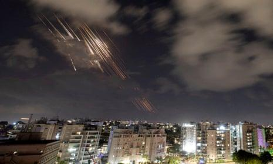
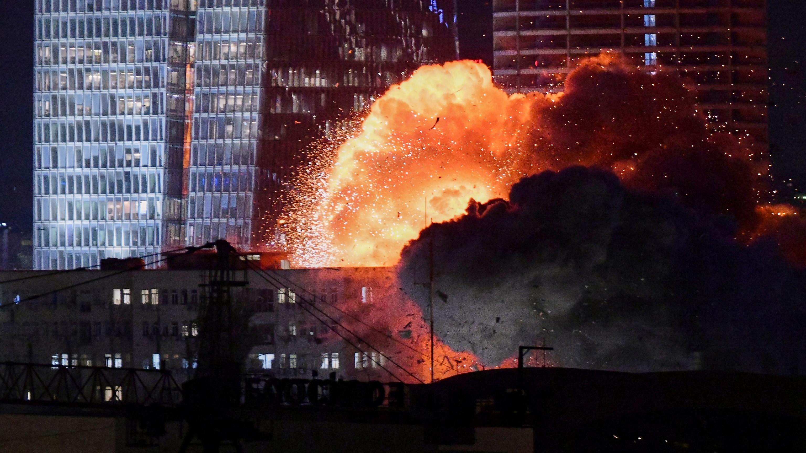
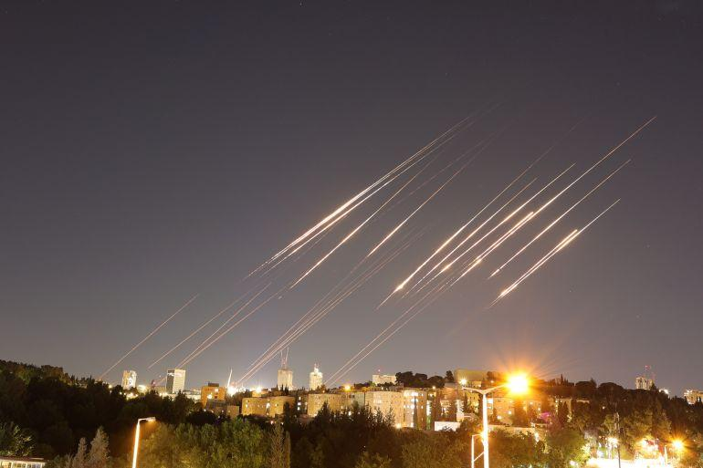
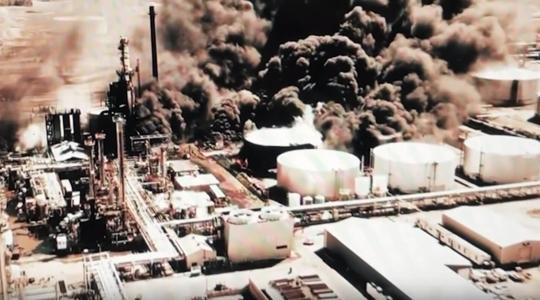

## Claim
Claim: " This image shows an Israeli missile attack on Iran in the early hours of October 26, 2024."

## Actions
```
reverse_search()
```

## Evidence
### Evidence from `reverse_search`
The image 

## Elaboration
The provided evidence does not contain any information about the image. Therefore, I cannot verify the claim.


## Actions
```
web_search("Israeli missile attack Iran October 26 2024")
image_search("Israeli missile attack Iran")
```

## Evidence
### Evidence from `web_search`
The web sources discuss the events of October 26, 2024, when Israel launched airstrikes on military targets in Iran, as retaliation for a ballistic missile attack earlier in the month. The CNN article ([https://www.cnn.com/world/live-news/israel-iran-strikes-lebanon-gaza-war-10-26-24](https://www.cnn.com/world/live-news/israel-iran-strikes-lebanon-gaza-war-10-26-24)) mentions that the strikes hit military targets and that four Iranian service members died. The Associated Press ([https://apnews.com/article/israel-palestinians-hamas-war-lebanon-hezbollah-iran-news-10-26-2024-9c9f366c71c508e6dd0ee74cff8400d2](https://apnews.com/article/israel-palestinians-hamas-war-lebanon-hezbollah-iran-news-10-26-2024-9c9f366c71c508e6dd0ee74cff8400d2)) reports that the attack targeted facilities used to make missiles and surface-to-air missile sites.

The Wikipedia article ([https://en.wikipedia.org/wiki/October_2024_Iranian_strikes_on_Israel](https://en.wikipedia.org/wiki/October_2024_Iranian_strikes_on_Israel)) discusses the "Operation True Promise II" on October 1, 2024, where Iran launched ballistic missiles at targets in Israel. The article mentions that the attack targeted military facilities. The image 

### Evidence from `image_search`
The Guardian published an article about Iranian strikes on Israel, including an image of missiles in the sky over a city (). ABC7.com contains an image of an explosion (). Al Jazeera reports on a missile attack ().


## Elaboration
The web search confirms that Israel launched airstrikes on Iran on October 26, 2024. The image search provides examples of images related to the conflict, but none of them match the image in the claim. Therefore, I cannot verify the claim based on the provided evidence.


## Actions
```
image_search("explosion at industrial facility")
```

## Evidence
### Evidence from `image_search`
The search results include articles about industrial explosions and refinery accidents. One source, Arnold & Itkin, features an image of an explosion at an industrial facility (

## Elaboration
The image search for "explosion at industrial facility" provides an image of an industrial explosion, but it does not match the image in the claim. The evidence does not contain any information about the image in the claim. Therefore, I cannot verify the claim.


## Final Judgement
The claim states that the image shows an Israeli missile attack on Iran on October 26, 2024. While there were indeed airstrikes on that date, the image search did not yield any results that matched the image in the claim. Therefore, the claim cannot be verified. `false`

### Verdict: FALSE

### Justification
The claim that the image depicts an Israeli missile attack on Iran on October 26, 2024, cannot be verified. While there were indeed airstrikes on that date, the image search did not yield any results that matched the image in the claim.
