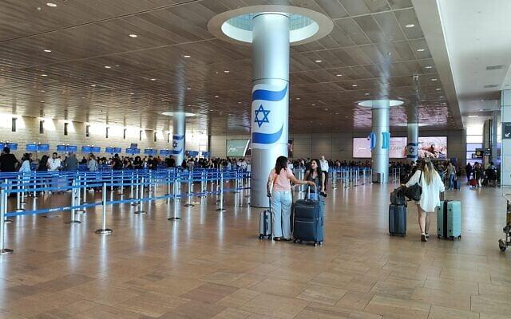
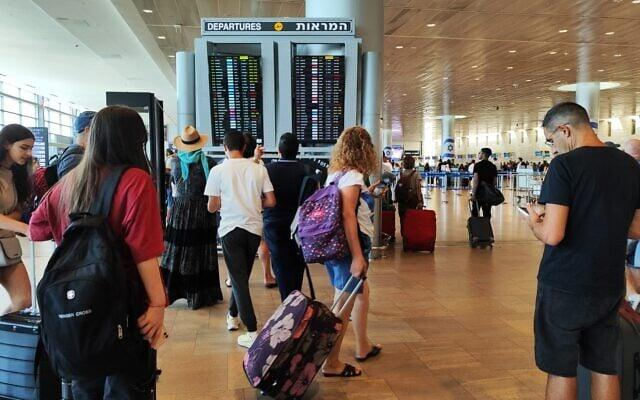
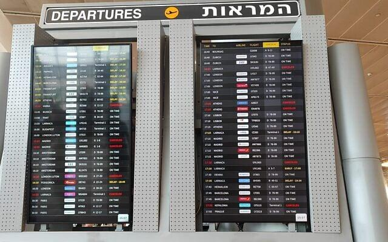
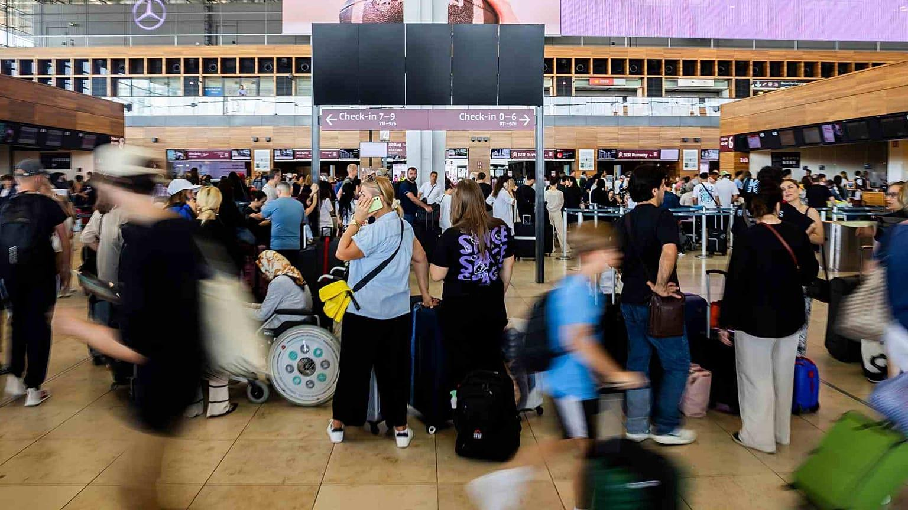
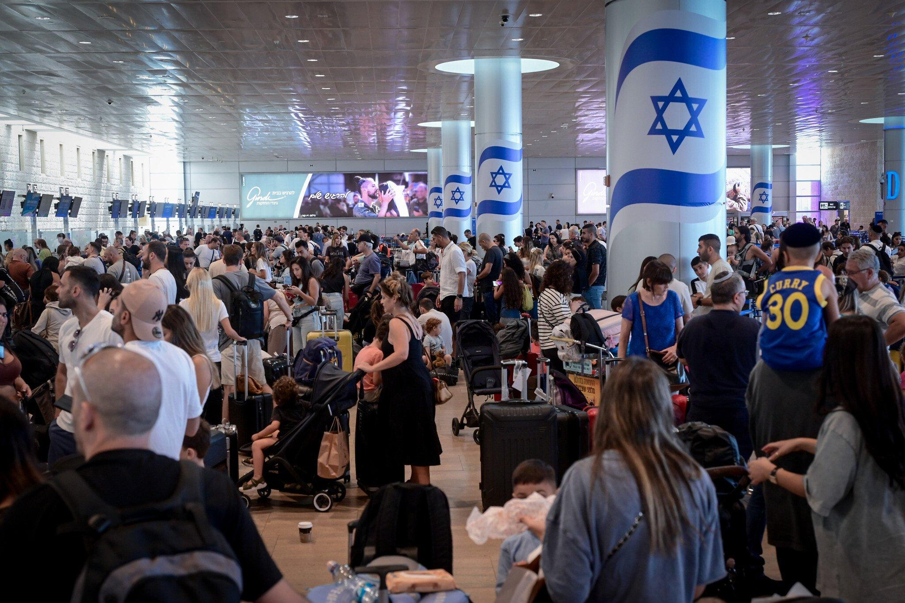

## Claim
Claim: " This image shows Israelis fleeing the airport after the Houthis attack on July 19, 2024."

## Actions
```
reverse_search()
```

## Evidence
### Evidence from `reverse_search`
The image 

## Elaboration
The provided evidence does not contain any information about the image. Therefore, I cannot verify the claim.


## Actions
```
web_search("Houthis attack Israel airport July 19 2024")
web_search("Israel airport crowded July 2024")
```

## Evidence
### Evidence from `web_search`
On July 19, 2024, the Houthis claimed responsibility for a drone attack on Tel Aviv, Israel, resulting in one death and at least 10 injuries, as reported by The Guardian ([https://www.theguardian.com/world/article/2024/jul/19/yemen-houthis-claim-deadly-drone-attack-on-tel-aviv-israel](https://www.theguardian.com/world/article/2024/jul/19/yemen-houthis-claim-deadly-drone-attack-on-tel-aviv-israel)) and Al Jazeera ([https://www.aljazeera.com/news/2024/7/19/drone-attack-on-israels-tel-aviv-leaves-one-dead-at-least-10-injured](https://www.aljazeera.com/news/2024/7/19/drone-attack-on-israels-tel-aviv-leaves-one-dead-at-least-10-injured)). The attack caused a new wave of anxiety in Israel.

The Wikipedia article discusses the Houthi drone attack on Israel on July 19, 2024, and the subsequent Israeli attack on Yemen on July 20, 2024, which resulted in casualties ([https://en.wikipedia.org/wiki/20_July_2024_Israeli_attack_on_Yemen](https://en.wikipedia.org/wiki/20_July_2024_Israeli_attack_on_Yemen)).


### Evidence from `web_search`
The Haaretz article from July 4, 2024, discusses the expected increase in passengers at Ben-Gurion International Airport during the summer, with passenger volume still expected to be lower than in previous summers. The Times of Israel published an article on August 4, 2024, discussing the situation at Ben Gurion Airport, mentioning that more than 18 airlines have canceled or suspended flights. The article includes images of the arrivals and departures halls at Ben Gurion Airport on August 4, 2024. , , , .

An article from July 2025 discusses the recovery of tourism in Israel after months of conflict, mentioning that Ben Gurion Airport is operating with its typical crowds and queues.


## Elaboration
The evidence confirms that a Houthi drone attack occurred on July 19, 2024, causing anxiety in Israel. The evidence also shows that Ben Gurion Airport was experiencing increased passenger volume in July and August 2024. However, the provided evidence does not confirm that the image depicts Israelis fleeing the airport after the Houthi attack. The image could depict the general increased passenger volume at the airport.


## Actions
```
image_search("Israel airport crowded July 19 2024")
```

## Evidence
### Evidence from `image_search`
Euronews, The Times of Israel, and CNN published articles that include images of crowded airports. The Euronews article was published on July 19, 2024, and discusses flight delays and cancellations. The Times of Israel article discusses travel chaos at Ben Gurion Airport. The CNN article also includes an image of a crowded airport. , , 


## Elaboration
The evidence indicates that the image could depict a crowded airport, which aligns with reports of increased passenger volume and travel chaos at Ben Gurion Airport in July 2024. However, the evidence does not confirm that the image specifically shows Israelis fleeing the airport after the Houthi attack on July 19, 2024.

**Insufficient Information:** The exact context of the image cannot be determined from the provided evidence.


## Final Judgement
The image shows a crowded airport, which aligns with reports of increased passenger volume at Ben Gurion Airport in July 2024. However, there is no evidence to confirm that the image specifically depicts Israelis fleeing the airport after the Houthi attack on July 19, 2024. Therefore, the claim is not factually accurate. `false`

### Verdict: FALSE

### Justification
The claim is not supported by the evidence. While the image depicts a crowded airport, and there were reports of a Houthi attack and increased passenger volume at Ben Gurion Airport in July 2024, there is no evidence to confirm that the image specifically shows Israelis fleeing the airport after the attack.
