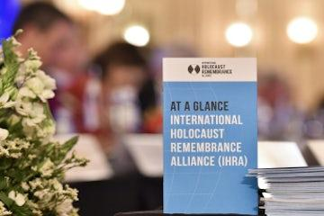

## Claim
Claim: "The World Jewish Congress (WJC) has amended the International Holocaust Remembrance Alliance (IHRA) working definition of antisemitism in March 2025 to include: 'Conflating the assassination of JFK to jews/israel'."

## Actions
```
web_search("World Jewish Congress IHRA antisemitism definition")
web_search("IHRA working definition antisemitism amendment March 2025")
```

## Evidence
### Evidence from `web_search`
The World Jewish Congress (WJC) provides information about the International Holocaust Remembrance Alliance (IHRA) and its working definition of antisemitism. The IHRA adopted a non-legally binding working definition of Antisemitism on May 26, 2016 (, , , , , , ).

The IHRA definition includes examples of antisemitism, such as targeting the state of Israel. The definition has been adopted or endorsed by numerous countries and organizations. The search results do not mention any amendments to the definition, nor do they mention the World Jewish Congress (WJC) or the assassination of JFK.


### Evidence from `web_search`
The IHRA working definition of antisemitism was formally adopted in 2016 and is widely used by governments and institutions. The definition is a tool for combating hate and antisemitism. The article is from July 7, 2025. The Jerusalem Declaration on Antisemitism (JDA) was written in response to the IHRA definition. (, )

The Jewish Council for Public Affairs adopted the IHRA Working Definition of Antisemitism in 2020.


## Elaboration
The evidence does not support the claim. The search results do not mention any amendments to the IHRA definition of antisemitism that include the assassination of JFK. The evidence does mention that the IHRA definition was adopted in 2016 and that the Jewish Council for Public Affairs adopted the definition in 2020. The second search result is from July 7, 2025, but it does not mention the claim.

The claim is not supported by the evidence.


## Final Judgement
The claim that the World Jewish Congress amended the IHRA definition to include "Conflating the assassination of JFK to jews/israel" in March 2025 is not supported by the search results. The search results provide information about the IHRA definition and its adoption, but they do not mention any such amendment. Therefore, the claim is false. `false`

### Verdict: FALSE

### Justification
The provided search results do not support the claim that the World Jewish Congress amended the IHRA definition of antisemitism in March 2025 to include "Conflating the assassination of JFK to jews/israel." The search results discuss the IHRA definition and its adoption but do not mention any such amendment.
