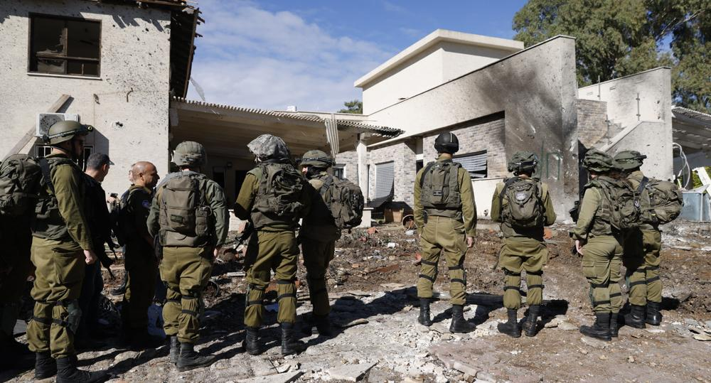
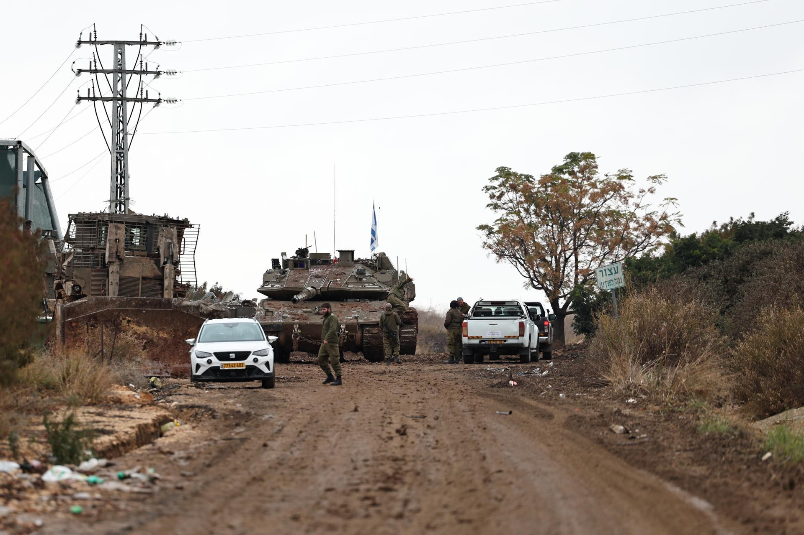
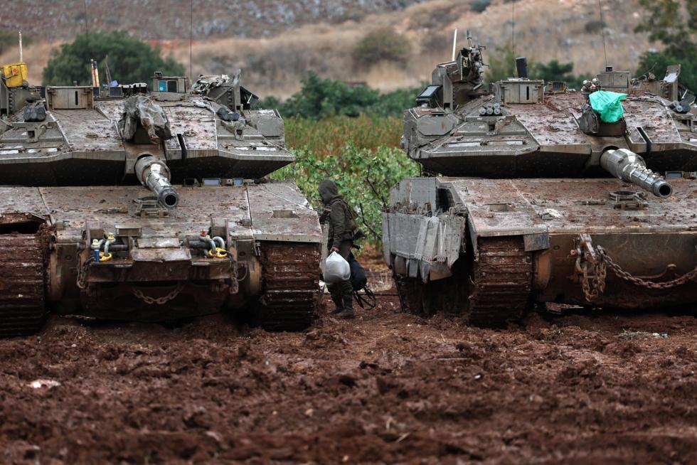
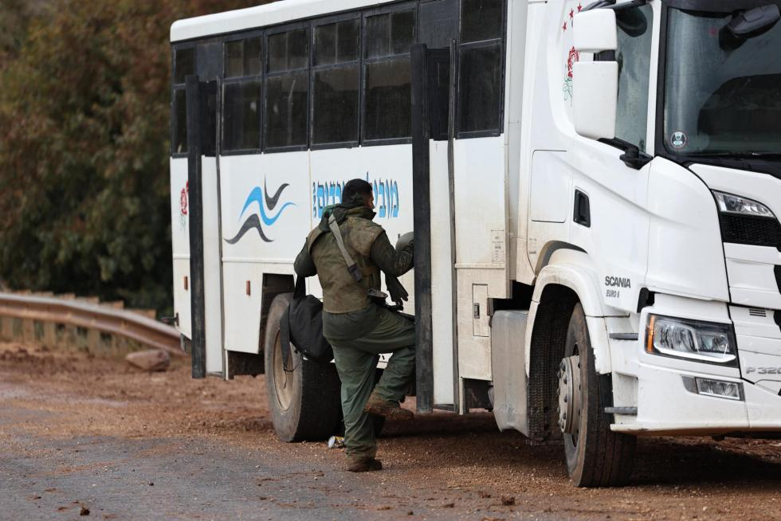

## Claim
Claim: "Commander of the Israeli Air Force, Major General Tomer Bar has been killed by Hеzbollаh in Tel Aviv in a drone attack in November 2024."

## Actions
```
web_search("Tomer Bar killed drone attack November 2024")
```

## Evidence
### Evidence from `web_search`
Press TV reports that Hezbollah claimed to have targeted the residence of Israeli Air Force Commander Major General Tomer Bar in Tel Aviv with a drone attack on November 18, 2024, which was subject to censorship by Israeli authorities. The article also mentions damage to Israeli infrastructure caused by Hezbollah since October 2023. ([https://www.presstv.ir/Detail/2024/11/27/738007/Lebanon-Hezbollah-residence-Tomer-Bar-attack-drones](https://www.presstv.ir/Detail/2024/11/27/738007/Lebanon-Hezbollah-residence-Tomer-Bar-attack-drones)) 

EFE also reported on November 27, 2024, that Hezbollah claimed to have attacked the Tel Aviv residence of the head of the Israeli air force. ([https://efe.com/en/latest-news/2024-11-27/israel-hezbollah-ceasefire-2/](https://efe.com/en/latest-news/2024-11-27/israel-hezbollah-ceasefire-2/)) , , 


## Elaboration
The evidence indicates that Hezbollah claimed to have targeted the residence of Israeli Air Force Commander Major General Tomer Bar in Tel Aviv with a drone attack on November 18, 2024. However, the evidence does not explicitly state that Major General Tomer Bar was killed in the attack.

The Press TV article mentions that the attack was subject to censorship by Israeli authorities. This suggests that the full extent of the damage or casualties might not be fully disclosed.

To verify the claim, information is missing regarding the outcome of the attack, specifically whether Major General Tomer Bar was killed.


## Actions
```
web_search("Tomer Bar death drone attack November 2024")
```

## Evidence
### Evidence from `web_search`
From [Source](https://english.almayadeen.net/latestnews/2024/11/26/lebanese-resistance--on-18-november--one-of-critical-militar): 
Content: Al Mayadeen reports that on November 18, 2024, the residence of Israeli Air Force chief Tomer Bar in Tel Aviv was struck by a swarm of attack drones. The report also mentions that Israeli censorship imposed a strict gag order on the incident. The article was published on November 26, 2024.


## Elaboration
The new evidence from Al Mayadeen confirms the drone attack on Tomer Bar's residence in Tel Aviv on November 18, 2024, and reiterates the Israeli censorship of the event. However, the evidence still does not confirm whether Tomer Bar was killed in the attack.

The claim's veracity remains uncertain due to the lack of information about Tomer Bar's status following the attack.


## Actions
```
web_search("Tomer Bar status after drone attack November 2024")
```

## Evidence
### Evidence from `web_search`
Hezbollah claimed to have attacked the residence of Israeli Air Force Commander Major General Tomer Bar in Tel Aviv with a drone attack on November 18, 2024. ([https://www.presstv.ir/Detail/2024/11/27/738007/Lebanon-Hezbollah-residence-Tomer-Bar-attack-drones](https://www.presstv.ir/Detail/2024/11/27/738007/Lebanon-Hezbollah-residence-Tomer-Bar-attack-drones))  and ([https://efe.com/en/latest-news/2024-11-27/israel-hezbollah-ceasefire-2/](https://efe.com/en/latest-news/2024-11-27/israel-hezbollah-ceasefire-2/)) , ,  Israeli authorities imposed censorship on the incident.

However, there is no information in the provided sources confirming that Major General Tomer Bar was killed in the attack.


## Elaboration
The evidence confirms that Hezbollah claimed to have attacked the residence of Israeli Air Force Commander Major General Tomer Bar in Tel Aviv with a drone on November 18, 2024. However, the evidence does not confirm the claim that Major General Tomer Bar was killed in the attack. The sources also mention Israeli censorship, which may explain the lack of information about the outcome of the attack.

**Insufficient information to verify the claim.**


## Final Judgement
The available evidence confirms that Hezbollah claimed to have attacked the residence of Israeli Air Force Commander Tomer Bar in Tel Aviv with a drone on November 18, 2024. However, the evidence does not confirm that Tomer Bar was killed in the attack. Due to the lack of information about Tomer Bar's status after the attack, the claim cannot be verified.

`not enough information`


### Verdict: NEI

### Justification
The claim cannot be verified. While multiple sources ([Press TV](https://www.presstv.ir/Detail/2024/11/27/738007/Lebanon-Hezbollah-residence-Tomer-Bar-attack-drones), [EFE](https://efe.com/en/latest-news/2024-11-27/israel-hezbollah-ceasefire-2/), and [Al Mayadeen](https://english.almayadeen.net/latestnews/2024/11/26/lebanese-resistance--on-18-november--one-of-critical-militar)) report that Hezbollah claimed to have attacked the residence of Israeli Air Force Commander Tomer Bar in Tel Aviv with a drone on November 18, 2024, none of the provided evidence confirms that he was killed in the attack. Furthermore, the sources mention Israeli censorship, which may explain the lack of information about the outcome of the attack.
