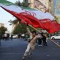
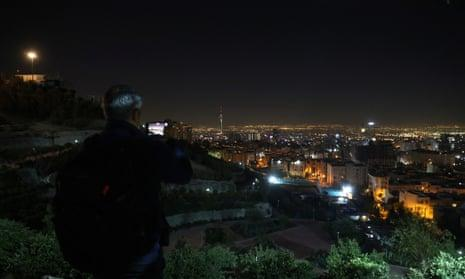

## Claim
Claim: " This image shows Israel bombing Tehran on October 26, 2024."

## Actions
```
reverse_search()
web_search("Israel bombing Tehran October 26 2024")
```

## Evidence
### Evidence from `reverse_search`
The image in the claim () appears in articles about a fire at an oil refinery near Tehran. The Times of Israel ([https://www.timesofisrael.com/liveblog_entry/huge-fire-at-refinery-near-tehran-extinguished-after-20-hours-report/](https://www.timesofisrael.com/liveblog_entry/huge-fire-at-refinery-near-tehran-extinguished-after-20-hours-report/)) and The New Arab ([https://www.newarab.com/news/massive-fire-breaks-out-oil-refinery-near-irans-capital](https://www.newarab.com/news/massive-fire-breaks-out-oil-refinery-near-irans-capital)) published articles on June 2, 2021, with the image. The Globe and Mail ([https://www.theglobeandmail.com/world/article-massive-fire-breaks-out-at-oil-refinery-south-of-tehran/](https://www.theglobeandmail.com/world/article-massive-fire-breaks-out-at-oil-refinery-south-of-tehran/)) also used the image.


### Evidence from `web_search`
The CNN article ([https://www.cnn.com/world/live-news/israel-iran-strikes-lebanon-gaza-war-10-26-24](https://www.cnn.com/world/live-news/israel-iran-strikes-lebanon-gaza-war-10-26-24)) reports on Israeli strikes against Iran on October 26, 2024, showing a general view of Tehran after explosions were heard. The article mentions that Israel hit military targets and that four Iranian military members were killed. 

The NPR article ([https://www.npr.org/2024/10/25/nx-s1-5165574/israel-iran-airstrikes-tehran](https://www.npr.org/2024/10/25/nx-s1-5165574/israel-iran-airstrikes-tehran)) reports that Israel conducted airstrikes on military targets in Iran in response to months of attacks from Iran.  The Guardian ([https://www.theguardian.com/world/2024/oct/26/idf-israel-iran-strikes-explosions-tehran](https://www.theguardian.com/world/2024/oct/26/idf-israel-iran-strikes-explosions-tehran)) reports that Israel launched airstrikes against military targets in Iran on October 26, 2024, in retaliation for attacks against Israel.  The article mentions explosions in Tehran and Karaj.


## Elaboration
The claim is partially accurate. The image (

## Final Judgement
The image in the claim is from a fire at an oil refinery near Tehran in 2021, not from an event in October 2024. However, there were reports of Israeli strikes in Tehran on October 26, 2024.

The claim is `misleading`.

### Verdict: MISLEADING

### Justification
The image in the claim (