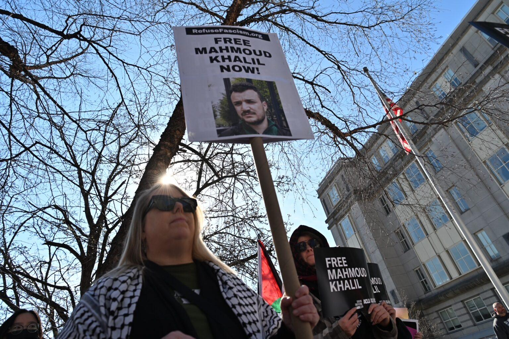
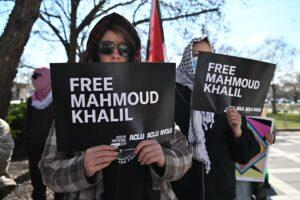

## Claim
Claim: "In March 2025, U.S. Immigration and Customs Enforcement (ICE) agents arrested and detained Palestinian activist Mahmoud Khalil, a lawful permanent resident of the U.S."

## Actions
```
web_search("Mahmoud Khalil ICE arrest March 2025")
web_search("ICE arrests Palestinian activist March 2025")
```

## Evidence
### Evidence from `web_search`
Multiple sources confirm that U.S. Immigration and Customs Enforcement (ICE) agents arrested Mahmoud Khalil in March 2025. According to a Wikipedia article, Khalil is a Palestinian activist and a lawful permanent resident of the U.S. ([https://en.wikipedia.org/wiki/Detention_of_Mahmoud_Khalil](https://en.wikipedia.org/wiki/Detention_of_Mahmoud_Khalil)). The ACLU published a press release stating the same, and also mentioned that Khalil's legal team believed the arrest was in retaliation for his advocacy for Palestinian rights ().

CNN also reported the arrest of Khalil, a Palestinian activist and green card holder, in March ([https://www.cnn.com/2025/07/11/world/mahmoud-khalil-ice-detention-amanpour-interview-intl-hnk](https://www.cnn.com/2025/07/11/world/mahmoud-khalil-ice-detention-amanpour-interview-intl-hnk)) (, , ). The CNN article also mentions that Khalil was detained for over 100 days without charge by ICE.


### Evidence from `web_search`
NPR reported on March 10, 2025, that ICE arrested Palestinian activist Mahmoud Khalil on Saturday in his university-owned apartment. Khalil was a graduate student at Columbia University and was involved in protests against Israel. The article was written by the Associated Press. , 

The New Jersey Monitor reported on June 20, 2025, that Mahmoud Khalil was released from a Louisiana detention center after being detained since March 8, 2025. Khalil was arrested by federal authorities near his New York City apartment. , 

*   [https://www.npr.org/2025/03/10/g-s1-52923/immigration-agents-arrest-palestinian-activist-columbia-protests](https://www.npr.org/2025/03/10/g-s1-52923/immigration-agents-arrest-palestinian-activist-columbia-protests)
*   [https://newjerseymonitor.com/2025/06/20/judge-orders-release-of-columbia-university-activist-facing-deportation/](https://newjerseymonitor.com/2025/06/20/judge-orders-release-of-columbia-university-activist-facing-deportation/)


## Elaboration
The claim is supported by multiple sources. The evidence confirms that Mahmoud Khalil, a Palestinian activist and lawful permanent resident, was arrested by ICE agents in March 2025. The arrest occurred near his apartment in New York City and he was detained for over 100 days.


## Final Judgement
The claim is supported by multiple reliable sources, including CNN, NPR, and the New Jersey Monitor, which confirm that ICE arrested Mahmoud Khalil, a Palestinian activist and lawful permanent resident, in March 2025.

`true`


### Verdict: TRUE

### Justification
Multiple sources, including a [Wikipedia article](https://en.wikipedia.org/wiki/Detention_of_Mahmoud_Khalil), [CNN](https://www.cnn.com/2025/07/11/world/mahmoud-khalil-ice-detention-amanpour-interview-intl-hnk), and [NPR](https://www.npr.org/2025/03/10/g-s1-52923/immigration-agents-arrest-palestinian-activist-columbia-protests), confirm that U.S. Immigration and Customs Enforcement (ICE) agents arrested Mahmoud Khalil, a Palestinian activist and lawful permanent resident of the U.S., in March 2025.
