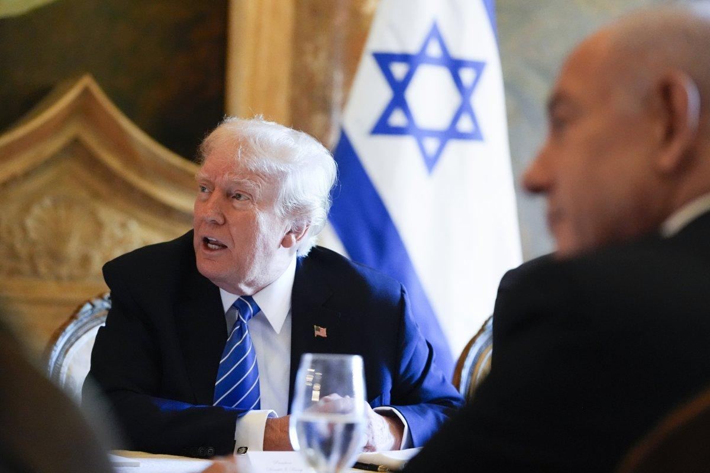

## Claim
Claim: "In a phone call with Benjamin Netanyahu on August 14, 2024, Donald Trump told the Israeli prime minister to stop a Gaza ceasefire deal because it would help Vice President Kamala Harris' 2024 presidential campaign."

## Actions
```
web_search("Donald Trump Benjamin Netanyahu phone call August 14 2024 Gaza ceasefire")
```

## Evidence
### Evidence from `web_search`
Reuters reports that Donald Trump and Benjamin Netanyahu spoke on August 14, 2024, and discussed the Gaza ceasefire and hostage release deal (). Newsweek reported that Trump allegedly called Netanyahu on August 14 to discuss a ceasefire deal, but both Netanyahu's office and Trump denied the call took place ().

NDTV reported that Benjamin Netanyahu denied reports of speaking to Donald Trump about the Gaza ceasefire.

*   [https://www.reuters.com/world/trump-netanyahu-speak-about-gaza-hostage-ceasefire-deal-axios-reports-2024-08-15/](https://www.reuters.com/world/trump-netanyahu-speak-about-gaza-hostage-ceasefire-deal-axios-reports-2024-08-15/)
*   [https://www.newsweek.com/donald-trump-accused-crime-benjamin-netanyahu-call-ceasefire-hamas-1942248](https://www.newsweek.com/donald-trump-accused-crime-benjamin-netanyahu-call-ceasefire-hamas-1942248)
*   [https://www.ndtv.com/world-news/benjamin-netanyahu-denies-reports-of-speaking-to-donald-trump-over-gaza-ceasefire-6343281](https://www.ndtv.com/world-news/benjamin-netanyahu-denies-reports-of-speaking-to-donald-trump-over-gaza-ceasefire-6343281)


## Elaboration
The evidence presents conflicting reports regarding the phone call between Trump and Netanyahu. Reuters indicates that they spoke and discussed the Gaza ceasefire, while Newsweek reports that both Trump and Netanyahu denied the call took place. NDTV also reported that Netanyahu denied the call.

The evidence does not provide any information about Trump's alleged motivations for the call, such as the claim that he wanted to influence the ceasefire to affect Kamala Harris's campaign.

Therefore, the claim cannot be verified due to conflicting reports about the phone call and the absence of information about Trump's alleged motivations.


## Actions
```
web_search("Donald Trump Kamala Harris Gaza ceasefire political motivation")
```

## Evidence
### Evidence from `web_search`
NPR reports that Kamala Harris supports Israel's right to defend itself and is pushing for a ceasefire deal, while Donald Trump criticized her stance on Israel on Truth Social (, , ). The Times of Israel states that both Trump and Harris want an end to the war in Gaza, with Harris focusing on a ceasefire and Trump emphasizing Israeli victory (). Al Jazeera reports that Trump's role in the Gaza ceasefire agreement has led to anger with Biden among Arab Americans, with Trump claiming credit for the agreement ().

*   [https://www.npr.org/2024/08/23/g-s1-19232/kamala-harris-israel-gaza-dnc](https://www.npr.org/2024/08/23/g-s1-19232/kamala-harris-israel-gaza-dnc)
*   [https://www.timesofisrael.com/how-donald-trump-and-kamala-harris-differ-and-agree-on-middle-east-policy/](https://www.timesofisrael.com/how-donald-trump-and-kamala-harris-differ-and-agree-on-middle-east-policy/)
*   [https://www.aljazeera.com/news/2025/1/17/trumps-role-in-gaza-ceasefire-fuels-arab-american-anger-with-biden](https://www.aljazeera.com/news/2025/1/17/trumps-role-in-gaza-ceasefire-fuels-arab-american-anger-with-biden)


## Elaboration
The new evidence reveals that Donald Trump and Kamala Harris have different approaches to the Gaza conflict. Harris supports a ceasefire, while Trump emphasizes Israeli victory. The evidence does not provide any information about Trump's alleged motivations for the call, such as the claim that he wanted to influence the ceasefire to affect Kamala Harris's campaign.

Therefore, the claim cannot be verified.


## Actions
```
web_search("Donald Trump Kamala Harris Gaza ceasefire political campaign")
```

## Evidence
### Evidence from `web_search`
From [Source](https://www.columnblog.com/p/if-harris-opposes-trumps-horrific): 
Content: The Column, published on May 19, 2025, discusses the political debate surrounding Kamala Harris's stance on the Gaza conflict and her potential differences with Donald Trump's policies. The article suggests that Harris should publicly criticize Trump's policies on Gaza to gain political points and pressure the White House. .


## Elaboration
The evidence suggests that Kamala Harris and Donald Trump have different stances on the Gaza conflict, with Harris supporting a ceasefire and Trump emphasizing Israeli victory. The Column article suggests that Harris could use her stance on Gaza to gain political points. However, the evidence does not provide any information about Trump's alleged motivations for the call, such as the claim that he wanted to influence the ceasefire to affect Kamala Harris's campaign.

Therefore, the claim cannot be verified.


## Final Judgement
The claim cannot be verified because there are conflicting reports about the phone call between Trump and Netanyahu, and there is no evidence to support the assertion that Trump's motivation was to affect Kamala Harris's campaign. `not enough information`


### Verdict: NEI

### Justification
The claim cannot be verified. While there are reports of a phone call between Donald Trump and Benjamin Netanyahu on August 14, 2024, the existence of the call is disputed by both Trump and Netanyahu's offices, as reported by [Newsweek](https://www.newsweek.com/donald-trump-accused-crime-benjamin-netanyahu-call-ceasefire-hamas-1942248) and [NDTV](https://www.ndtv.com/world-news/benjamin-netanyahu-denies-reports-of-speaking-to-donald-trump-over-gaza-ceasefire-6343281). Furthermore, there is no evidence to support the assertion that Trump's motivation was to influence the ceasefire to affect Kamala Harris's campaign.
