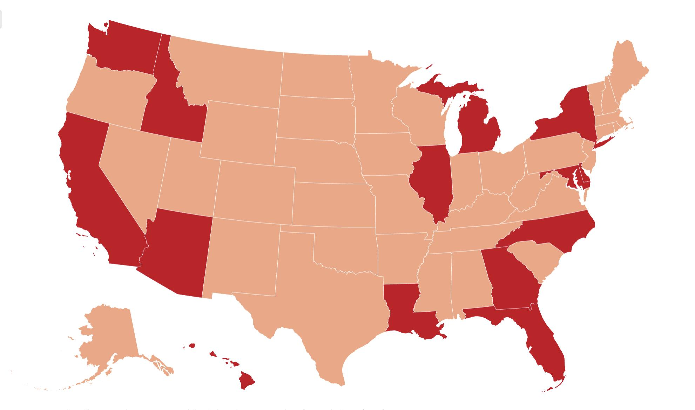

## Claim
Claim: "As the tensions between Israel and Hezbollah escalate in October, 2024, the U.S. government is offering Americans loans to pay for flights out of Lebanon while they have been flying Israeli citizens out of Israel on chartered flights for a year 'on US taxpayers' dime."

## Actions
```
web_search("US government loans for Americans Lebanon flights October 2024")
web_search("US chartered flights for Israeli citizens")
```

## Evidence
### Evidence from `web_search`
The U.S. government is assisting Americans in Lebanon by organizing flights and offering loans for those who cannot afford tickets, as reported by multiple sources in October 2024. The U.S. Embassy in Beirut is offering loans to Americans for flight tickets. The U.S. has made over 1400 seats available on flights out of Lebanon. The articles mention escalating conflict between Hezbollah and Israel.

Sources: [Texas Standard](https://www.texasstandard.org/stories/how-americans-can-leave-lebanon-beirut-us-citizens-assistance-embassy/), [Yahoo News](https://www.yahoo.com/news/us-organizing-flights-lebanon-offering-202227102.html), [NBC Washington](https://www.nbcwashington.com/news/national-international/us-middle-east-tensions-american-flights/3733059/). , , , , , 


### Evidence from `web_search`
Newsweek reports that the State Department has begun "assisted departure flights" for U.S. citizens and lawful residents out of Israel, mentioning "Operation Exodus" and options to leave via cruise ship, commercial or charter flight or a few US Gov't operated flights (). CBS News reports that evacuation flights are underway to bring back Americans from Israel, led by Florida, especially for college students (). Reuters reports that the U.S. government will provide charter flights to Europe to help Americans leave Israel, starting Friday, October 13, 2023 (). Americans will be asked to sign an agreement to repay the U.S. The U.S. State Department is also offering transit options to Athens or Frankfurt, or sea from Haifa to Cyprus.

*   [https://www.newsweek.com/state-dept-starts-exit-flights-israel-trump-mulls-war-entry-2088832](https://www.newsweek.com/state-dept-starts-exit-flights-israel-trump-mulls-war-entry-2088832)
*   [https://www.cbsnews.com/miami/news/gov-desantis-speaks-live-after-americans-trapped-in-israel-arrive-at-tampa-international-airport/](https://www.cbsnews.com/miami/news/gov-desantis-speaks-live-after-americans-trapped-in-israel-arrive-at-tampa-international-airport/)
*   [https://www.reuters.com/world/us/us-working-charter-flights-help-americans-leave-israel-sources-2023-10-12/](https://www.reuters.com/world/us/us-working-charter-flights-help-americans-leave-israel-sources-2023-10-12/)


## Elaboration
The U.S. government is offering loans to Americans for flights out of Lebanon in October 2024, as tensions escalate between Israel and Hezbollah. The U.S. is also providing charter flights to help Americans leave Israel, starting in October 2023.

The evidence supports the claim that the U.S. government is assisting Americans in both Lebanon and Israel with flights. However, the evidence does not specify that the U.S. has been flying Israeli citizens out of Israel on chartered flights for a year.

Therefore, the claim is partially supported, but the statement about flying Israeli citizens for a year requires further verification.


## Final Judgement
The claim is partially true. The U.S. government is offering loans and organizing flights for Americans in Lebanon and has been providing charter flights for Americans leaving Israel. However, the claim that the U.S. has been flying Israeli citizens out of Israel on chartered flights for a year is not supported by the evidence. `misleading`

### Verdict: MISLEADING

### Justification
The U.S. government is providing assistance to Americans in Lebanon, including offering loans for flights, as tensions escalate in October 2024, as reported by sources like [Texas Standard](https://www.texasstandard.org/stories/how-americans-can-leave-lebanon-beirut-us-citizens-assistance-embassy/), [Yahoo News](https://www.yahoo.com/news/us-organizing-flights-lebanon-offering-202227102.html), and [NBC Washington](https://www.nbcwashington.com/news/national-international/us-middle-east-tensions-american-flights/3733059/). Additionally, the U.S. has been organizing charter flights for Americans leaving Israel since October 2023, as indicated by [Reuters](https://www.reuters.com/world/us/us-working-charter-flights-help-americans-leave-israel-sources-2023-10-12/). However, the claim that the U.S. has been flying Israeli citizens out of Israel on chartered flights for a year is not supported by the provided evidence.
