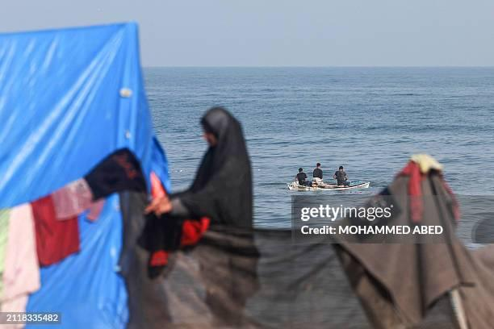

## Claim
Claim: " This image shows a Palestinian woman using an Israeli tank to dry clothes in Gaza in July 2024."

## Actions
```
reverse_search()
web_search("Israeli tank Palestinian woman Gaza")
```

## Evidence
### Evidence from `web_search`
The search results include articles discussing the killing of a Palestinian girl by Israeli forces in Gaza on January 29, 2024, as reported on Wikipedia ([https://en.wikipedia.org/wiki/Killing_of_Hind_Rajab](https://en.wikipedia.org/wiki/Killing_of_Hind_Rajab)). Another article from Euro-Med Human Rights Monitor, published on June 30, 2024, discusses the Israeli army's actions in Gaza ([https://euromedmonitor.org/en/article/6385/A-compound-crime:-Israeli-army-hits-Gaza-family,-uses-them-as-human-shields,-and-runs-over-their-mother](https://euromedmonitor.org/en/article/6385/A-compound-crime:-Israeli-army-hits-Gaza-family,-uses-them-as-human-shields,-and-runs-over-their-mother)).

NPR reported on July 19, 2025, that 32 Palestinians were killed by Israeli troops while trying to reach food distribution hubs in Gaza ([https://www.npr.org/2025/07/19/g-s1-78420/palestinians-food-aid-deaths](https://www.npr.org/2025/07/19/g-s1-78420/palestinians-food-aid-deaths)). 

## Elaboration
The evidence provides information about events in Gaza, including the killing of a Palestinian girl in January 2024 ([https://en.wikipedia.org/wiki/Killing_of_Hind_Rajab](https://en.wikipedia.org/wiki/Killing_of_Hind_Rajab)), actions by the Israeli army in June 2024 ([https://euromedmonitor.org/en/article/6385/A-compound-crime:-Israeli-army-hits-Gaza-family,-uses-them-as-human-shields,-and-runs-over-their-mother](https://euromedmonitor.org/en/article/6385/A-compound-crime:-Israeli-army-hits-Gaza-family,-uses-them-as-human-shields,-and-runs-over-their-mother)), and the killing of Palestinians in July 2025 ([https://www.npr.org/2025/07/19/g-s1-78420/palestinians-food-aid-deaths](https://www.npr.org/2025/07/19/g-s1-78420/palestinians-food-aid-deaths)).

The evidence does not directly verify the claim about the image. It does not mention the image or its context.

To verify the claim, information about the image's origin, the tank's identification, and the woman's identity is missing.


## Actions
```
image_search("tank drying clothes Gaza")
```

## Evidence
### Evidence from `image_search`
Al Jazeera published an article on November 25, 2024, about flooding in Gaza, which includes a photograph of a woman near a tent (

## Elaboration
The new evidence provides an image of a woman near a tent in Gaza, but it does not contain any information about the tank in the original claim. Therefore, the claim remains unverified.


## Actions
```
image_search("tank drying clothes Palestinian woman")
```

## Evidence
### Evidence from `image_search`
The Getty Images website contains an image of a displaced Palestinian woman hanging clothes to dry (

## Elaboration
The evidence includes an image of a displaced Palestinian woman hanging clothes to dry, but it does not show a tank. The claim remains unverified.


## Final Judgement
The provided evidence does not confirm the claim. The image search results show images of Palestinian women and tents, but not the tank in the original claim. The claim is about an image that is not verified by the search results. Therefore, the claim is `not enough information`.

### Verdict: NEI

### Justification
The provided evidence does not verify the claim. While the search results include articles about events in Gaza and images of Palestinian women, they do not contain the image of the tank with clothes drying on it. Therefore, the claim cannot be verified due to a lack of information.
