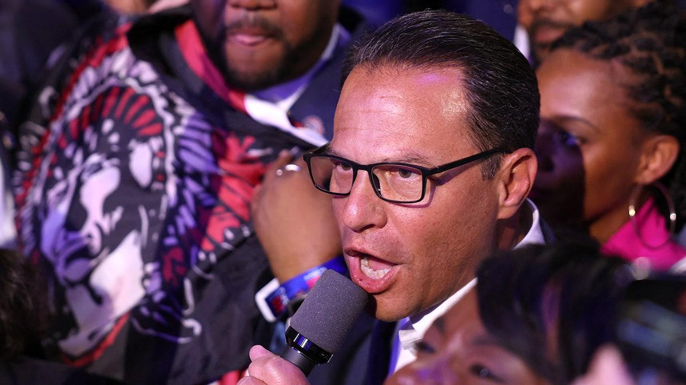

## Claim
Claim: " This image shows Ukrainian President Volodymyr Zelenskyy in March 2025 signing Israeli bombs intended for use against Palestinians in Gaza."

## Actions
```
reverse_search()
web_search("Zelenskyy signing bombs")
```

## Evidence
### Evidence from `reverse_search`
The image shows Ukrainian President Volodymyr Zelenskyy signing ammunition at the Scranton Army Ammunition Plant on September 23, 2024. The BBC published articles on September 26, 2024, about Zelenskyy's visit to the White House to discuss his "victory plan" and included the image. The Associated Press reported that House Speaker Mike Johnson is demanding Zelenskyy remove Ukraine’s ambassador to the U.S. after Zelenskyy's visit to the ammunition plant.

The articles can be found on the BBC ([https://www.bbc.co.uk/news/articles/c80rkv0k4j8o](https://www.bbc.co.uk/news/articles/c80rkv0k4j8o)) and ([https://www.bbc.com/news/articles/c80rkv0k4j8o](https://www.bbc.com/news/articles/c80rkv0k4j8o)) and AP News ([https://apnews.com/article/zelenskyy-johnson-ambassador-ukraine-biden-harris-trump-d81b0a055d99cfd4804b3f2c00915d09](https://apnews.com/article/zelenskyy-johnson-ambassador-ukraine-biden-harris-trump-d81b0a055d99cfd4804b3f2c00915d09)).   


### Evidence from `web_search`
The image shows Ukrainian President Volodymyr Zelenskyy signing munitions at the Scranton Army Ammunition Plant in Pennsylvania. The video and still images shared online falsely claimed that Zelenskyy signed artillery shells destined for use in Gaza by Israel. The video was published on September 23, 2024, and Zelenskyy's handwritten messages on the shells reference Ukraine's war with Russia.

The visit stirred controversy. Pennsylvania Democratic Gov. Josh Shapiro was also present. Zelenskyy inscribed messages on US bombs, including the phrase "Glory to Ukraine."

References: , 


## Elaboration
The claim is false. The image shows Volodymyr Zelenskyy signing ammunition at the Scranton Army Ammunition Plant on September 23, 2024, not in March 2025. The ammunition was not Israeli bombs intended for use against Palestinians in Gaza, but rather US-made munitions. Zelenskyy's handwritten messages on the shells referenced Ukraine's war with Russia.


## Final Judgement
The claim is demonstrably false. The image depicts Zelenskyy signing US-made munitions, not Israeli bombs, and the event occurred in September 2024, not March 2025. The claim misrepresents the origin and purpose of the munitions. `false`

### Verdict: FALSE

### Justification
The image depicts Ukrainian President Volodymyr Zelenskyy signing US-made munitions at the Scranton Army Ammunition Plant on September 23, 2024, not Israeli bombs intended for use against Palestinians in Gaza, as claimed. The event is documented by the BBC ([https://www.bbc.co.uk/news/articles/c80rkv0k4j8o](https://www.bbc.co.uk/news/articles/c80rkv0k4j8o)) and AP News ([https://apnews.com/article/zelenskyy-johnson-ambassador-ukraine-biden-harris-trump-d81b0a055d99cfd4804b3f2c00915d09](https://apnews.com/article/zelenskyy-johnson-ambassador-ukraine-biden-harris-trump-d81b0a055d99cfd4804b3f2c00915d09)).
