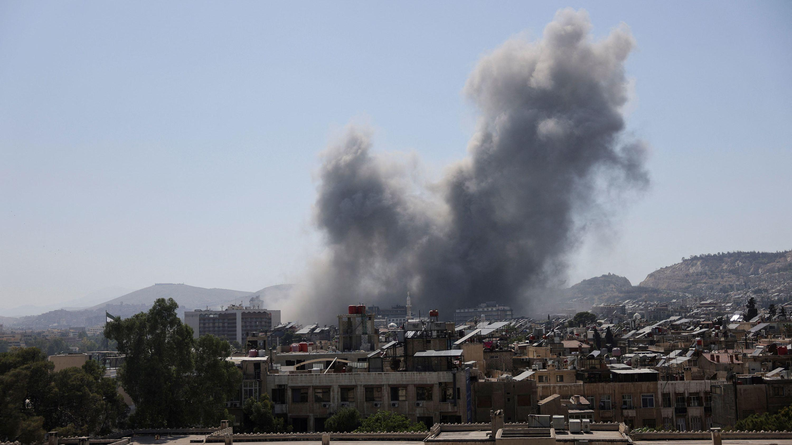
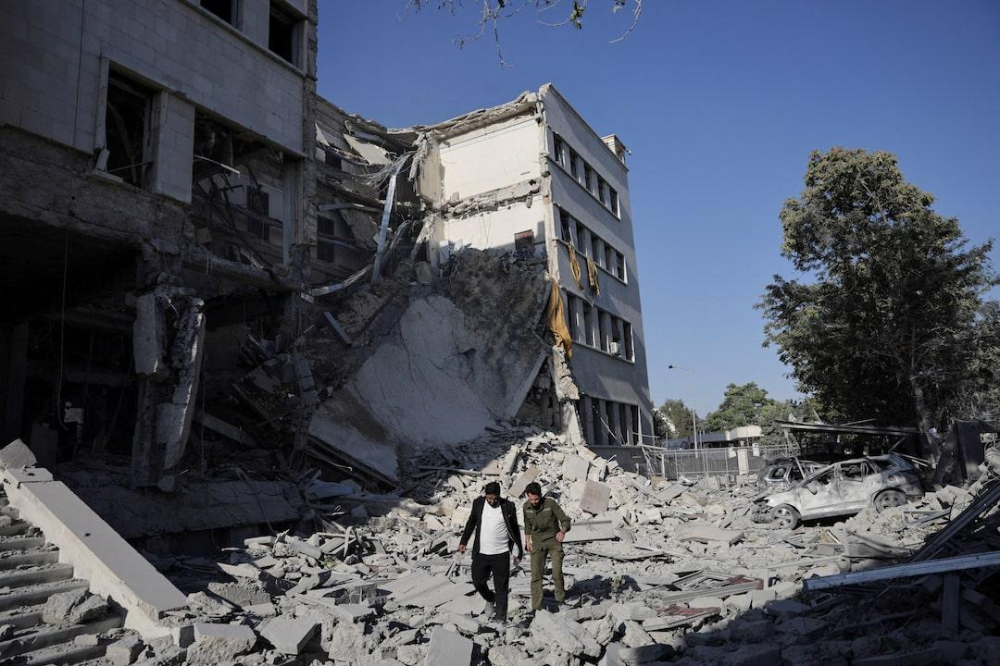

## Claim
Claim: "Turkey's President urged the U.S. in March 2025 to control its ally Israel over its intervention in southern Syria in February 2025."

## Actions
```
web_search("Turkey President US Israel Syria February 2025")
```

## Evidence
### Evidence from `web_search`
According to a CNN article published on July 18, 2025, Israel and Syria agreed to a ceasefire, which Turkey embraced. The US Secretary of State discussed the matter with the Turkish Foreign Minister. ([https://www.cnn.com/2025/07/18/middleeast/israel-syria-ceasefire-latam-intl](https://www.cnn.com/2025/07/18/middleeast/israel-syria-ceasefire-latam-intl)) 

Reuters reported on July 18, 2025, about the ceasefire agreement between Israel and Syria, supported by Turkey and others, and mentioned Israeli airstrikes in Damascus on July 16, 2025. ([https://www.reuters.com/world/middle-east/israel-syria-agree-ceasefire-us-ambassador-turkey-says-2025-07-18/](https://www.reuters.com/world/middle-east/israel-syria-agree-ceasefire-us-ambassador-turkey-says-2025-07-18/)) 

The Arab Weekly reported that on February 4, 2025, Turkish President Recep Tayyip Erdogan met with Syria’s interim President Ahmed al-Sharaa, accusing Israel of aggression and calling for international intervention. ([https://www.thearabweekly.com/turkey-grapples-over-answer-israels-destabilising-intervention-syria-agendas-collide](https://www.thearabweekly.com/turkey-grapples-over-answer-israels-destabilising-intervention-syria-agendas-collide)) , , 


## Elaboration
The Arab Weekly reported that on February 4, 2025, the Turkish President met with Syria’s interim President and called for international intervention, accusing Israel of aggression. This aligns with the claim that Turkey's President urged action regarding Israel's intervention in Syria. However, the claim specifies March 2025, while the evidence mentions February 2025.

Therefore, the claim is partially supported. The evidence confirms the Turkish President's actions regarding Israel's intervention in Syria, but the timing is off by a month.

I need more information to verify the claim fully. Specifically, I need to confirm whether the Turkish President urged the U.S. in March 2025.


## Final Judgement
The evidence indicates that the Turkish President did call for international intervention regarding Israel's actions in Syria, but this occurred in February 2025, not March 2025 as the claim states. Since the claim's timing is inaccurate, it is considered misleading.

`misleading`


### Verdict: MISLEADING

### Justification
The claim is misleading. While the Turkish President did call for international intervention regarding Israel's actions in Syria, as reported by the [Arab Weekly](https://www.thearabweekly.com/turkey-grapples-over-answer-israels-destabilising-intervention-syria-agendas-collide), this occurred in February 2025, not March 2025 as the claim states.
