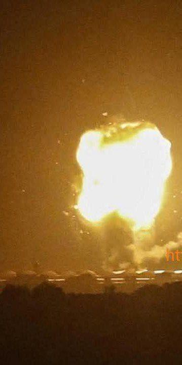

## Claim
Claim: " This image shows Israel bombing the surroundings of Southern Damascus in February 2025, destroying its last remaining army depots."

## Actions
```
reverse_search()
```

## Evidence
### Evidence from `reverse_search`
From [Source](https://daraa24.org/%D8%A5%D8%B5%D8%A7%D8%A8%D8%A9-%D8%B4%D8%A7%D8%A8%D9%8A%D9%86-%D9%81%D9%8A-%D8%A8%D9%84%D8%AF%D8%A9-%D9%86%D8%A7%D8%AD%D8%AA%D8%A9/): Found exact image on website with title: إصابة شابين في بلدة ناحتة شرقي درعا
Content: The search result is from Daraa24.org and contains the exact image. The article is titled "إصابة شابين في بلدة ناحتة شرقي درعا" (Injuring two young men in the town of Nahta, east of Daraa). The article reports that two young men were injured in Nahta, Daraa governorate, during a dispute. 


## Elaboration
The image is associated with an article from Daraa24.org, which reports on the injury of two young men in Nahta, Daraa governorate, during a dispute. The image is not related to Israel bombing the surroundings of Southern Damascus or the destruction of army depots.

The claim is therefore false.


## Final Judgement
The image is not related to Israel bombing the surroundings of Southern Damascus or the destruction of army depots. The image is associated with an article from Daraa24.org, which reports on the injury of two young men in Nahta, Daraa governorate, during a dispute.

`false`

### Verdict: FALSE

### Justification
The image in the claim is associated with an article from [Daraa24.org](https://daraa24.org/%D8%A5%D8%B5%D8%A7%D8%A8%D8%A9-%D8%B4%D8%A7%D8%A8%D9%8A%D9%86-%D9%81%D9%8A-%D8%A8%D9%84%D8%AF%D8%A9-%D9%86%D8%A7%D8%AD%D8%AA%D8%A9/), which reports on the injury of two young men in Nahta, Daraa governorate, during a dispute, and is unrelated to the claim.
