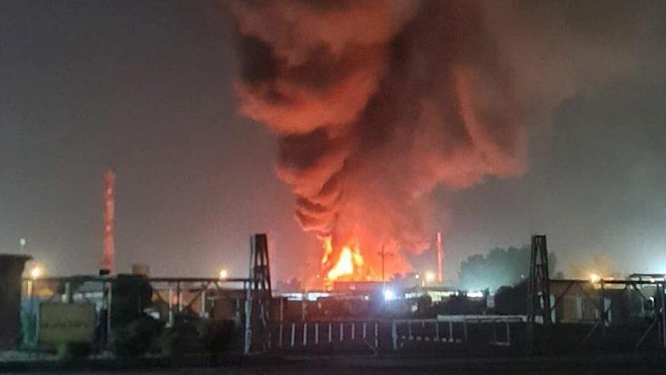
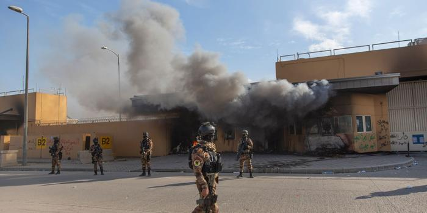

## Claim
Claim: " This image shows a US factility come under attack in Baghdad on September 30, 2024 as the conflict between Israel and the Iran-backed militant group Hezbollah escalated."

## Actions
```
reverse_search()
web_search("Baghdad facility attack September 30 2024")
```

## Evidence
### Evidence from `reverse_search`
The image 

### Evidence from `web_search`
Reuters ([Source](https://www.reuters.com/world/middle-east/rocket-attack-targets-military-base-hosting-us-forces-baghdad-military-sources-2024-09-30/)) reports a rocket attack near Baghdad International Airport on October 1, 2024, targeting a military base hosting U.S. forces. The article mentions rising tensions in the Middle East.

ReliefWeb ([Source](https://reliefweb.int/report/iraq/ishm-september-26-october-3-2024)) discusses attacks on September 30, including attacks by militias on Israel and rockets fired at Baghdad Airport. Wikipedia ([Source](https://en.wikipedia.org/wiki/September_2024_Israeli_attacks_against_Lebanon)) discusses the September 2024 Israeli attacks against Lebanon, which is part of the Israel–Hezbollah conflict (2023–present). The attacks took place between September 23 and September 30, 2024. On September 30, 2024, Hezbollah fired 35 rockets into northern Israel and the Golan Heights. 


## Elaboration
The evidence suggests that the claim is partially accurate. The provided image depicts an explosion, and the web search confirms that there were attacks in Baghdad and escalating tensions between Israel and Hezbollah around September 30, 2024. However, the evidence does not explicitly confirm that the image shows a US facility under attack. The Reuters article mentions a rocket attack near Baghdad International Airport on October 1, 2024, targeting a military base hosting U.S. forces.

The ReliefWeb report mentions attacks on September 30, including attacks by militias and rockets fired at Baghdad Airport. The Wikipedia article discusses the Israel–Hezbollah conflict, which escalated in late September 2024.

Therefore, while the claim's date and location are supported by the evidence, the specific detail about the image depicting a US facility under attack requires further verification.


## Actions
```
image_search("Baghdad explosion September 30 2024")
```

## Evidence
### Evidence from `image_search`
The Guardian published a video on February 8, 2024, showing a car engulfed in flames in Baghdad after a US drone strike (

## Elaboration
The image search did not return any results that match the original image. The only relevant result is a video from The Guardian showing a car on fire in Baghdad after a US drone strike. This does not confirm the claim.

The claim's veracity is still uncertain. The evidence confirms that there were attacks in Baghdad around the specified date, but it does not confirm that the image depicts a US facility under attack. More information is needed to verify the claim.


## Actions
```
image_search("US facility Baghdad explosion")
```

## Evidence
### Evidence from `image_search`
The Stars and Stripes ([Source](https://www.stripes.com/theaters/middle_east/2021-06-01/Militia-attack-on-U.S.-Embassy-in-Baghdad-caused-35-million-in-fire-damage-in-2019-1616430.html)) reported on a militia attack on the U.S. Embassy in Baghdad in 2019, which caused $3.5 million in fire damage.  Iranpress.com ([Source](https://iranpress.com/content/307049/explosion-reported-military-base-iraq-taji-north-baghdad)) reported an explosion at a military base in Taji, north of Baghdad.  Business Insider ([Source](https://www.businessinsider.com/us-embassy-rocket-attack-baghdad-2020-1)) published an article about a rocket attack on the US embassy in Baghdad. 


## Elaboration
The image search provides additional context but does not confirm the claim. The search results show images of attacks on US facilities in Baghdad, including the US Embassy. However, none of the images match the original image. The evidence confirms that US facilities in Baghdad have been attacked, but it does not verify that the original image depicts such an attack.

The claim remains unverified due to the lack of evidence directly linking the image to a US facility attack in Baghdad on September 30, 2024.


## Final Judgement
The evidence indicates that there were attacks in Baghdad around the specified date, and the conflict between Israel and Hezbollah was escalating. However, the image itself has not been directly linked to a US facility attack on September 30, 2024. The image search results show attacks on US facilities in Baghdad, but none of the images match the original one. Therefore, the claim is not fully supported by the available evidence. `false`

### Verdict: FALSE

### Justification
The claim is not supported by the evidence. While there were attacks in Baghdad and escalating tensions between Israel and Hezbollah around September 30, 2024, the image in question has not been directly linked to a US facility attack on that date. The image search results show attacks on US facilities in Baghdad, but none of the images match the original one.
