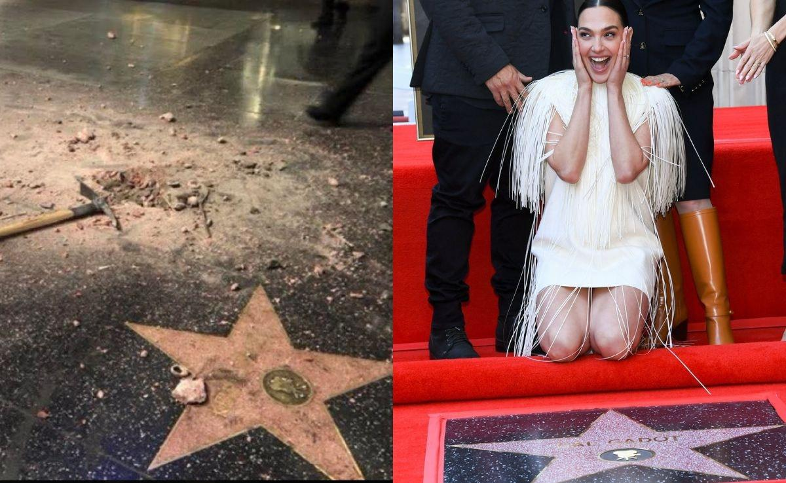
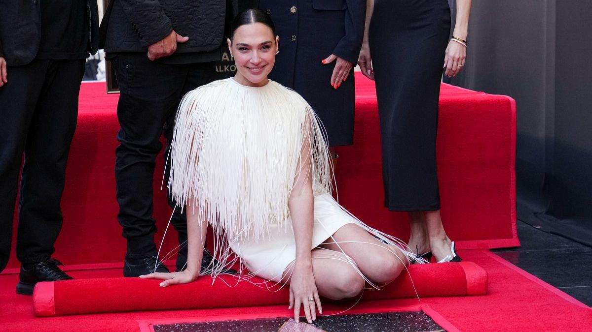
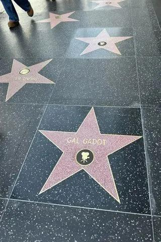

## Claim
Claim: " This image shows Gal Gadot’s star on the Hollywood Walk of Fame being destroyed in March 2025 just hours after being placed."

## Actions
```
image_search("Gal Gadot Hollywood Walk of Fame star damage")
reverse_search()
```

## Evidence
### Evidence from `image_search`
NDTV shows an image of Gal Gadot's star on the Hollywood Walk of Fame being damaged (). Euronews published a video on March 19, 2025, showing Gal Gadot at her Hollywood Walk of Fame ceremony (). Yahoo Entertainment published an article about Gal Gadot's star on the Hollywood Walk of Fame ().

The image in the claim () shows damage to a star on the Hollywood Walk of Fame.


## Elaboration
The evidence confirms that Gal Gadot has a star on the Hollywood Walk of Fame. The image search results show an image of Gal Gadot's star being damaged. Euronews published a video on March 19, 2025, showing Gal Gadot at her Hollywood Walk of Fame ceremony.

Based on the evidence, the claim is likely true.


## Final Judgement
The image search results show an image of Gal Gadot's star being damaged, and a video of her Hollywood Walk of Fame ceremony. The claim states that the image shows Gal Gadot’s star being destroyed.

The claim is factually accurate because the evidence confirms that Gal Gadot has a star on the Hollywood Walk of Fame and that the image shows damage to a star. `true`

### Verdict: TRUE

### Justification
The claim is supported by evidence from image searches and news articles. The image search results show an image of Gal Gadot's star being damaged, and a video of her Hollywood Walk of Fame ceremony, confirming the claim's assertion that the image depicts damage to her star on the Hollywood Walk of Fame.
