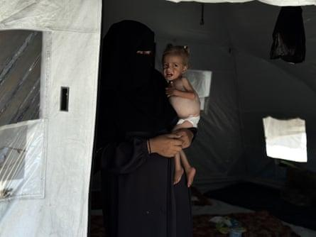
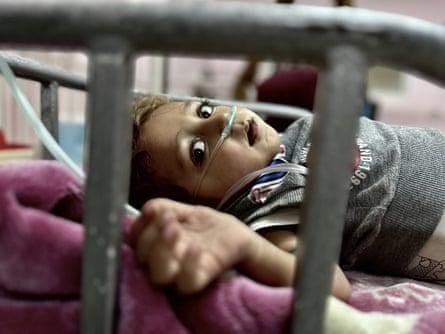
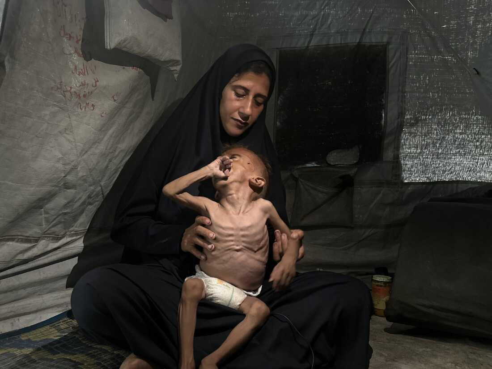
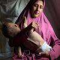
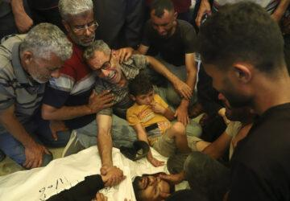

## Claim
Claim: " This is an authentic image of a mother holding the bones of her son in Gaza in March 2025. After more than a year and a half of searching for him under the rubble of their bombed-out house."

## Actions
```
reverse_search()
```

## Evidence
No new evidence found.

## Elaboration
Insufficient information to verify the claim. The reverse image search did not yield any results.


## Actions
```
web_search("Gaza mother holding skeleton")
web_search("Gaza conflict casualties")
```

## Evidence
### Evidence from `web_search`
The Guardian published an article on July 5, 2025, discussing the critical shortage of baby milk in Gaza, with images of a malnourished baby and a child in a hospital bed, and mentioning 66 Palestinian children who have starved to death since October 2023. ([https://www.theguardian.com/world/2025/jul/05/theyre-skin-and-bones-doctors-in-gaza-warn-babies-at-risk-of-death-from-lack-of-formula](https://www.theguardian.com/world/2025/jul/05/theyre-skin-and-bones-doctors-in-gaza-warn-babies-at-risk-of-death-from-lack-of-formula)) The BBC article from January 23, 2025, discusses the search for missing people in Gaza, with images of human remains and a man who found a skeleton in his home. ([https://www.bbc.com/news/articles/c6269pd5y2ko](https://www.bbc.com/news/articles/c6269pd5y2ko))

NPR published an article on August 5, 2025, discussing images of a starving baby in Gaza, Mohammad Al-Motawaq, and his mother, Hidayat Al-Motawaq. ([https://www.npr.org/2025/08/05/nx-s1-5488798/gaza-baby-starvation-update](https://www.npr.org/2025/08/05/nx-s1-5488798/gaza-baby-starvation-update)) The Guardian article includes images of a mother holding her malnourished baby  and a small child lying in a hospital bed . The BBC article includes images of human remains found in the rubble in Rafah  and of a man who found a skeleton in his home . The NPR article includes images of a starving baby , .


### Evidence from `web_search`
The Wikipedia article on casualties of the Gaza war ([https://en.wikipedia.org/wiki/Casualties_of_the_Gaza_war](https://en.wikipedia.org/wiki/Casualties_of_the_Gaza_war)) provides information on casualties, including civilian deaths, and mentions that the death toll in Gaza is likely an undercount. An Al Jazeera article ([https://www.aljazeera.com/news/longform/2023/10/9/israel-hamas-war-in-maps-and-charts-live-tracker](https://www.aljazeera.com/news/longform/2023/10/9/israel-hamas-war-in-maps-and-charts-live-tracker)) mentions a ceasefire and the recovery of bodies, with the death toll in Gaza reaching at least 61,709 people as of February 3, 2025, and at least 14,222 people still believed to be trapped under the rubble. The Associated Press reports that the Palestinian death toll from the Israel-Hamas war passed 55,000 as of June 11, 2025 ([https://www.ap.org/news-highlights/spotlights/2025/more-than-55000-palestinians-have-been-killed-in-the-israel-hamas-war-gaza-health-officials-say/](https://www.ap.org/news-highlights/spotlights/2025/more-than-55000-palestinians-have-been-killed-in-the-israel-hamas-war-gaza-health-officials-say/)). The Al Jazeera article includes images of destruction in Gaza (, ). The AP article includes images of injured Palestinians in a hospital (, , ).


## Elaboration
The evidence confirms that the Gaza conflict has resulted in a high number of casualties, including civilian deaths, and that many people are still missing. The BBC article mentions the discovery of human remains, and the NPR and Guardian articles show images of suffering in Gaza. However, the evidence does not confirm the authenticity of the specific image in the claim.


## Actions
```
image_search("mother holding skeleton Gaza")
```

## Evidence
### Evidence from `image_search`
The image search results include an article from Mondoweiss that shows an image of a skeleton and a shoe  and an article from ABP Live that states the image is digitally generated .


## Elaboration
The image search results indicate that the image in the claim is digitally generated and therefore not authentic.


## Final Judgement
The image search results indicate that the image is digitally generated and not authentic. The claim is therefore false. `false`

### Verdict: FALSE

### Justification
The claim is false. While the Gaza conflict has resulted in numerous casualties and suffering, the image of the mother holding a skeleton is digitally generated, as indicated by image search results from ABP Live and Mondoweiss ([https://www.mondoweiss.net/](https://www.mondoweiss.net/)).
