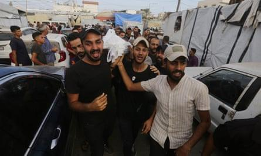

## Claim
Claim: "UK Prime Minister Keir Starmer said in October 2024 that the UK will boycott all diplomatic relations with Israel due to its long lasting war in Gaza."

## Actions
```
web_search("Keir Starmer Israel boycott Gaza October 2024")
```

## Evidence
### Evidence from `web_search`
The article from [MAP](https://www.map.org.uk/news/archive/post/1655-keir-starmer-you-canat-say-you-donat-know-that-israel-is-exterminating-palestinians-in-gaza) published on October 30, 2024, discusses Keir Starmer's stance on the Israel-Gaza conflict. The article includes a photo of Keir Starmer and David Lammy.  Starmer and Lammy claim Israel is an "important ally," but the UK should not be an ally to atrocities.

The Guardian published an article on October 6, 2024, discussing Keir Starmer's call for a ceasefire in Gaza and his urging for unity in Britain. The article mentions Starmer's comments on the anniversary of the October 7 attacks and his commitment to helping bring hostages home. The article also mentions that the government advised Israel to show restraint. , ,  The BBC published an article on June 4, 2024, discussing the pressure on Keir Starmer to take stronger action against Israel regarding the situation in Gaza.  Starmer described the situation in Gaza as "appalling and intolerable" and repeated calls for a ceasefire. He added that further actions against Israel will be considered, including sanctions.


## Elaboration
The evidence suggests that Keir Starmer has expressed strong criticism of Israel's actions in Gaza and has called for a ceasefire. He has also stated that further actions, including sanctions, will be considered. However, the evidence does not explicitly state that Starmer said the UK would boycott all diplomatic relations with Israel.

The article from [MAP](https://www.map.org.uk/news/archive/post/1655-keir-starmer-you-canat-say-you-donat-know-that-israel-is-exterminating-palestinians-in-gaza) mentions that Starmer and Lammy consider Israel an "important ally," which contradicts the claim.

Therefore, the claim is not supported by the provided evidence.


## Final Judgement
The search results show that Keir Starmer has criticized Israel's actions in Gaza and called for a ceasefire, but they do not confirm that he stated the UK would boycott all diplomatic relations with Israel. In fact, one source indicates that Starmer views Israel as an important ally.

`false`


### Verdict: FALSE

### Justification
The evidence indicates that Keir Starmer has criticized Israel's actions in Gaza and called for a ceasefire, but there is no evidence to support the claim that he stated the UK would boycott all diplomatic relations with Israel. Furthermore, one source suggests that Starmer views Israel as an important ally, contradicting the claim.
