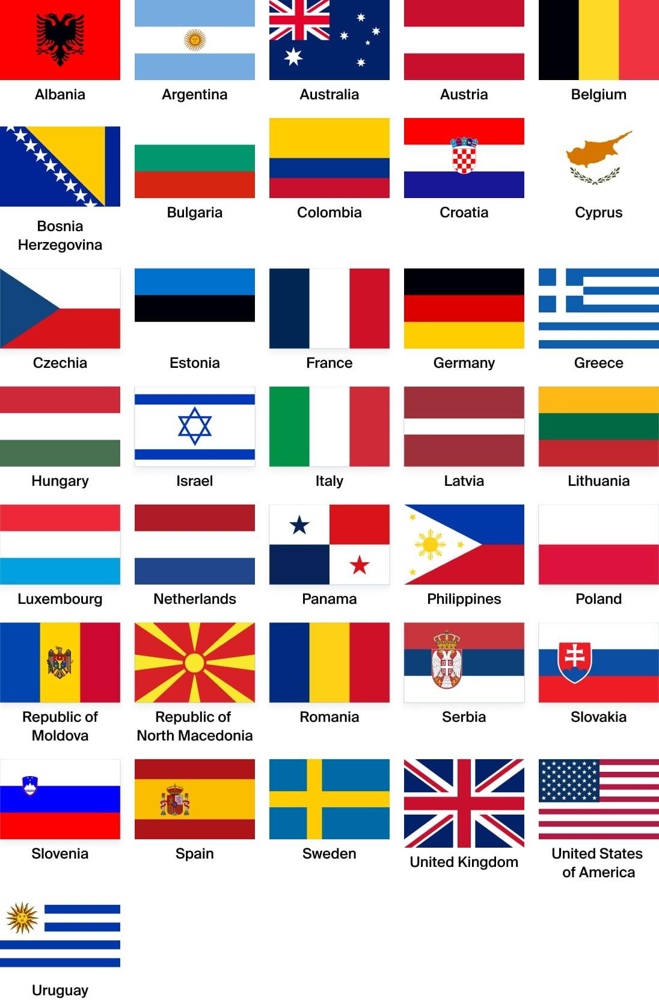

## Claim
Claim: "The World Jewish Congress (WJC) has amended the International Holocaust Remembrance Alliance (IHRA) working definition of antisemitism in March 2025 to include: 'Conflating the assassination of JFK to jews/israel'."

## Actions
```
web_search("World Jewish Congress IHRA antisemitism definition")
web_search("IHRA working definition of antisemitism March 2025")
```

## Evidence
### Evidence from `web_search`
The World Jewish Congress website provides the IHRA Working Definition of Antisemitism, adopted on May 26, 2016, which includes examples of antisemitism but does not mention the assassination of JFK (, ). The IHRA adopted a non-legally binding working definition of antisemitism on May 26, 2016, which has been adopted or endorsed by numerous countries and organizations.

The IHRA working definition of antisemitism was adopted by the United Kingdom on December 12, 2016, and by Israel shortly after. The definition has been adopted by numerous countries, including Albania (October 22, 2020), Argentina (June 4, 2020), and Australia (October 13, 2021). None of the sources mention the World Jewish Congress or any amendments to the definition in March 2025.


### Evidence from `web_search`
The IHRA Working Definition of Antisemitism, adopted in May 2016, is discussed in an article from palquest.org, which notes that by March 2025, the definition had been endorsed by 44 UN member states. The article does not mention the World Jewish Congress or any amendment to the definition in March 2025. Another article from urj.org discusses different definitions of antisemitism, including the IHRA Working Definition of Antisemitism, and mentions that the words "working definition" connote the possibility for change. This article was published on August 11, 2025. <image:k>

*   [https://www.palquest.org/en/highlight/38757/ihra-working-definition-antisemitism](https://www.palquest.org/en/highlight/38757/ihra-working-definition-antisemitism)
*   [https://urj.org/blog/five-definitions-antisemitism](https://urj.org/blog/five-definitions-antisemitism)


## Elaboration
The evidence indicates that the IHRA working definition of antisemitism was adopted in May 2016 and has been endorsed by numerous countries and organizations. The definition itself does not mention the assassination of JFK. While the definition is a "working definition" and thus subject to change, there is no evidence of any amendment by the World Jewish Congress in March 2025 to include the assassination of JFK.

The search results provide no information about the World Jewish Congress amending the IHRA definition to include the assassination of JFK. The article from urj.org, published in August 2025, mentions the possibility of changes to the definition, but it does not provide any details about specific amendments.

Therefore, the claim cannot be verified based on the provided evidence.


## Final Judgement
The provided evidence does not support the claim that the World Jewish Congress amended the IHRA working definition of antisemitism in March 2025 to include conflating the assassination of JFK to Jews/Israel. The IHRA definition was adopted in 2016 and there is no mention of the JFK assassination in the definition.

`false`

### Verdict: FALSE

### Justification
The claim is false. The IHRA working definition of antisemitism, adopted in 2016, does not mention the assassination of JFK. There is no evidence from the provided sources, including the World Jewish Congress website and other articles, to support the claim that the definition was amended in March 2025 to include the assassination of JFK.
