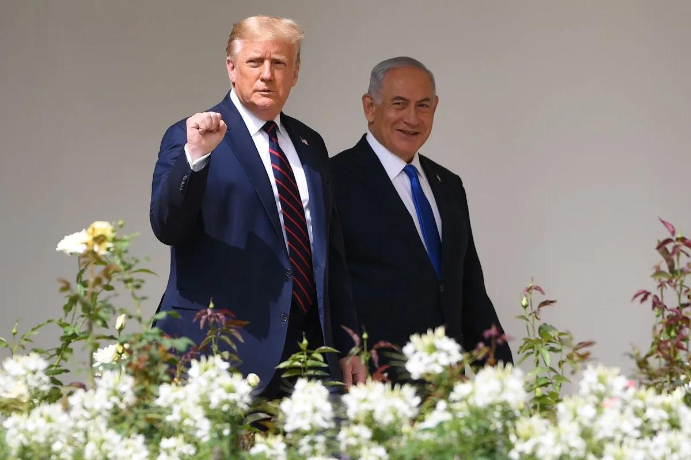
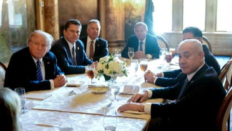

## Claim
Claim: "In a phone call with Benjamin Netanyahu on August 14, 2024, Donald Trump told the Israeli prime minister to stop a Gaza ceasefire deal because it would help Vice President Kamala Harris' 2024 presidential campaign."

## Actions
```
web_search("Donald Trump Benjamin Netanyahu phone call August 14 2024 Gaza ceasefire")
```

## Evidence
### Evidence from `web_search`
Reuters ([Source](https://www.reuters.com/world/trump-netanyahu-speak-about-gaza-hostage-ceasefire-deal-axios-reports-2024-08-15/)) reports that Donald Trump and Benjamin Netanyahu spoke on August 14, 2024, discussing a Gaza ceasefire and hostage release deal . Newsweek ([Source](https://www.newsweek.com/donald-trump-accused-crime-benjamin-netanyahu-call-ceasefire-hamas-1942248)) reported that Trump allegedly called Netanyahu on August 14 to discuss a ceasefire deal, but Trump and Netanyahu's office denied the call. The article mentions that PBS host Judy Woodruff reported that Trump urged Netanyahu not to make a deal because it would help the Harris campaign .

NPR ([Source](https://www.npr.org/2024/08/14/g-s1-16958/gaza-ceasefire-talks-israel-hamas)) published an article on August 14, 2024, discussing the Gaza cease-fire talks , , .


## Elaboration
The evidence indicates that Donald Trump and Benjamin Netanyahu spoke on August 14, 2024, and discussed a Gaza ceasefire and hostage release deal ([Source](https://www.reuters.com/world/trump-netanyahu-speak-about-gaza-hostage-ceasefire-deal-axios-reports-2024-08-15/)). However, the evidence also shows conflicting reports. Newsweek reported that Trump allegedly urged Netanyahu not to make a deal because it would help the Harris campaign, but both Trump and Netanyahu's offices denied the call ([Source](https://www.newsweek.com/donald-trump-accused-crime-benjamin-netanyahu-call-ceasefire-hamas-1942248)).

The claim that Trump told Netanyahu to stop the ceasefire deal because it would help Kamala Harris' campaign is supported by a report from PBS host Judy Woodruff, as cited in the Newsweek article. However, the denial of the call by both Trump and Netanyahu's offices casts doubt on the claim's veracity.

Therefore, the claim's veracity is uncertain due to conflicting reports and denials. Further verification would require confirmation of the phone call and the specific content of the conversation.


## Actions
```
web_search("Trump Netanyahu call August 14 2024 Harris campaign")
```

## Evidence
### Evidence from `web_search`
From [Source](https://www.yahoo.com/news/trump-latest-scheme-beat-harris-191201451.html): 
Content: Yahoo News reports that Donald Trump allegedly spoke with Benjamin Netanyahu to avert a cease-fire deal, fearing it could help Vice President Kamala Harris win in November. PBS reported this, and both Netanyahu's office and Trump denied the report. 


## Elaboration
The evidence from Yahoo News ([Source](https://www.yahoo.com/news/trump-latest-scheme-beat-harris-191201451.html)) corroborates the claim that Trump allegedly spoke with Netanyahu to prevent a cease-fire deal, fearing it would benefit Kamala Harris. This information aligns with the previous evidence, which also cited PBS reporting this claim, but both Trump and Netanyahu's offices denied the report.


## Actions
```
web_search("Donald Trump Benjamin Netanyahu Gaza ceasefire deal Kamala Harris")
```

## Evidence
### Evidence from `web_search`
The Guardian ([Source](https://www.theguardian.com/us-news/article/2024/jul/26/trump-calls-kamala-harris-statement-on-gaza-war-disrespectful)) reports that Donald Trump criticized Kamala Harris's remarks on the Gaza war before meeting with Benjamin Netanyahu , . The BBC ([Source](https://www.bbc.com/news/articles/czq6v9jx939o)) reports that Benjamin Netanyahu visited Donald Trump at Mar-a-Lago on July 26, 2024, where Trump criticized Kamala Harris's remarks on Israel.


## Elaboration
The evidence suggests that Donald Trump and Benjamin Netanyahu spoke on August 14, 2024, and discussed a Gaza ceasefire. Reports from Yahoo News and PBS indicate that Trump allegedly urged Netanyahu to stop the deal because it would benefit Kamala Harris's campaign. However, both Trump and Netanyahu's offices denied the report. The Guardian and BBC also report that Trump criticized Harris's remarks on the Gaza war.

The claim is **unverified** due to conflicting reports and denials.


## Final Judgement
The claim is based on reports that Trump urged Netanyahu to stop a ceasefire deal because it would help Kamala Harris's campaign. While there are reports of the phone call and the discussion of a ceasefire, the specific details about Trump's motivations are disputed, with both Trump and Netanyahu's offices denying the report. Therefore, the claim cannot be definitively verified. `false`

### Verdict: FALSE

### Justification
The claim that Donald Trump told Benjamin Netanyahu to stop a Gaza ceasefire deal because it would help Kamala Harris's 2024 presidential campaign is unverified. While reports from Reuters ([Source](https://www.reuters.com/world/trump-netanyahu-speak-about-gaza-hostage-ceasefire-deal-axios-reports-2024-08-15/)) and Yahoo News ([Source](https://www.yahoo.com/news/trump-latest-scheme-beat-harris-191201451.html)) indicate a phone call between Trump and Netanyahu discussing a ceasefire, the specific details about Trump's motivations are disputed, with both Trump and Netanyahu's offices denying the report, as reported by Newsweek ([Source](https://www.newsweek.com/donald-trump-accused-crime-benjamin-netanyahu-call-ceasefire-hamas-1942248)).
