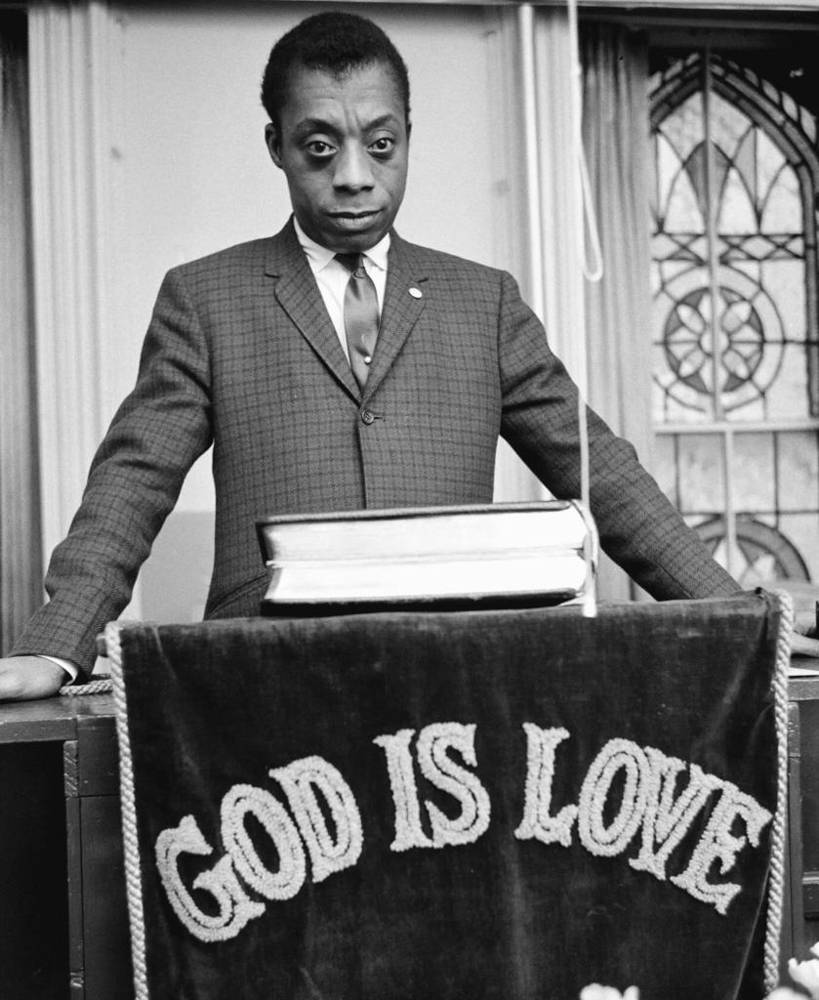

## Claim
Claim: "American writer James Baldwin once said: 'The state of Israel was not created for the salvation of the Jews; it was created for the salvation of the Western interests.'"

## Actions
```
web_search("James Baldwin Israel Western interests")
```

## Evidence
### Evidence from `web_search`
The NPR article, "What James Baldwin can teach us about Israel, and ourselves" ([https://www.npr.org/transcripts/1197958398](https://www.npr.org/transcripts/1197958398)), mentions James Baldwin's views on Israel and includes the quote: "It was created for the salvation of the Western interests." 

The website radicaldiscipleship.net ([https://radicaldiscipleship.net/2024/11/18/the-salvation-of-western-interests/](https://radicaldiscipleship.net/2024/11/18/the-salvation-of-western-interests/)) includes the quote from Baldwin's "Open Letter to the Born Again" (September 29, 1979). The article from stevesalaita.com ([https://stevesalaita.com/james-baldwin-and-the-jewish-state/](https://stevesalaita.com/james-baldwin-and-the-jewish-state/)) also includes the quote and discusses Baldwin's views on Zionism and Israel.  


## Elaboration
The evidence confirms that James Baldwin made the statement "It was created for the salvation of the Western interests." The NPR article ([https://www.npr.org/transcripts/1197958398](https://www.npr.org/transcripts/1197958398)) includes the quote. The website radicaldiscipleship.net ([https://radicaldiscipleship.net/2024/11/18/the-salvation-of-western-interests/](https://radicaldiscipleship.net/2024/11/18/the-salvation-of-western-interests/)) and stevesalaita.com ([https://stevesalaita.com/james-baldwin-and-the-jewish-state/](https://stevesalaita.com/james-baldwin-and-the-jewish-state/)) also include the quote. The claim is therefore accurate.


## Final Judgement
The claim is supported by multiple sources, including an NPR article and other websites, which attribute the quote to James Baldwin. The quote is found in Baldwin's "Open Letter to the Born Again" (September 29, 1979).

`true`


### Verdict: TRUE

### Justification
The claim is accurate. Multiple sources, including an NPR article ([https://www.npr.org/transcripts/1197958398](https://www.npr.org/transcripts/1197958398)), confirm that James Baldwin stated, "It was created for the salvation of the Western interests." This quote is also found in Baldwin's "Open Letter to the Born Again" (September 29, 1979).
