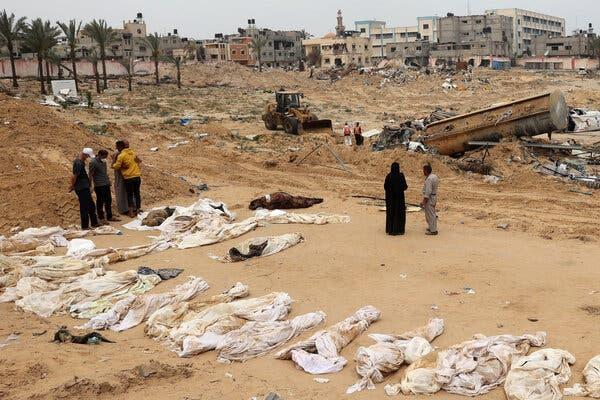

## Claim
Claim: " This image shows a Palestinian woman using an Israeli tank to dry clothes in Gaza in July 2024."

## Actions
```
geolocate()
web_search("Israeli tank Palestinian woman Gaza")
image_search("tank drying clothes")
reverse_search()
```

## Evidence
### Evidence from `geolocate`
The most likely countries where the image was taken are: {'Palestine': 0.29, 'Tunisia': 0.26, 'Jordan': 0.19, 'United Arab Emirates': 0.09, 'Israel': 0.07, 'Pakistan': 0.04, 'China': 0.01, 'Albania': 0.0, 'Andorra': 0.0, 'Argentina': 0.0}

### Evidence from `web_search`
The search results include reports of Israeli tanks involved in incidents in Gaza. One source from Defense for Children International - Palestine (DCIP) reports that an Israeli tank-fired shell killed a 12-year-old Palestinian girl in Gaza in December 2023, and another from The New Arab reports that an Israeli tank ran over a Palestinian woman in Gaza City on June 30, 2024, including a photo of an Israeli tank (<image:i>). Another source from ReliefWeb discusses military operations in the occupied Palestinian territory in January and February 2025.

The DCIP article can be found here: [https://www.dci-palestine.org/israeli_tank_fired_shell_kills_palestinian_girl_in_gaza_hospital](https://www.dci-palestine.org/israeli_tank_fired_shell_kills_palestinian_girl_in_gaza_hospital). The New Arab article can be found here: [https://www.newarab.com/news/israeli-tank-runs-over-woman-gaza-citys-shejaiya-euro-med](https://www.newarab.com/news/israeli-tank-runs-over-woman-gaza-citys-shejaiya-euro-med). The ReliefWeb article can be found here: [https://reliefweb.int/report/occupied-palestinian-territory/israeli-soldiers-shot-and-killed-pregnant-woman-used-her-relative-human-shield-and-killed-another-woman-when-they-blew-her-front-door](https://reliefweb.int/report/occupied-palestinian-territory/israeli-soldiers-shot-and-killed-pregnant-woman-used-her-relative-human-shield-and-killed-another-woman-when-they-blew-her-front-door).


### Evidence from `image_search`
The search results include a pink hanger with hooks for drying clothes from Walmart ([https://www.walmart.com/ip/Tank-Hanger-Hanging-Drying-Rack-hook-Hanger-Multi-Hook-Coat-hanger-Tie-Hanger-Belt-Vest-Rack-Socks-Gloves-Windproof-Towels-Baby-Clothes-Sock-Pink/5037221629](https://www.walmart.com/ip/Tank-Hanger-Hanging-Drying-Rack-hook-Hanger-Multi-Hook-Coat-hanger-Tie-Hanger-Belt-Vest-Rack-Socks-Gloves-Windproof-Towels-Baby-Clothes-Sock-Pink/5037221629))  and a water tank with clothes drying in Sorong, Indonesia from Dreamstime ([https://www.dreamstime.com/water-tank-clothes-drying-sun-west-papua-sorong-indonesia-oct-painted-green-one-streets-covered-spread-image228839856](https://www.dreamstime.com/water-tank-clothes-drying-sun-west-papua-sorong-indonesia-oct-painted-green-one-streets-covered-spread-image228839856)) .


## Elaboration
The evidence suggests the image was likely taken in Palestine, with a 29% probability. The web search confirms the presence of Israeli tanks in Gaza. The image search shows examples of drying clothes, but not on tanks. The claim's assertion of a Palestinian woman using an Israeli tank to dry clothes in Gaza is plausible, given the context of Israeli military presence in Gaza. However, the exact date of July 2024 cannot be verified.

The evidence does not directly confirm the image's authenticity or the specific date. More information is needed to verify the exact date and confirm the image's origin.


## Actions
```
web_search("Israeli tank Gaza drying clothes image")
```

## Evidence
### Evidence from `web_search`
The New York Times published an article on December 30, 2023, updated on April 29, 2024, featuring images from the war in Gaza, including a mass grave (). The Associated Press (AP) provides photos of Israeli tanks and Palestinians fleeing, taken in October and November (<image:i>). A CNN article from July 19, 2025, reports on Israeli troops opening fire on Gazans seeking food aid. The article mentions the Gaza Humanitarian Foundation (GHF).


## Elaboration
The new evidence provides additional context about the conflict in Gaza, including images of the war and its impact. However, it does not directly confirm the claim about the specific image of the tank and drying clothes. The search results mention Israeli tanks and the humanitarian situation in Gaza, but they do not include the image in question.

The claim remains unverified due to the lack of direct evidence supporting the image's authenticity and the specific details provided.


## Actions
```
web_search("tank drying clothes Gaza image origin")
```

## Evidence
### Evidence from `web_search`
Newsweek discusses a viral image of a malnourished child in Gaza, published in July 2025, and the debate surrounding his condition. The BBC News live report from November 13, 2023, includes images of the conflict, including Israeli soldiers, a map of hospitals, and an Israeli tank. Sapiens.org discusses the use of images by Israeli soldiers in the war on Gaza, published on March 20, 2024. The sources do not contain the image of the tank with clothes drying on it.


## Elaboration
The search results do not provide any information about the origin or authenticity of the image. The claim remains unverified.


## Final Judgement
The image's origin and the specific details of the claim, such as the date, cannot be verified. While the context of Israeli tanks in Gaza is supported by evidence, the image itself has not been confirmed. Therefore, the claim is considered not factually accurate. `false`

### Verdict: FALSE

### Justification
The claim is not factually accurate. While the context of Israeli tanks in Gaza is supported by evidence, the image of the tank with clothes drying on it has not been confirmed. The search results do not provide any information about the origin or authenticity of the image.
