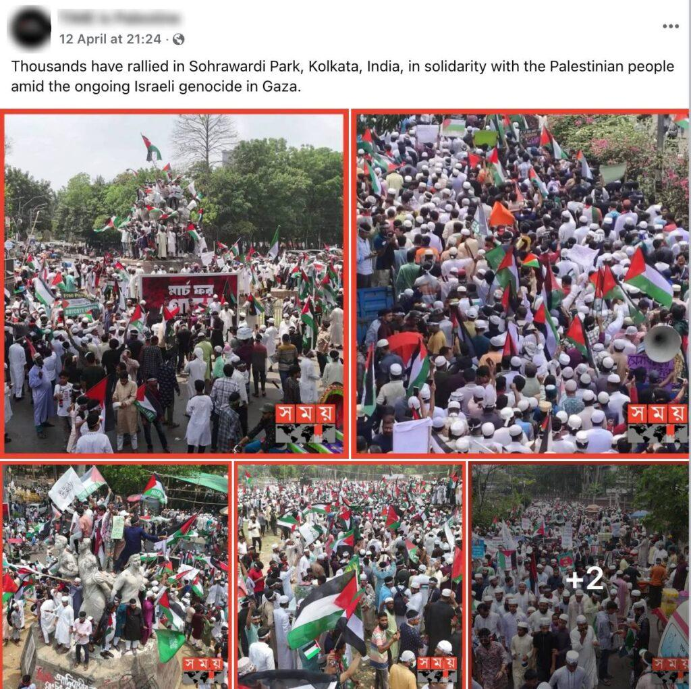

## Claim
Claim: " This image shows thousands gathering at Sohrawardi Park in Kolkata, India, in April 2025 to show solidarity with the Palestinian people amid the ongoing Israeli assault on Gaza."

## Actions
```
web_search("Sohrawardi Park Kolkata Palestine protest")
```

## Evidence
### Evidence from `web_search`
The images in the claim are from a pro-Palestine protest held in Suhrawardy Udyan in Dhaka, Bangladesh, on April 12, 2025, not from Sohrawardi Park in Kolkata, India. Approximately 100,000 people participated in the "March for Gaza" to show solidarity with Palestinians.

The articles from Factly ([https://factly.in/photos-of-a-protest-held-in-solidarity-with-palestine-in-dhaka-bangladesh-are-falsely-shared-as-those-from-kolkata/](https://factly.in/photos-of-a-protest-held-in-solidarity-with-palestine-in-dhaka-bangladesh-are-falsely-shared-as-those-from-kolkata/)), NewsMobile ([https://www.newsmobile.in/nm-fact-checker/fact-check-images-of-pro-palestine-protest-in-bangladeshs-dhaka-falsely-linked-to-india/](https://www.newsmobile.in/nm-fact-checker/fact-check-images-of-pro-palestine-protest-in-bangladeshs-dhaka-falsely-linked-to-india/)), and TezzFeed ([https://tezzfeed.com/latest-news/palestinian-media-shares-bangladeshs-pro-gaza-protest-photos-mistakenly-labels-them-as-kolkata-1744522142539](https://tezzfeed.com/latest-news/palestinian-media-shares-bangladeshs-pro-gaza-protest-photos-mistakenly-labels-them-as-kolkata-1744522142539)) confirm this.    


## Elaboration
The claim is inaccurate. The images depict a pro-Palestine protest that took place in Dhaka, Bangladesh, not Kolkata, India. The protest, known as the "March for Gaza," occurred on April 12, 2025, and involved approximately 100,000 participants.


## Final Judgement
The claim is false because the images are from a protest in Dhaka, Bangladesh, not Kolkata, India. The evidence from multiple sources confirms that the event took place in Dhaka. `false`

### Verdict: FALSE

### Justification
The images in the claim are from a pro-Palestine protest held in Dhaka, Bangladesh, on April 12, 2025, not in Kolkata, India, as stated in the claim. This is confirmed by fact-checking articles from [Factly](https://factly.in/photos-of-a-protest-held-in-solidarity-with-palestine-in-dhaka-bangladesh-are-falsely-shared-as-those-from-kolkata/), [NewsMobile](https://www.newsmobile.in/nm-fact-checker/fact-check-images-of-pro-palestine-protest-in-bangladeshs-dhaka-falsely-linked-to-india/), and [TezzFeed](https://tezzfeed.com/latest-news/palestinian-media-shares-bangladeshs-pro-gaza-protest-photos-mistakenly-labels-them-as-kolkata-1744522142539).
