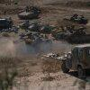
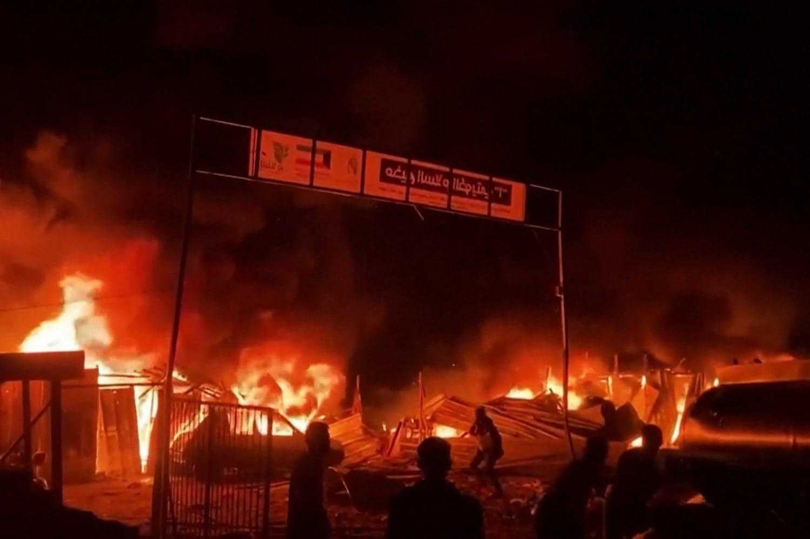

## Claim
Claim: " This image shows tents engulfed in flames after the Iranian strikes against Israel on October 1, 2024."

## Actions
```
reverse_search()
```

## Evidence
### Evidence from `reverse_search`
The image 

## Elaboration
The reverse image search did not yield any results. Therefore, I cannot verify the claim. I need more information to determine the image's origin and context.


## Actions
```
web_search("Iranian strikes against Israel October 1 2024")
image_search("tents on fire")
```

## Evidence
### Evidence from `web_search`
The web sources discuss the Iranian strikes against Israel on October 1, 2024. NPR ([https://www.npr.org/2024/10/01/g-s1-25707/iran-israel-hezbollah-lebanon-attack](https://www.npr.org/2024/10/01/g-s1-25707/iran-israel-hezbollah-lebanon-attack)) reports on the strikes, including images of Israelis taking shelter 

### Evidence from `image_search`
From [Source](https://www.nbcnews.com/news/world/israeli-airstrike-gaza-family-rafah-wiped-out-rcna154877): 
Content: NBC News published an article about an Israeli airstrike in Gaza. The article includes an image of tents on fire .


## Elaboration
The claim states that the image shows tents engulfed in flames after the Iranian strikes against Israel on October 1, 2024. The web search confirms that there were Iranian strikes against Israel on October 1, 2024. However, the image search reveals an image of tents on fire from an NBC News article about an Israeli airstrike in Gaza.

Based on the evidence, I cannot confirm that the image depicts the aftermath of the Iranian strikes. The image search results suggest the image might be related to an Israeli airstrike in Gaza.

**Verdict:** The claim is unverified.


## Final Judgement
The initial reverse image search did not yield any results, and the web search confirmed the Iranian strikes on October 1, 2024. However, the image search revealed an image of tents on fire from an NBC News article about an Israeli airstrike in Gaza. Therefore, the claim that the image shows tents engulfed in flames after the Iranian strikes against Israel on October 1, 2024, is not supported by the evidence.

`false`

### Verdict: FALSE

### Justification
The claim is unverified. While there were Iranian strikes against Israel on October 1, 2024, the image search revealed that the image of tents on fire is from an NBC News article about an Israeli airstrike in Gaza, not related to the Iranian strikes.
