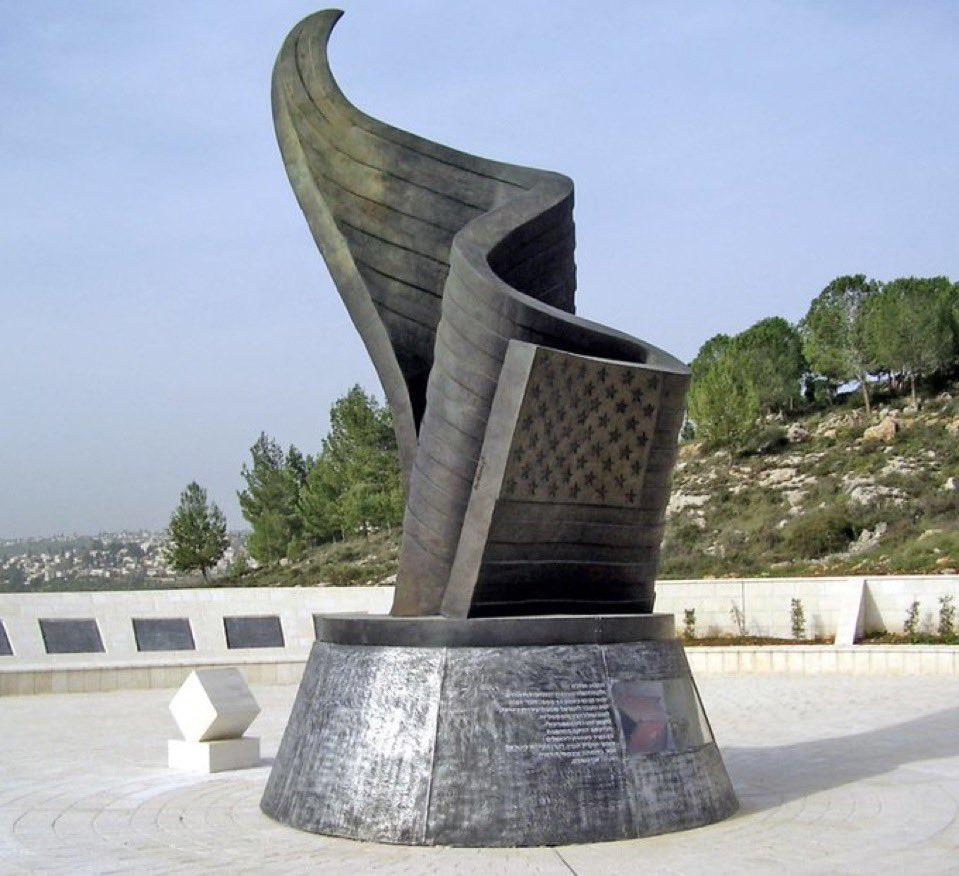

## Claim
Claim: " This image shows Israel's 9/11 memorial which is the only one outside the US."

## Actions
```
reverse_search()
```

## Evidence
### Evidence from `reverse_search`
The image shows the 9/11 Living Memorial Plaza in Jerusalem, Israel, which is a 30-foot bronze sculpture of a waving American flag transforming into a flame (

## Elaboration
The evidence confirms that the image depicts the 9/11 Living Memorial Plaza in Jerusalem, Israel. The memorial is a bronze sculpture.

The evidence does not explicitly state whether this is the only 9/11 memorial outside the US.

To verify the claim, additional information is needed to confirm if this is the only 9/11 memorial outside the US.


## Actions
```
web_search("9/11 memorials outside US")
```

## Evidence
### Evidence from `web_search`
The search results indicate that there are multiple 9/11 memorials outside the US. One source, Memorial Mapping, lists memorials in Afghanistan, Australia, Canada, Israel, and the United Kingdom, among others. Another source, Architectural Digest, features the 9/11 Living Memorial Plaza in Jerusalem, Israel (

## Elaboration
The evidence indicates that the claim is false. The search results show that there are multiple 9/11 memorials outside the US, not just the one in Israel.


## Final Judgement
The image shows the 9/11 Living Memorial Plaza in Jerusalem, Israel. However, the claim that this is the only 9/11 memorial outside the US is false. Multiple sources confirm the existence of other 9/11 memorials outside the US.

`false`

### Verdict: FALSE

### Justification
The image depicts the 9/11 Living Memorial Plaza in Jerusalem, Israel. However, the claim that this is the only 9/11 memorial outside the US is false, as multiple sources, such as Memorial Mapping, list other 9/11 memorials located outside the United States.
