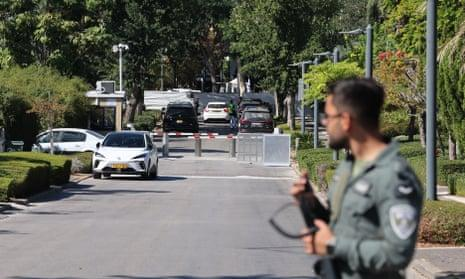
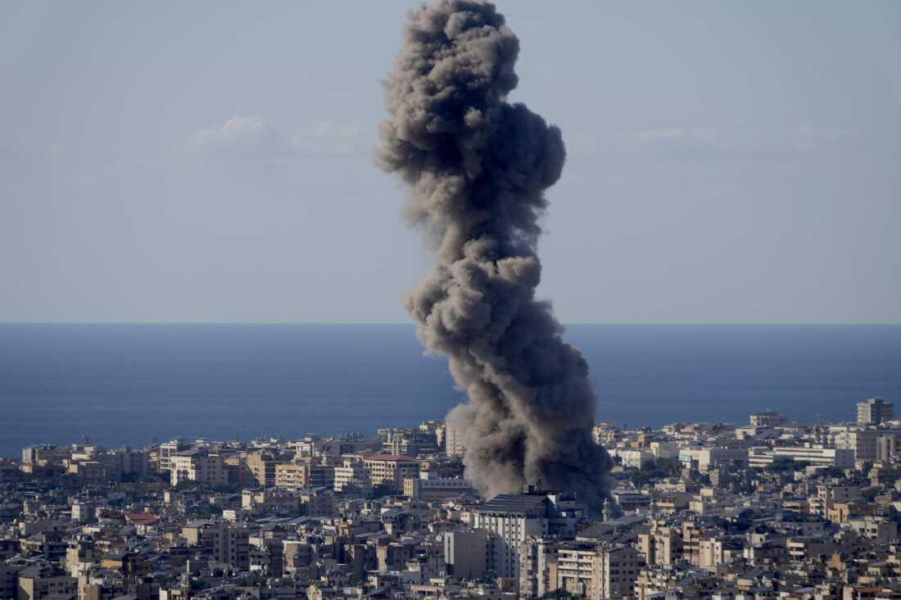

## Claim
Claim: " This image shows Israeli PM Benjamin Netanyahu's house taken by a Hezbollah drone in August 2024."

## Actions
```
geolocate()
reverse_search()
web_search("Benjamin Netanyahu house drone image")
```

## Evidence
### Evidence from `geolocate`
The most likely countries where the image was taken are: {'Israel': 0.17, 'Mexico': 0.15, 'Tunisia': 0.11, 'Malta': 0.1, 'Palestine': 0.07, 'Bermuda': 0.05, 'Jordan': 0.05, 'United Arab Emirates': 0.04, 'Dominican Republic': 0.03, 'Pakistan': 0.03}

### Evidence from `reverse_search`
The image () is of Israeli Prime Minister Benjamin Netanyahu's house. The image dates back to 2019 and was featured in a June 25, 2020 article by Times of Israel. The image was also featured in a YouTube video uploaded on July 1, 2019.

The Times of Israel has a topic page dedicated to the Prime Minister's Residence, which contains articles and images of the residence. The Times of Israel published an article on October 21, 2024, discussing a Hezbollah drone attack on Netanyahu's home.


### Evidence from `web_search`
Multiple sources report that Benjamin Netanyahu's house in Caesarea, Israel, was targeted by a drone strike in October 2024. The attacks were claimed by Hezbollah. The NPR article, published on October 19, 2024, mentions the drone targeted Netanyahu's house. The CNN article, published on October 23, 2024, states that the house was damaged in the attack. The Guardian also reported on the attack on October 19, 2024.

The articles can be found here: [https://www.npr.org/2024/10/19/nx-s1-5158375/netanyahu-house-drone-israel](https://www.npr.org/2024/10/19/nx-s1-5158375/netanyahu-house-drone-israel), [https://www.cnn.com/2024/10/23/middleeast/video-netanyahu-beach-hezbollah-drone-attack-intl-hnk](https://www.cnn.com/2024/10/23/middleeast/video-netanyahu-beach-hezbollah-drone-attack-intl-hnk), and [https://www.theguardian.com/world/2024/oct/19/netanyahus-house-hit-by-drone-as-israel-and-hezbollah-trade-blows-in-lebanon](https://www.theguardian.com/world/2024/oct/19/netanyahus-house-hit-by-drone-as-israel-and-hezbollah-trade-blows-in-lebanon). The CNN article includes an image of the damage to the house <image:k>. The Guardian article includes a photograph of the scene . The NPR article includes images , , .


## Elaboration
The claim is partially accurate. The image is of Benjamin Netanyahu's house. However, the image dates back to 2019, according to the reverse image search results. The web search results confirm that Netanyahu's house was targeted by a drone strike in October 2024, but the provided image is not from that event. Therefore, the claim is misleading.


## Final Judgement
The image is of Benjamin Netanyahu's house, but it is not from a Hezbollah drone attack in August 2024. The image is older, and the drone attack occurred in October 2024.

`false`

### Verdict: FALSE

### Justification
The image is of Benjamin Netanyahu's house, but it predates the alleged Hezbollah drone attack. The image dates back to 2019, as confirmed by a reverse image search and articles from the Times of Israel. While the house was targeted by a drone in October 2024, as reported by [NPR](https://www.npr.org/2024/10/19/nx-s1-5158375/netanyahu-house-drone-israel), [CNN](https://www.cnn.com/2024/10/23/middleeast/video-netanyahu-beach-hezbollah-drone-attack-intl-hnk), and [The Guardian](https://www.theguardian.com/world/2024/oct/19/netanyahus-house-hit-by-drone-as-israel-and-hezbollah-trade-blows-in-lebanon), the provided image is not related to that event.
