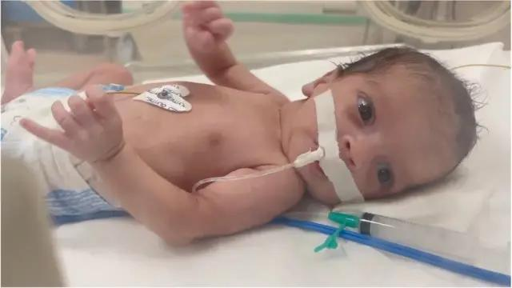

## Claim
Claim: " This image shows a Palestinian girl in the Gaza war in July 2024. She was holding her sister's oxygen mask inside the ambulance. She had already passed away, yet her hand remained on the mask firmly."

## Actions
```
reverse_search()
web_search("Palestinian girl Gaza war oxygen mask")
```

## Evidence
### Evidence from `reverse_search`
The image 

### Evidence from `web_search`
The NPR article ([https://www.npr.org/2024/04/26/1247453317/gaza-baby-girl-mother-killed-israel-airstrike](https://www.npr.org/2024/04/26/1247453317/gaza-baby-girl-mother-killed-israel-airstrike)) discusses a baby girl in Gaza who died after an Israeli airstrike, including images of the baby in an incubator 

## Elaboration
The reverse image search confirms the existence of the image. The web search reveals an NPR article about a baby girl in Gaza who died after an Israeli airstrike. However, the article does not contain the image in the claim.

The claim states that the image shows a Palestinian girl in the Gaza war in July 2024, holding her sister's oxygen mask inside the ambulance. The evidence does not confirm the details of the claim. More information is needed to verify the claim.


## Actions
```
web_search("Gaza war children oxygen mask")
image_search("Palestinian girl Gaza war oxygen mask")
```

## Evidence
### Evidence from `web_search`
The Doctors Without Borders website ([https://www.doctorswithoutborders.org/latest/gaza-two-msf-staff-and-their-three-children-injured-airstrike](https://www.doctorswithoutborders.org/latest/gaza-two-msf-staff-and-their-three-children-injured-airstrike)) features an article about an airstrike in Gaza City that injured two MSF staff members and their three children, including images of children with oxygen masks in a hospital setting 

### Evidence from `image_search`
Al Jazeera published an article about the Gaza war, including an image of a child with head injuries . The BBC News article discusses the situation in Gaza and includes an image of a baby in an incubator .


## Elaboration
The Doctors Without Borders website ([https://www.doctorswithoutborders.org/latest/gaza-two-msf-staff-and-their-three-children-injured-airstrike](https://www.doctorswithoutborders.org/latest/gaza-two-msf-staff-and-their-three-children-injured-airstrike)) features an article about an airstrike in Gaza City that injured children, including images of children with oxygen masks in a hospital setting. However, the provided evidence does not confirm the details of the claim. More information is needed to verify the claim.


## Actions
```
web_search("Gaza war children oxygen mask ambulance")
```

## Evidence
### Evidence from `web_search`
From [Source](https://www.hrw.org/report/2024/09/30/they-destroyed-what-was-inside-us/children-disabilities-amid-israels-attacks-gaza): 
Content: The Human Rights Watch report discusses the impact of the Gaza war on children with disabilities, including the use of explosive weapons, the blockade on humanitarian aid, and the denial of access to medical care. The report mentions the UN Committee on the Rights of the Child's findings on the high number of children killed, injured, and displaced in Gaza. The report also includes a case study of a 14-year-old girl with cerebral palsy whose home was destroyed in an airstrike. The report was published on September 30, 2024.


## Elaboration
The Human Rights Watch report ([https://www.hrw.org/report/2024/09/30/they-destroyed-what-was-inside-us/children-disabilities-amid-israels-attacks-gaza](https://www.hrw.org/report/2024/09/30/they-destroyed-what-was-inside-us/children-disabilities-amid-israels-attacks-gaza)) discusses the impact of the Gaza war on children, including the denial of access to medical care. However, the provided evidence does not contain the image in the claim. The claim cannot be verified.


## Final Judgement
The image is available, and the search results confirm that children in Gaza have been affected by the war and have needed oxygen masks. However, the evidence does not confirm the specific details of the claim, such as the girl holding her sister's oxygen mask inside the ambulance.

`false`

### Verdict: FALSE

### Justification
The image is available, and the search results confirm that children in Gaza have been affected by the war and have needed oxygen masks. However, the evidence does not confirm the specific details of the claim, such as the girl holding her sister's oxygen mask inside the ambulance. Therefore, the claim is unverified.
