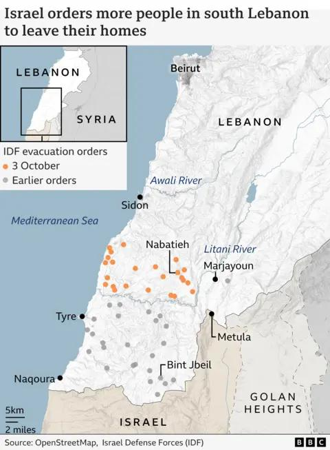

## Claim
Claim: " This is an authentic image of Israel bombing Beirut's International Airport in October 2024."

## Actions
```
reverse_search()
web_search("Beirut airport bombing October 2024")
```

## Evidence
### Evidence from `reverse_search`
The image  is AI-generated and does not depict a real event. According to [India Today](https://www.indiatoday.in/fact-check/story/fact-check-photo-middle-east-airlines-flight-israel-airstrikes-beirut-lebanon-ai-generated-2622766-2024-10-24), the image was fact-checked on October 24, 2024, and is AI-generated. Factly.in also confirms the image is AI-generated, stating it was posted on Instagram by "eyesoflebanon" on October 21, 2024, who confirmed it was AI-generated. The article includes other AI-generated images ,  and the results of AI detection tools , .


### Evidence from `web_search`
NPR reports that Israel launched airstrikes on Beirut on October 20, 2024, targeting Hezbollah's financial arm. ([https://www.npr.org/2024/10/20/nx-s1-5159029/israel-airstrikes-beirut-hezbollahs-financial-lebanon](https://www.npr.org/2024/10/20/nx-s1-5159029/israel-airstrikes-beirut-hezbollahs-financial-lebanon))  The BBC reported on October 4, 2024, on Israeli air strikes in Beirut, including near the international airport, mentioning explosions near the airport and the targeting of Hezbollah. ([https://www.bbc.com/news/articles/c17lpydd842o](https://www.bbc.com/news/articles/c17lpydd842o)) , , 

Wikipedia discusses the 2024 Israeli invasion of Lebanon, mentioning Israeli strikes in Beirut, including airstrikes and the targeting of Hezbollah infrastructure, and the near-total closure of Beirut's airport. ([https://en.wikipedia.org/wiki/2024_Israeli_invasion_of_Lebanon](https://en.wikipedia.org/wiki/2024_Israeli_invasion_of_Lebanon)) 


## Elaboration
The image is AI-generated and does not depict a real event. While there were Israeli airstrikes near Beirut's airport in October 2024, the image has been confirmed as AI-generated by multiple sources, including India Today and Factly.in.


## Final Judgement
The claim is demonstrably false because the image is AI-generated, and therefore, does not depict an authentic event. `false`

### Verdict: FALSE

### Justification
The image is AI-generated, as confirmed by [India Today](https://www.indiatoday.in/fact-check/story/fact-check-photo-middle-east-airlines-flight-israel-airstrikes-beirut-lebanon-ai-generated-2622766-2024-10-24) and Factly.in, and does not depict an authentic event. While there were Israeli airstrikes near Beirut's airport in October 2024, the image is not a real depiction of those events.
