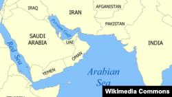

## Claim
Claim: "A US-flagged vessel has been attacked in the Guld of Aden in July 2024. A Spokesperson at Denmark's shipping company Maersk said: 'There was an attack targeted on one of the company's US-flagged vessels at the northernmost part of the Gulf of Aden.'"

## Actions
```
web_search("US flagged vessel attacked Gulf of Aden July 2024 Maersk")
```

## Evidence
### Evidence from `web_search`
Reuters reports that Yemen's Houthis targeted the Maersk Sentosa, a U.S.-flagged vessel, in the Arabian Sea on July 9, 2024. The captain reported an explosion near the vessel off the coast of Nishtun, Yemen. No injuries or damage were reported. The Columbian also reports that the Houthi rebels targeted a U.S.-flagged container ship in the Gulf of Aden, mentioning the Maersk Sentosa. The article is dated August 22, 2025, but the events described occurred in July 2024.

VOA News reports that Houthi militants fired on the Maersk Sentosa in the Arabian Sea on July 10, 2024. A spokesperson for the group took responsibility for the attack. The Maersk Sentosa and its crew were safe. 

*   [Source](https://www.reuters.com/world/middle-east/vessel-reports-nearby-explosion-east-yemens-nishtun-ukmto-says-2024-07-09/)
*   [Source](https://www.columbian.com/news/2024/jul/10/yemens-houthi-rebels-target-a-us-flagged-container-ship-in-the-gulf-of-aden/)
*   [Source](https://www.voanews.com/a/houthis-fire-on-u-s--flagged-container-ship-sailing-through-arabian-sea/7692113.html)


## Elaboration
The evidence confirms that a U.S.-flagged vessel, the Maersk Sentosa, was targeted in July 2024. The attacks occurred in the Arabian Sea, not the Gulf of Aden, according to Reuters ([https://www.reuters.com/world/middle-east/vessel-reports-nearby-explosion-east-yemens-nishtun-ukmto-says-2024-07-09/](https://www.reuters.com/world/middle-east/vessel-reports-nearby-explosion-east-yemens-nishtun-ukmto-says-2024-07-09/)) and VOA News ([https://www.voanews.com/a/houthis-fire-on-u-s--flagged-container-ship-sailing-through-arabian-sea/7692113.html](https://www.voanews.com/a/houthis-fire-on-u-s--flagged-container-ship-sailing-through-arabian-sea/7692113.html)). The Columbian also mentions the Gulf of Aden ([https://www.columbian.com/news/2024/jul/10/yemens-houthi-rebels-target-a-us-flagged-container-ship-in-the-gulf-of-aden/](https://www.columbian.com/news/2024/jul/10/yemens-houthi-rebels-target-a-us-flagged-container-ship-in-the-gulf-of-aden/)), but the other sources are more specific.

The evidence does not mention a spokesperson from Maersk.


## Final Judgement
The claim is partially accurate. Multiple sources confirm that a U.S.-flagged vessel, the Maersk Sentosa, was attacked in July 2024. However, the attack occurred in the Arabian Sea, not the Gulf of Aden, and the claim mentions a Maersk spokesperson, which is not supported by the evidence.

`false`


### Verdict: FALSE

### Justification
The claim is partially accurate. Multiple sources, including Reuters ([https://www.reuters.com/world/middle-east/vessel-reports-nearby-explosion-east-yemens-nishtun-ukmto-says-2024-07-09/](https://www.reuters.com/world/middle-east/vessel-reports-nearby-explosion-east-yemens-nishtun-ukmto-says-2024-07-09/)) and VOA News ([https://www.voanews.com/a/houthis-fire-on-u-s--flagged-container-ship-sailing-through-arabian-sea/7692113.html](https://www.voanews.com/a/houthis-fire-on-u-s--flagged-container-ship-sailing-through-arabian-sea/7692113.html)), confirm that a U.S.-flagged vessel was attacked in July 2024. However, the attack occurred in the Arabian Sea, not the Gulf of Aden, and the claim mentions a Maersk spokesperson, which is not supported by the evidence.
