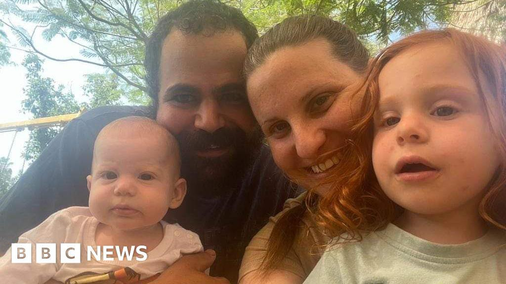
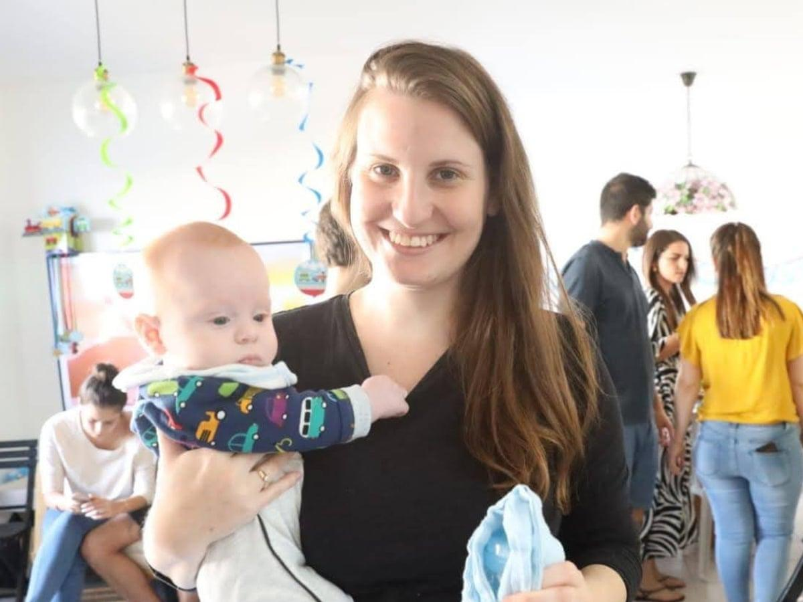

## Claim
Claim: " This image shows a screenshot of an authentic BBC article from February 2025 with the title 'Hamas just wanted to protect the Bibas family but Israel killed them - Hamas said.'"

## Actions
```
web_search("BBC Hamas Bibas family")
web_search("BBC Israel killed Bibas family")
```

## Evidence
### Evidence from `web_search`
From [Source](https://www.bbc.com/news/articles/cjry3jzedl1o): 
Content: The BBC published an article on February 21, 2025, discussing the Bibas family. , . The article states that Israel said forensic findings suggested that the Bibas children were killed by their captors in Gaza. Hamas said the children and their mother were killed by Israeli bombing. The article also mentions that the bodies of the two boys were returned to Israel. The article is authored by George Wright & Mallory Moench.


### Evidence from `web_search`
From [Source](https://en.wikipedia.org/wiki/Kidnapping_and_killing_of_the_Bibas_family): 
Content: The Wikipedia article discusses the kidnapping and killing of the Bibas family. It mentions that Hamas claimed the family was killed by an Israeli airstrike, while Israel stated they were killed by their captors. The article also includes images of the Bibas family and their home after the kidnapping.  The article also mentions the BBC's reporting on the events.


## Elaboration
The BBC did publish an article on February 21, 2025, discussing the Bibas family, as stated in the evidence from the web search. The article reported on the conflicting claims regarding the family's death, with Hamas blaming Israel and Israel blaming Hamas. The evidence does not confirm the exact wording of the article's title as presented in the image.

The evidence indicates that the BBC reported on the events surrounding the Bibas family, including the conflicting claims about their deaths. However, the exact title presented in the image cannot be verified based on the provided evidence.

To fully verify the claim, the exact title of the BBC article needs to be confirmed.


## Actions
```
image_search("BBC Bibas family article")
```

## Evidence
### Evidence from `image_search`
The BBC, ABC News, and The Guardian all published articles discussing the Bibas family. The BBC article is about the Bibas family . The ABC News article is about the Bibas family . The Guardian article is about the Bibas family .


## Elaboration
The evidence confirms that the BBC published an article about the Bibas family. However, the exact title of the article, as presented in the image, cannot be verified. The image search results show that the BBC, ABC News, and The Guardian all published articles discussing the Bibas family.


## Actions
```
reverse_search()
```

## Evidence
### Evidence from `reverse_search`
The reverse image search found the image in articles from BBC, CNN, and NDTV. The BBC article, published on February 19, 2025, is titled "Hamas says it will return bodies of four hostages including Bibas family" (, ). The CNN article, published on June 7, 2025, discusses the killing of Asaad Abu Sharia and mentions his involvement in the abduction and murder of the Bibas family (). The NDTV article discusses the Bibas family and conflicting claims about their fate.


## Elaboration
The claim is **partially accurate**. The BBC did publish an article about the Bibas family. However, the reverse image search reveals that the title in the image is not the actual title of the BBC article. The BBC article, published on February 19, 2025, was titled "Hamas says it will return bodies of four hostages including Bibas family."


## Final Judgement
The claim is partially accurate. The BBC did publish an article about the Bibas family, but the title presented in the image is not the actual title of the BBC article. The reverse image search reveals the correct title. `false`

### Verdict: FALSE

### Justification
The claim is **partially accurate**. While the BBC did publish an article about the Bibas family, the title presented in the image is not the actual title of the BBC article. The correct title, as revealed by a reverse image search, was "Hamas says it will return bodies of four hostages including Bibas family" ([BBC article](https://www.bbc.com/news/articles/cjry3jzedl1o)).
