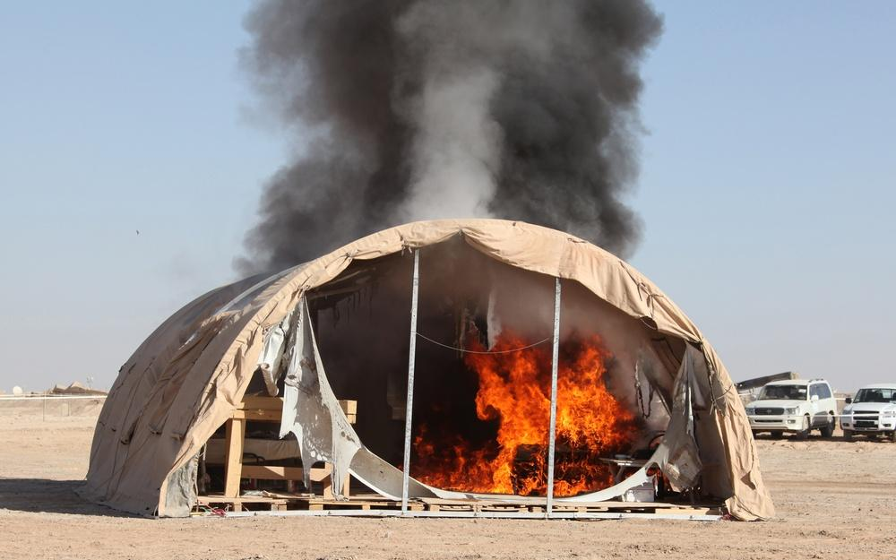

## Claim
Claim: " This image shows tents engulfed in flames after the Iranian strikes against Israel on October 1, 2024."

## Actions
```
reverse_search()
```

## Evidence
### Evidence from `reverse_search`
The image 

## Elaboration
The reverse image search did not yield any results. Therefore, I cannot verify the claim. I need more information to determine the image's origin and context.


## Actions
```
web_search("Iranian strikes against Israel October 1 2024")
image_search("tents on fire")
```

## Evidence
### Evidence from `web_search`
The web sources discuss the Iranian strikes against Israel on October 1, 2024. An NPR article ([https://www.npr.org/2024/10/01/g-s1-25707/iran-israel-hezbollah-lebanon-attack](https://www.npr.org/2024/10/01/g-s1-25707/iran-israel-hezbollah-lebanon-attack)) reports on the strikes, including images of Israelis taking shelter 

### Evidence from `image_search`
NBC News published an article about an Israeli airstrike in Gaza, which includes an image of tents on fire . DVIDS Hub also shows a tent on fire . The third source does not contain any relevant information.


## Elaboration
The NPR article ([https://www.npr.org/2024/10/01/g-s1-25707/iran-israel-hezbollah-lebanon-attack](https://www.npr.org/2024/10/01/g-s1-25707/iran-israel-hezbollah-lebanon-attack)) discusses the Iranian strikes against Israel on October 1, 2024, but it does not include an image of tents on fire. The image search revealed other images of tents on fire, but they are not related to the Iranian strikes against Israel.

Based on the available evidence, I cannot verify the claim.


## Final Judgement
The initial reverse image search did not yield any results. Subsequent searches revealed information about the Iranian strikes against Israel on October 1, 2024, and images of tents on fire, but none of the images matched the one in the claim.

The claim cannot be verified because the image in question has not been found in relation to the Iranian strikes against Israel on October 1, 2024. Therefore, there is not enough evidence to support the claim. `false`


### Verdict: FALSE

### Justification
The claim is unverified. While there were Iranian strikes against Israel on October 1, 2024, and images of tents on fire exist, the image provided in the claim could not be found in relation to the strikes.
