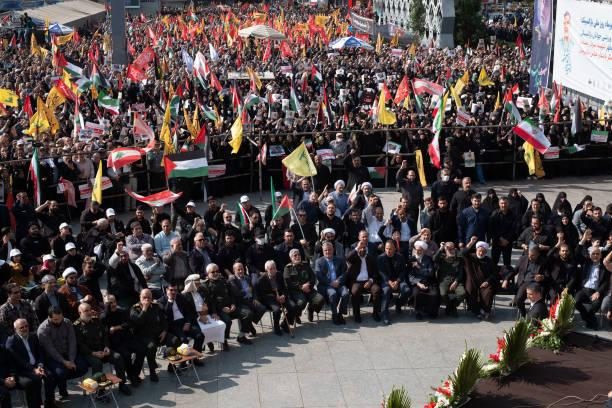
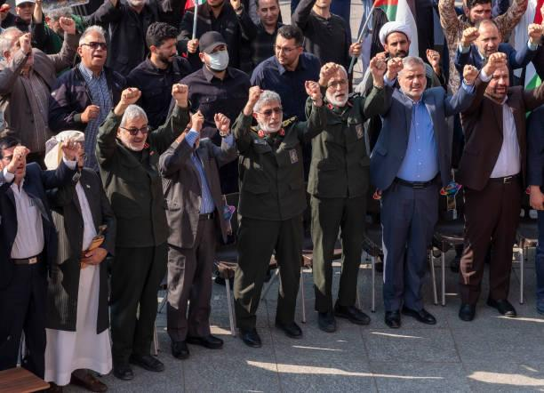
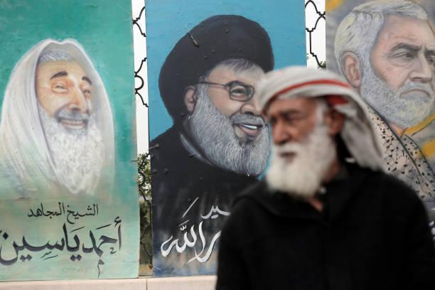

## Claim
Claim: " This is an authentic image of Esmail Qaani, the commander of the Iranian Revolutionary Guards, disguised in a hijab in fear of Israeli bombing."

## Actions
```
web_search("Esmail Qaani disguised hijab")
reverse_search()
```

## Evidence
### Evidence from `web_search`
The article from India Tomorrow ([Source](https://indiatomorrow.net/2024/10/17/irans-top-commander-being-mossad-agent-subsides-after-his-public-appearance-the-iran-embassy-in-india-denies-the-rumours-about-esmail-qaani/)) discusses rumors about Esmail Qaani, including a photo of him. The Voice of America ([Source](https://www.voanews.com/a/extremism-watch_afghan-officials-irans-new-quds-chief-likely-faked-identity-2018/6182322.html)) also mentions Qaani and includes a photo of him.

Getty Images ([Source](https://www.gettyimages.ca/photos/islamic-revolutionary-guard-corps?page=4)) contains images of Esmail Qaani and veiled Iranian women. , , , 


### Evidence from `reverse_search`
From [Source](https://www.nairaland.com/8460455/commander-ghost-qaanis-great-escape): Found exact image on website with title: "From Commander To Ghost: Qaani's Great Escape?" - Foreign Affairs
Content: The search result is from Nairaland, a Nigerian forum. It discusses an article titled "From Commander To Ghost: Qaani’s Great Escape?" from Foreign Affairs. The article, and the discussion around it, centers on the claim that Esmail Qaani, commander of Iran's IRGC Quds Force, was disguised in civilian clothing, possibly a hijab, after reported Israeli airstrikes.  is included in the discussion. The post links to an X post by @MOSSADil, which juxtaposes images of Qaani in military attire and civilian disguise. The forum discussion includes various opinions and reactions to the situation. The date of the post is June 26, 2025.


## Elaboration
The evidence suggests that the image in the claim is associated with rumors about Esmail Qaani disguising himself, possibly in a hijab, after reported Israeli airstrikes. The reverse image search confirms the image's presence in discussions about Qaani's alleged disguise. The India Tomorrow article mentions rumors about Qaani, and Getty Images has images of Qaani and veiled women. The Nairaland forum post links to an article discussing Qaani's disguise.

The evidence does not definitively confirm the authenticity of the image as Qaani in disguise. However, it does show that the image is used in discussions and articles that suggest this possibility.

To verify the claim, additional information is needed to confirm whether the person in the image is indeed Esmail Qaani and whether the disguise was intentional.


## Actions
```
web_search("Esmail Qaani disguise Israeli bombing")
```

## Evidence
### Evidence from `web_search`
The Guardian ([Source](https://www.theguardian.com/world/2024/oct/10/iran-esmail-ghaani-al-quds-beirut-lebanon-israeli-strikes-hezbollah)) discusses Esmail Ghaani's whereabouts after Israeli strikes, mentioning conflicting reports and including a photo of him in military uniform . The New Arab ([Source](https://www.newarab.com/news/back-dead-iran-quds-force-leader-qaani-re-emerges)) reports on Qaani's public appearance after rumors of an Israeli strike, also including a photo of him in military uniform . All Israel News ([Source](https://allisrael.com/iran-s-quds-force-says-chief-is-in-good-health-following-reports-of-his-disappearance-in-beirut)) discusses reports of Qaani's disappearance and the Quds Force's statement on his health, including a photo of Qaani.


## Elaboration
The evidence indicates that the image is associated with rumors about Esmail Qaani's disguise. The Guardian and The New Arab report on Qaani's public appearances and include photos of him in military uniform. All Israel News also includes a photo of Qaani. However, none of the sources confirm that the image in the claim is authentic.

Insufficient information to verify the claim.


## Final Judgement
The claim is based on an image that has been associated with rumors about Esmail Qaani's disguise. However, there is no definitive evidence to confirm that the person in the image is Qaani or that the disguise was intentional. Therefore, the claim cannot be verified. `false`

### Verdict: FALSE

### Justification
The claim is unverified. While the image has circulated in discussions about Esmail Qaani, including rumors of disguise, there is no definitive evidence to confirm the image's authenticity or the intent behind the alleged disguise. News sources like The Guardian ([Source](https://www.theguardian.com/world/2024/oct/10/iran-esmail-ghaani-al-quds-beirut-lebanon-israeli-strikes-hezbollah)) and The New Arab ([Source](https://www.newarab.com/news/back-dead-iran-quds-force-leader-qaani-re-emerges)) show Qaani in military uniform, not in disguise.
