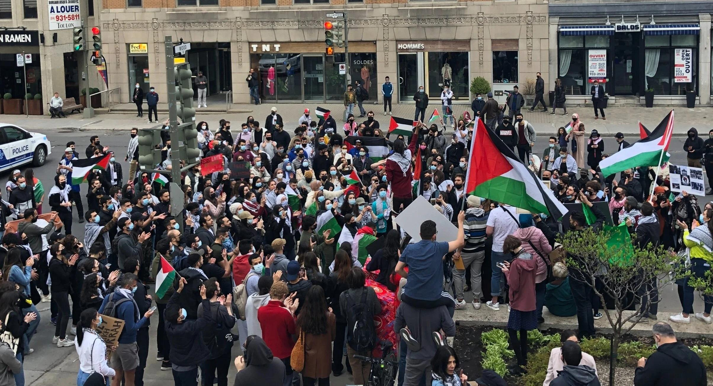
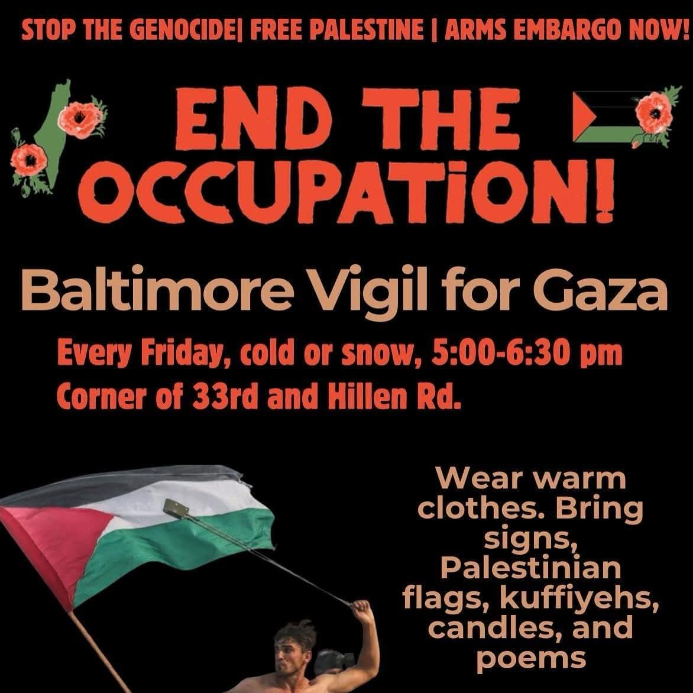
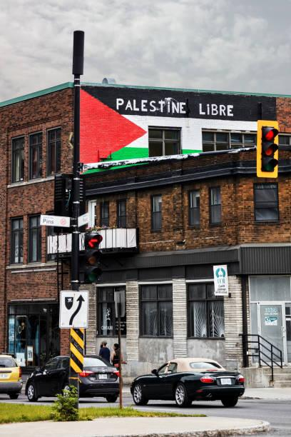
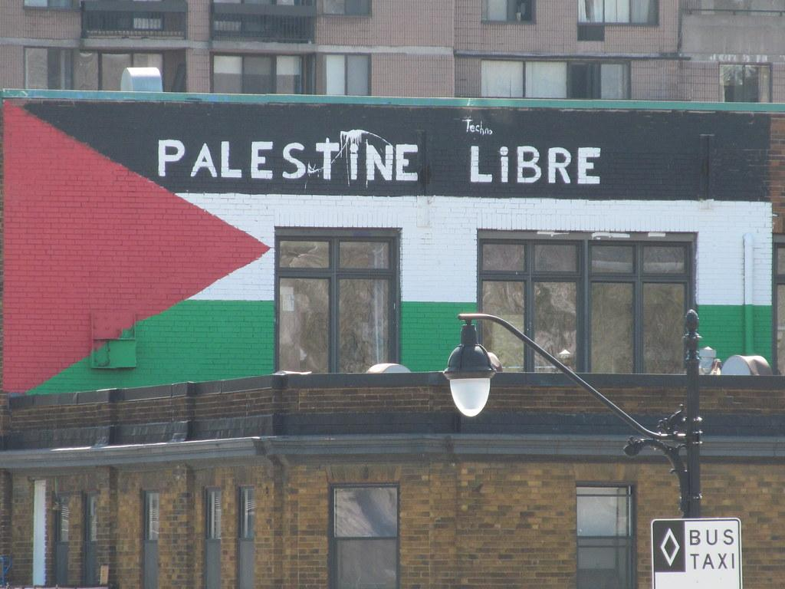

## Claim
Claim: " This image shows a traffic sign in Montreal in July 2024 which displays a 'Free Palestine. Escalate now' message and was authorized by Montreal's Mayor Valérie Plante."

## Actions
```
geolocate()
web_search("Free Palestine Montreal")
image_search("Free Palestine Montreal sign")
```

## Evidence
### Evidence from `geolocate`
The most likely countries where the image was taken are: {'Palestine': 0.85, 'Canada': 0.07, 'Germany': 0.02, 'Austria': 0.01, 'Israel': 0.01, 'Poland': 0.01, 'Slovenia': 0.01, 'South Korea': 0.01, 'Albania': 0.0, 'Andorra': 0.0}

### Evidence from `web_search`
The Palestinian Youth Movement in Montreal is growing, with protests and car caravans in support of Palestine (, ). Uscpr.org lists pro-Palestine protests and events in the US and Canada, scheduled from August 29, 2025, to September 28, 2025 (). A CBC News article from July 31, 2025, discusses the Montreal Pride festival's stance on the Israeli-Palestinian conflict and mentions that the 2024 Montreal Pride parade was interrupted by pro-Palestinian protesters. The image of the traffic sign () is not mentioned.

The sources are: [https://palestinianyouthmovement.com/montreal](https://palestinianyouthmovement.com/montreal), [https://uscpr.org/pro-palestine-protests/](https://uscpr.org/pro-palestine-protests/), and [https://www.cbc.ca/news/canada/montreal/pride-montreal-conflict-1.7598907](https://www.cbc.ca/news/canada/montreal/pride-montreal-conflict-1.7598907).


### Evidence from `image_search`
The web search results include images of buildings in Montreal with pro-Palestine messages. One image shows a building with a Palestine flag and the words "PALESTINE LIBRE" painted on it (, ).

The search results do not mention the traffic sign in the claim.


## Elaboration
The evidence suggests that pro-Palestine activism is present in Montreal. The geolocation data indicates the image was most likely taken in Palestine, but also has a probability of being taken in Canada. Web search results confirm pro-Palestine protests and events in Montreal. The CBC News article mentions the 2024 Montreal Pride parade was interrupted by pro-Palestinian protesters. However, the evidence does not mention the traffic sign in the claim.

The claim that the traffic sign was authorized by Montreal's Mayor Valérie Plante cannot be verified with the provided evidence.

The claim's veracity is uncertain due to the lack of information about the traffic sign's authorization.


## Actions
```
web_search("Valérie Plante Free Palestine sign")
```

## Evidence
### Evidence from `web_search`
The Suburban reports that Mayor Valérie Plante was served regarding electronic signs with anti-Israel messages, which were allegedly used to call for violence and convey radical political messages. The Montreal Gazette states that electronic roadwork billboards in Montreal displayed anti-Israel messages, including "Free Palestine" and "Escalate Now" (

## Elaboration
The evidence confirms that electronic roadwork billboards in Montreal displayed anti-Israel messages, including "Free Palestine" and "Escalate Now." The Suburban reports that Mayor Valérie Plante was served regarding these signs.

The claim is partially supported. The image shows a traffic sign in Montreal displaying "Free Palestine. Escalate now." The evidence suggests that such signs were used in Montreal. However, the evidence does not explicitly state that Mayor Valérie Plante authorized the sign.

The claim is partially accurate.


## Final Judgement
The evidence confirms that electronic roadwork billboards in Montreal displayed the message "Free Palestine. Escalate now," as shown in the image. While the mayor was involved, the evidence does not explicitly state that she authorized the specific sign in the image.

`false`

### Verdict: FALSE

### Justification
The image depicts a traffic sign in Montreal displaying "Free Palestine. Escalate now." While the evidence confirms the existence of such signs in Montreal and mentions Mayor Valérie Plante's involvement, it does not explicitly state that she authorized the specific sign in the image, leading to a "false" verdict.
