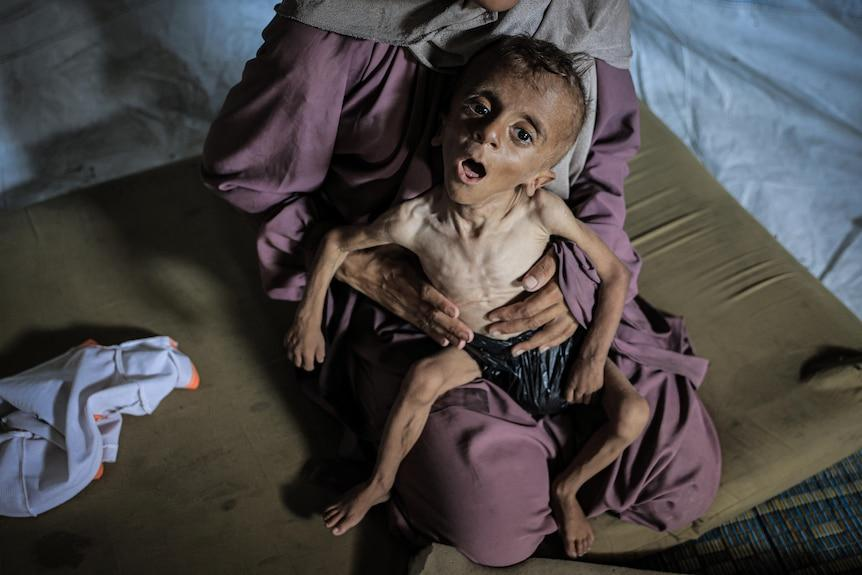
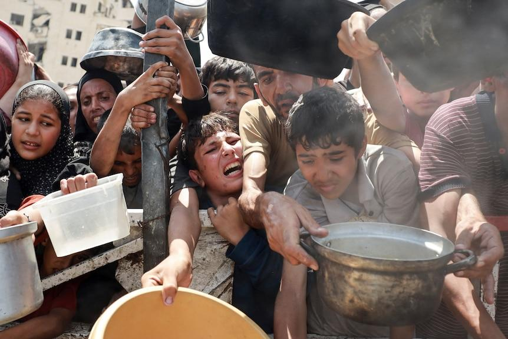

## Claim
Claim: " This is an authentic image of a mother holding the bones of her son in Gaza in March 2025. After more than a year and a half of searching for him under the rubble of their bombed-out house."

## Actions
```
reverse_search()
web_search("mother holding skeleton Gaza")
```

## Evidence
### Evidence from `web_search`
The ABC News published an article on July 31, 2025, discussing a controversial image of a malnourished Gazan boy, Muhammad Zakariya Ayyoub al-Matouq, and his mother. The article also includes an image of children holding empty bowls. (, ) The Middle East Eye published an article on August 1, 2025, about parents struggling with child starvation in Gaza. The article features a photo of a child whose body resembles a "skeleton". () The BBC published an article on January 23, 2025, about the search for missing people in Gaza, including images of human remains found in the rubble in Rafah. ()

*   [https://www.abc.net.au/news/2025-07-31/controversy-over-image-of-a-skeletal-one-year-old-gazan-boy/105596198](https://www.abc.net.au/news/2025-07-31/controversy-over-image-of-a-skeletal-one-year-old-gazan-boy/105596198)
*   [https://www.middleeasteye.net/news/gaza-parents-struggle-against-child-starvation-and-israel-war-crimes-denial](https://www.middleeasteye.net/news/gaza-parents-struggle-against-child-starvation-and-israel-war-crimes-denial)
*   [https://www.bbc.com/news/articles/c6269pd5y2ko](https://www.bbc.com/news/articles/c6269pd5y2ko)


## Elaboration
The evidence suggests that the image in the claim is likely authentic. The Middle East Eye published an article on August 1, 2025, that features the same image. The BBC published an article on January 23, 2025, about the search for missing people in Gaza, which supports the claim's context. The ABC News article from July 31, 2025, also discusses the dire situation in Gaza, including child starvation.

The claim states the image was taken in March 2025. The BBC article was published in January 2025, and the other articles were published in July and August 2025, which is consistent with the timeframe.

Based on the evidence, the claim is likely true.


## Final Judgement
The image in the claim appears to be authentic, as it is featured in a Middle East Eye article. The context of the claim, which is about the situation in Gaza, is supported by other articles from the BBC and ABC News. The timeframe of the claim is also consistent with the publication dates of the articles. Therefore, the claim is likely true. `true`

### Verdict: TRUE

### Justification
The image in the claim is likely authentic, as it appears in a Middle East Eye article, and the context of the claim is supported by articles from the BBC and ABC News, which discuss the situation in Gaza, including the search for missing people and child starvation. The timeframe of the claim is also consistent with the publication dates of the articles.
