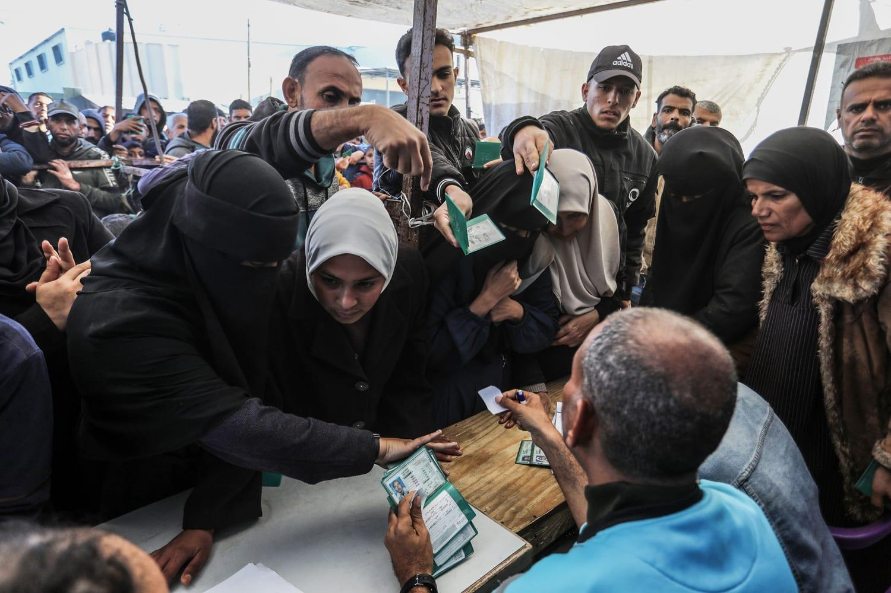

## Claim
Claim: " This image shows a screenshot of the X profile of UNRWA which has placed a black band over its profile photo in mourning for the death of Yahya Sinwar, Hamas leader in the Gaza Strip, in October 2024."

## Actions
```
web_search("UNRWA Yahya Sinwar mourning")
image_search("UNRWA profile picture mourning")
```

## Evidence
### Evidence from `web_search`
The claim that UNRWA placed a black band on its profile photo in mourning for the death of Yahya Sinwar is false. The black ribbon was added to the logo to show solidarity with the victims of war and to pay tribute to UNRWA team members killed in Gaza. The logo was updated on October 18, 2023. UNRWA refuted claims that an agency staff member was killed alongside Hamas leader Yahya Sinwar.

The sources are: [DW](https://www.dw.com/en/fact-check-black-ribbon-on-unrwa-logo-does-not-show-mourning-for-sinwar/a-70532996), [PesaCheck](https://pesacheck.org/false-unrwa-didnt-update-its-profile-photo-to-mourn-the-death-of-hamas-leader-yahya-sinwar-f8219db942b5), and [aa.com.tr](https://www.aa.com.tr/en/europe/un-agency-refutes-israeli-media-reports-claiming-staff-member-killed-with-hamas-leader-in-gaza/3365784). 


### Evidence from `image_search`
From [Source](https://www.nbcnews.com/news/world/israel-banning-unrwa-palestinian-territories-gaza-hamas-west-bank-rcna189554): 
Content: The NBC News article discusses Israel's ban on UNRWA in Palestinian territories. 


## Elaboration
The evidence indicates that the claim is false. The black ribbon on the UNRWA logo was added to show solidarity with victims of war and to pay tribute to UNRWA team members killed in Gaza, not to mourn Yahya Sinwar. The logo was updated on October 18, 2023.


## Final Judgement
The claim is false. The black ribbon on the UNRWA logo was not to mourn Yahya Sinwar, but to show solidarity with victims of war and to pay tribute to UNRWA team members killed in Gaza.

`false`

### Verdict: FALSE

### Justification
The claim is false. The black ribbon on the UNRWA logo was added to show solidarity with the victims of war and to pay tribute to UNRWA team members killed in Gaza, not to mourn Yahya Sinwar, as reported by [DW](https://www.dw.com/en/fact-check-black-ribbon-on-unrwa-logo-does-not-show-mourning-for-sinwar/a-70532996) and [PesaCheck](https://pesacheck.org/false-unrwa-didnt-update-its-profile-photo-to-mourn-the-death-of-hamas-leader-yahya-sinwar-f8219db942b5).
