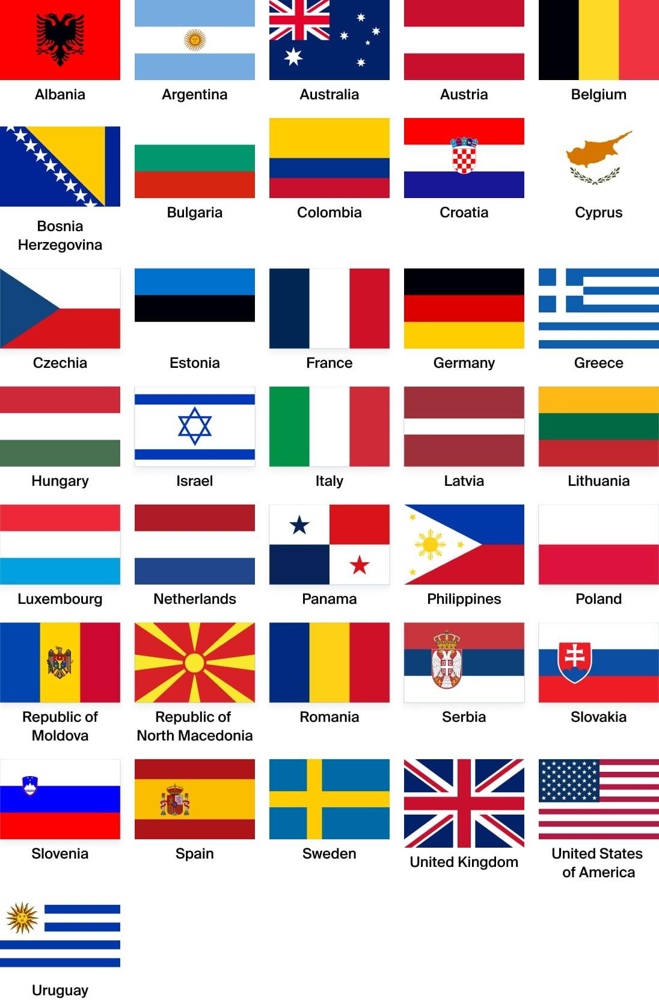

## Claim
Claim: "The World Jewish Congress (WJC) has amended the International Holocaust Remembrance Alliance (IHRA) working definition of antisemitism in March 2025 to include: 'Conflating the assassination of JFK to jews/israel'."

## Actions
```
web_search("World Jewish Congress IHRA antisemitism definition")
web_search("IHRA working definition of antisemitism March 2025")
```

## Evidence
### Evidence from `web_search`
The World Jewish Congress website provides the IHRA working definition of antisemitism, adopted on May 26, 2016, which includes examples of antisemitism but does not mention the assassination of JFK (, ). The International Holocaust Remembrance Alliance (IHRA) adopted a non-legally binding working definition of antisemitism on May 26, 2016, which has been adopted or endorsed by numerous countries and organizations. The definition includes examples of antisemitism, such as targeting the state of Israel.

The United Kingdom adopted the IHRA definition on December 12, 2016. The search results do not mention the World Jewish Congress or any amendments to the definition in March 2025.
*   [https://www.worldjewishcongress.org/en/working-definition-of-antisemitism](https://www.worldjewishcongress.org/en/working-definition-of-antisemitism)
*   [https://holocaustremembrance.com/resources/working-definition-antisemitism](https://holocaustremembrance.com/resources/working-definition-antisemitism)
*   [https://en.wikipedia.org/wiki/IHRA_definition_of_antisemitism](https://en.wikipedia.org/wiki/IHRA_definition_of_antisemitism)


### Evidence from `web_search`
From [Source](https://urj.org/blog/five-definitions-antisemitism): 
Content: The search result from urj.org discusses the IHRA Working Definition of Antisemitism, adopted in 2016, and notes that it is a "working definition" which "connote[s] the possibility for change." The article also mentions the Nexus Document and the Jerusalem Declaration on Antisemitism, which were written in response to the IHRA definition. The article was published on August 26, 2025.


## Elaboration
The provided evidence indicates that the IHRA working definition of antisemitism was adopted in 2016 and does not include the specific example mentioned in the claim. The search results do not mention any amendments made by the World Jewish Congress or any changes to the definition in March 2025. The evidence also mentions that the definition is a "working definition" which "connote[s] the possibility for change." However, there is no evidence to support the claim that the WJC amended the definition in March 2025 to include the assassination of JFK.

Insufficient information is available to verify the claim.


## Final Judgement
The IHRA working definition of antisemitism was adopted in 2016 and does not include the example mentioned in the claim. There is no evidence of the World Jewish Congress amending the definition in March 2025 to include "Conflating the assassination of JFK to jews/israel."

`false`

### Verdict: FALSE

### Justification
The IHRA working definition of antisemitism, adopted in 2016, does not include the example mentioned in the claim, and there is no evidence of the World Jewish Congress amending the definition in March 2025 to include "Conflating the assassination of JFK to jews/israel" as per the [World Jewish Congress](https://www.worldjewishcongress.org/en/working-definition-of-antisemitism) and [IHRA](https://holocaustremembrance.com/resources/working-definition-antisemitism) websites.
