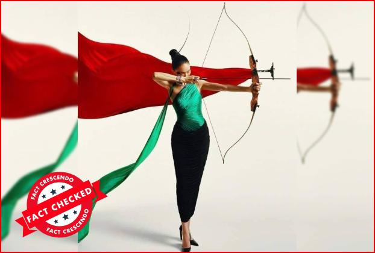
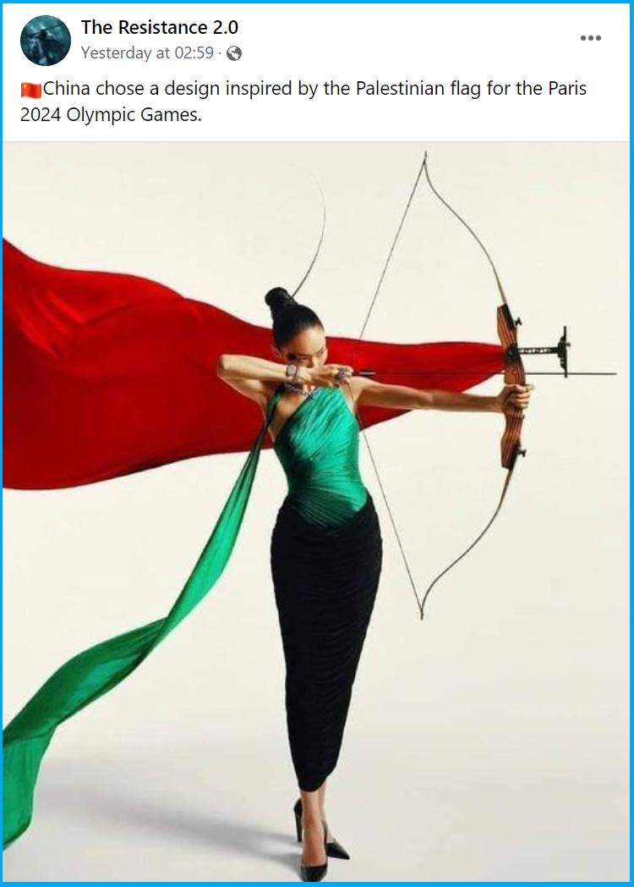

## Claim
Claim: " This image shows an athlete of China which has chosen a design of the Palestinian flag for the Paris 2024 Olympics."

## Actions
```
web_search("China Paris 2024 Olympics Palestinian flag design")
image_search("China Olympics athlete design Palestinian flag")
```

## Evidence
### Evidence from `web_search`
The image in the claim is from the September 2023 issue of Vogue China Magazine and was taken for the promotion of the Hangzhou Asian Games, not the Paris 2024 Olympics. The articles from Fact Crescendo ([https://srilanka.factcrescendo.com/english/china-has-not-chosen-a-design-inspired-by-the-palestinian-flag-for-the-paris-olympics-2024/](https://srilanka.factcrescendo.com/english/china-has-not-chosen-a-design-inspired-by-the-palestinian-flag-for-the-paris-olympics-2024/)) and Factly.in ([https://factly.in/an-old-photo-from-vogue-china-magazine-is-being-falsely-shared-as-showing-chinese-athletes-wearing-the-colours-of-the-palestinian-flag/](https://factly.in/an-old-photo-from-vogue-china-magazine-is-being-falsely-shared-as-showing-chinese-athletes-wearing-the-colours-of-the-palestinian-flag/)) confirm this. The Paris 2024 Summer Olympic Games will commence on July 26, 2024, and end on August 11, 2024. , , , , , , , , 


### Evidence from `image_search`
From [Source](https://english.factcrescendo.com/2024/07/26/china-has-not-chosen-a-design-inspired-by-the-palestinian-flag-for-the-paris-olympics-2024/): 
Content: Fact Crescendo states that the image is miscaptioned. 


## Elaboration
The claim is false. The image is from Vogue China Magazine and was taken for the promotion of the Hangzhou Asian Games, not the Paris 2024 Olympics.


## Final Judgement
The claim is demonstrably false. The image is from Vogue China Magazine and was taken for the promotion of the Hangzhou Asian Games, not the Paris 2024 Olympics. The claim misrepresents the origin and context of the image. `false`

### Verdict: FALSE

### Justification
The claim is demonstrably false. The image in the claim is from the September 2023 issue of Vogue China Magazine and was taken for the promotion of the Hangzhou Asian Games, not the Paris 2024 Olympics, as confirmed by [Fact Crescendo](https://srilanka.factcrescendo.com/english/china-has-not-chosen-a-design-inspired-by-the-palestinian-flag-for-the-paris-olympics-2024/) and [Factly.in](https://factly.in/an-old-photo-from-vogue-china-magazine-is-being-falsely-shared-as-showing-chinese-athletes-wearing-the-colours-of-the-palestinian-flag/).
