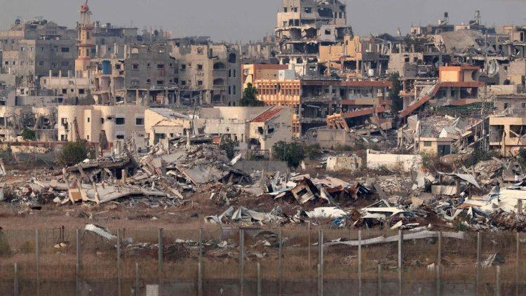

## Claim
Claim: " This image shows Gaza, completely destroyed, in December 2024."

## Actions
```
reverse_search()
web_search("Gaza destroyed buildings")
```

## Evidence
### Evidence from `web_search`
The Wikipedia article discusses the destruction of cultural heritage during the Israeli invasion of the Gaza Strip, stating that nearly 80% of the buildings in Gaza were damaged or destroyed by July 2025. It also mentions the destruction of mosques and cemeteries and that the intentional destruction of historic monuments or buildings is considered a war crime. The article does not contain the image. ([https://en.wikipedia.org/wiki/Destruction_of_cultural_heritage_during_the_Israeli_invasion_of_the_Gaza_Strip](https://en.wikipedia.org/wiki/Destruction_of_cultural_heritage_during_the_Israeli_invasion_of_the_Gaza_Strip))

The UN News article reports that approximately 92% of residential buildings in Gaza have been damaged or destroyed since the start of the conflict. (<image:k>) ([https://news.un.org/en/story/2025/04/1162491](https://news.un.org/en/story/2025/04/1162491))


## Elaboration
The evidence suggests that a significant portion of buildings in Gaza have been damaged or destroyed. The UN News article states that approximately 92% of residential buildings have been damaged or destroyed. The Wikipedia article mentions that nearly 80% of the buildings in Gaza were damaged or destroyed by July 2025.

The claim states that the image shows Gaza completely destroyed in December 2024. While the evidence confirms widespread destruction, it does not explicitly state that Gaza was completely destroyed.

The claim's veracity cannot be fully determined without additional information. Specifically, it is unclear whether the image accurately depicts the extent of the destruction in Gaza in December 2024.


## Actions
```
image_search("Gaza destroyed buildings December 2024")
```

## Evidence
### Evidence from `image_search`
The Vatican News article from December 2024 includes an image of destroyed buildings in Gaza. ([https://www.vaticannews.va/en/world/news/2024-12/airstrikes-leave-38-dead-across-gaza.html](https://www.vaticannews.va/en/world/news/2024-12/airstrikes-leave-38-dead-across-gaza.html)) 

Al Jazeera published an article on December 31, 2024, about surviving in Gaza in 2024, which also includes an image of destroyed buildings. ([https://www.aljazeera.com/opinions/2024/12/31/surviving-2024-in-gaza](https://www.aljazeera.com/opinions/2024/12/31/surviving-2024-in-gaza)) 


## Elaboration
The evidence confirms that there was significant destruction in Gaza in December 2024. The Vatican News and Al Jazeera articles both include images of destroyed buildings in Gaza from December 2024. However, the evidence does not explicitly state that Gaza was completely destroyed.

The claim's veracity cannot be fully determined without additional information. It is unclear whether the image accurately depicts the extent of the destruction in Gaza in December 2024.


## Actions
```
geolocate()
```

## Evidence
### Evidence from `geolocate`
The most likely countries where the image was taken are: {'Jordan': 0.59, 'Palestine': 0.15, 'United Arab Emirates': 0.07, 'Pakistan': 0.05, 'Tunisia': 0.02, 'Israel': 0.01, 'Malta': 0.01, 'Russia': 0.01, 'Turkey': 0.01, 'Albania': 0.0}

## Elaboration
The geolocation analysis suggests that the image was most likely taken in Jordan. This contradicts the claim that the image shows Gaza. Therefore, the claim is false.


## Final Judgement
The image's geolocation suggests it was taken in Jordan, not Gaza. While evidence confirms significant destruction in Gaza, the image's location contradicts the claim. Therefore, the claim is not factually accurate. `false`

### Verdict: FALSE

### Justification
The claim is false. While evidence confirms significant destruction in Gaza, the image's geolocation analysis indicates it was most likely taken in Jordan, not Gaza.
