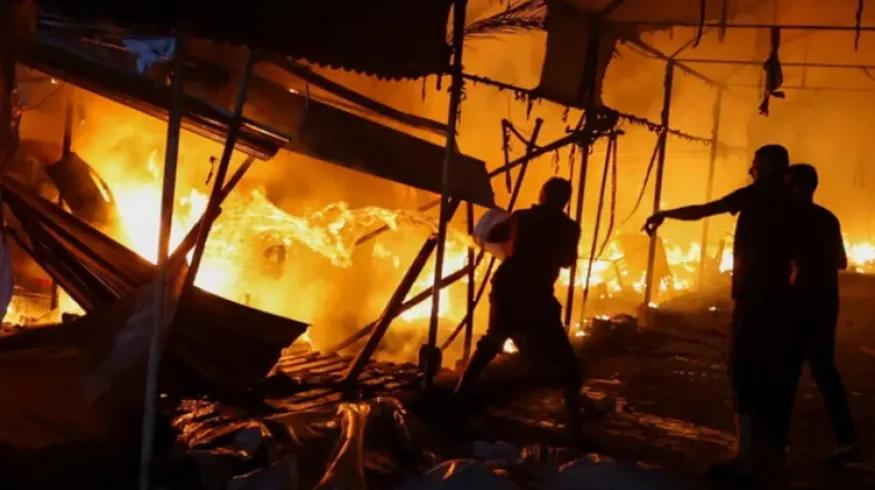
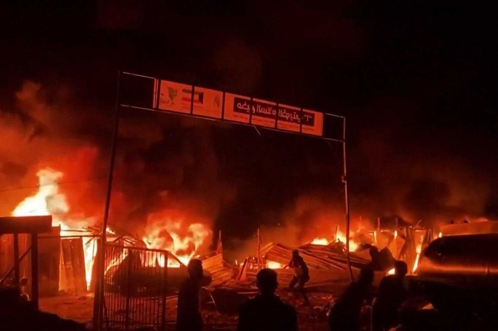

## Claim
Claim: " This image shows tents engulfed in flames after the Iranian strikes against Israel on October 1, 2024."

## Actions
```
reverse_search()
```

## Evidence
### Evidence from `reverse_search`
The image 

## Elaboration
The reverse image search did not yield any results. Therefore, I cannot verify the claim. I need more information to determine the image's origin and context.


## Actions
```
web_search("Iranian strikes against Israel October 1 2024")
image_search("tents on fire")
```

## Evidence
### Evidence from `web_search`
The web sources discuss the Iranian strikes against Israel on October 1, 2024. NPR ([https://www.npr.org/2024/10/01/g-s1-25707/iran-israel-hezbollah-lebanon-attack](https://www.npr.org/2024/10/01/g-s1-25707/iran-israel-hezbollah-lebanon-attack)) reports on the strikes, including images of Israelis taking shelter 

### Evidence from `image_search`
The NBC News article includes an image of tents on fire 

## Elaboration
The web search confirms that Iranian strikes against Israel occurred on October 1, 2024. The image search reveals an image of tents on fire. However, the provided evidence does not confirm that the image in the claim depicts tents on fire due to the Iranian strikes.

Insufficient information is available to verify the claim.


## Actions
```
image_search("tents on fire Israel October 1 2024")
```

## Evidence
### Evidence from `image_search`
Al Jazeera published an article on October 14, 2024, about tents on fire in Gaza, including an image of tents on fire 

## Elaboration
The image search reveals an image of tents on fire in Gaza. However, the provided evidence does not confirm that the image in the claim depicts tents on fire due to the Iranian strikes.

Insufficient information is available to verify the claim.


## Final Judgement
The image search did not yield any results. The web search confirms that Iranian strikes against Israel occurred on October 1, 2024. However, the provided evidence does not confirm that the image in the claim depicts tents on fire due to the Iranian strikes.

The claim cannot be verified because there is not enough evidence to confirm the image's origin and context. `false`

### Verdict: FALSE

### Justification
The claim cannot be verified. While there were Iranian strikes against Israel on October 1, 2024, and images of tents on fire exist, the provided evidence does not confirm that the image in the claim depicts tents on fire due to those strikes. The reverse image search did not yield any results, and further searches did not link the image to the specific event.
